<h1 style="text-align:center">Malware Analysis Basics</h1>
<b>Topics</b>

+	Malware lab preparation
+	What is malware?
+	What are the types of analysis?
+	Toolkit
+	Compiling a C/C++ Source File
+	Example

---
<h2 style="text-align:center"> Introduction</h2>

One Windows (7/10) virtual machine and one RemNux virtual machine are required to be used in the analyzes to be performed. FlareVM is available as Windows here. As for the purpose of use of these machines;

1.	Our analyses can lead to activities that can have dangerous consequences. 
2.	Systems must be reversible.
3.	Systems must be traceable.
4.	Availability of the toolkit that already comes installed.
5.	The ability to imitate normal systems.
In addition to the installation of these virtual machines, we will make certain network settings and completely isolate the virtual machines. This will benefit us as follows; we will be able to prevent an attack that may spread to our host device and monitor network movements on our analysis machine.

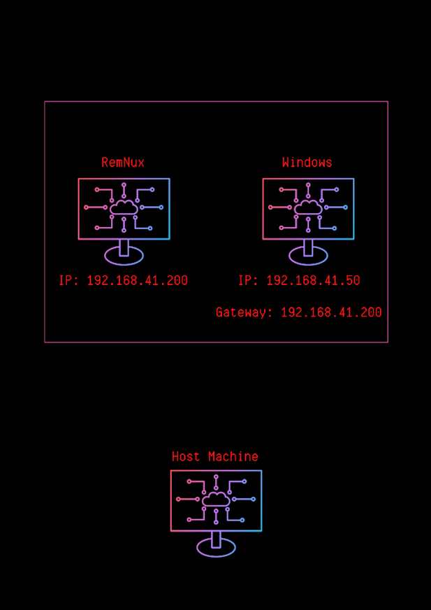

It will be as in the architectural shape we will build. All traffic from our Windows device will pass through RemNux and RemNux will also be used as the DNS server.

This blog series will use VMWare Pro as a hypervisor. 

---

<h2 style="text-align:center"> VMWare Settings</h2>
The necessary steps for the network settings to be valid and to isolate the machines from the host device are as follows;

1. Creating network via Virtual Network Editor.
   + Edit -> Virtual Network Editor
  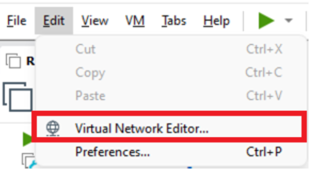
   + Change settings
    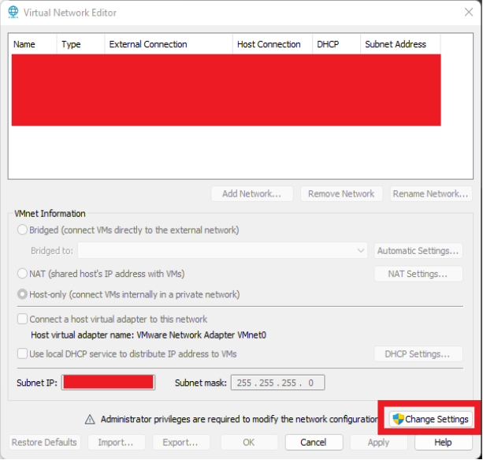
   + Add Network
    
   + We set it as in the image and save it. We do not connect the virtual adapter to this network, this is because our virtual network should not be connected to our host device, we do not run the DHCP service, we will manually assign IP and Gateway to the machines ourselves.
    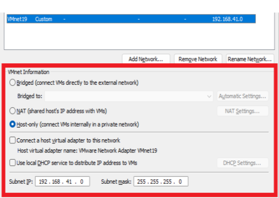

2. Network settings of machines
    + Assignment to subnet from virtual machine settings (we do it for both machines)
   
   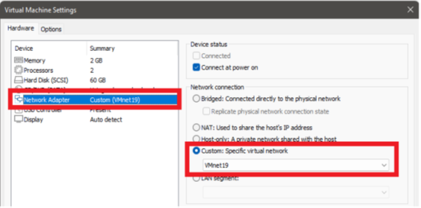

   + RemNux is a Linux distribution. Here you can also make a permanent IP assignment by making network settings on the device or you can also make a static IP assignment with the help of the following command. If you are going to assign a static IP, I recommend that you take a snapshot of the machine after making these settings to avoid making these settings each time. You will have both a clean version of the machine in your hands (reversible) and not having to adjust the settings repeatedly.
   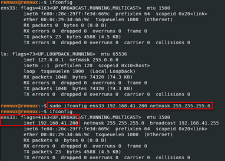
   + Static IP assignment on Windows devices; Network Connections -> Ethernet Interface -> Settings -> IPv4. As the gateway and DNS server, we give the IP of our RemNux machine. The reason for doing this is that thanks to the tools we will run on RemNux, we will be able to listen to the network and bypass some control mechanisms used by malwares.

   

   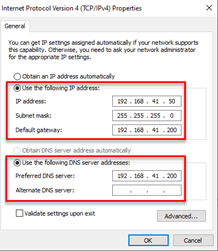
   + We will check the connection between the machines by activating the File and Printer Sharing IPv4 settings (Inbound-Outbound) on Windows Firewall and pinging
    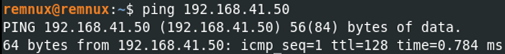

   

---
<h2 style="text-align:center"> What is malware?</h2>

Malware is the name given to software that performs activities without the **user's knowledge** and **request**. This is the clearest and sharpest definition that can be made here. For example, you can describe a type of trojan or ransomware with this definition. When we look at the technical specifications; information theft, disrupting the functioning of systems, uninformed use of the system (botnet), keylogger. software that performs any of these activities is called malware

One of the most common mistakes made in this context is the use of the word "virus" instead of malware. The sentence that explains this issue most clearly is; **"Every virus (worm) is a malware, not every malware is a virus."** Viruses are malicious software that aims to spread over systems. When we look at the history of malware, there are also species that only aim to spread.  See [**Creeper**](https://tr.wikipedia.org/wiki/Creeper) (1971). 

The types of malware are as follows;

1. **Trojan**: Trojans, also called Trojan horses, are malicious software that masquerades as a legal practice and actually performs harmful activities.
2. **RAT**: The Remote Access Trojan is used to gain privilege over the target system and its purpose is to leak data from the system, not to harm it. An attacker could run commands on the victim system.
3. **Ransomware**: The main purpose is to make the data on the victim's system unreadable/inaccessible, or to make the victim's system unusable to create panic-anxiety in the victim and to make him pay the ransom.
4. **Spyware**: They are software installed next to a licensed and reliable program installed in the system. Their purpose can be customized according to their use case, but basically collecting information about the target and sending it to the attacker.
5. **Adware**: It is software that collects information for marketing or advertising purposes without the victim's awareness and directs the user to different sites or pop-ups with manipulations on search engines.
6. **Rootkit**: It is malicious software that can hide itself among the processes running in the system, providing remote access to the attacker.
7. **Virus (Worm)**: It is software that threatens the integrity, accessibility and confidentiality of the system aimed at spreading between systems.

---
<h2 style="text-align:center"> Malware Analysis Techniques  </h2>

Our primary goal in the analyzes is to obtain the necessary information in the shortest way. For example, to get the IP or Domain information directly from the strings in the malware to get the IOC (Indicator of Compromise) information, it is a technique that takes much less time than running the software and finding the part that is connected in it. Looking at the graph above, going upwards increases the difficulty and time spent. Sometimes we will be able to access all the information needed using the Sandbox, while sometimes we may need to reverse engineer and analyze the structure/functioning of the malware and access this information. Here, before starting the analysis, it is recommended to determine the main purpose and to analyze it in a way that is focused on that point. For example, the target should be determined such as capturing the IP / Domain information of the C&C server, analyzing the encryption key / algorithm, touching points in the device. It can sometimes take days/weeks to read and analyze all the code of a malware written, so setting goals and analyzing will save us time. 

There is never a single way. We should always be able to create alternative paths, use alternative tools. Each piece of malware has its own characteristics. **Malwares are unique works of art.**  That's why this blog series will focus on the idea of "How to approach a malware?"

---

<h2 style="text-align:center"> Analysis Techniques </h2>

1. **Behavioral Static Analysis**: The main goal here is to get ideas before starting malware analysis. This form of analysis plays an important role in the "purpose/goal creation" phase we mentioned in the previous section. The DLLs that the program calls, the strings in them are analyzed and information about the software is obtained. For example a software that imports the ws32.dll file will perform socket operations, where there may be a leak of information or the execution of commands received from the remote server. In the light of this information, the purpose can be determined and the next stage can be started. This is important to save us time.

2. **Behavioral Dynamic Analysis**: After the analysis/monitoring tools are run, the malware is executed. The main goal here is to reverse engineer and detect the behavior of malware without wasting time. For example, we can detect the files and registry operations that the Procmon tool does by running it, or we can obtain the information of the C&C server by following the connections made via Wireshark/TCPView.

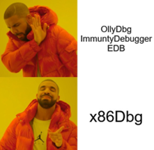

1. **Static Code Analysis**: In cases where we do not have enough information in the first 2 steps, we move on to the next stage, Static Code Analysis. Here we analyze the Assembly language code of the malware using various Dissassembler tools. The main purpose here is to analyze the operation of the program, its main functions, API calls and determine the parts that we will analyze/examine in the next stage, Dynamic Code analysis.

2. **Dynamic Code Analysis**: It is the analysis phase that is done by intervening in the program at the runtime with the help of debugger tools (the use of these tools will be explained in detail in the following articles). It is the analysis phase where we can change the situations that affect the flow of the program, such as CPU registers, flags, loaded variables, access the data analyzed at the time of operation and manipulate them.

--- 
<h2 style="text-align:center"> Tools Used </h2>

There are multiple alternatives to the tools used here. Just as a builder creates the toolkit with which he feels comfortable working, the same logic applies to malware analysis. You can choose which tool is more convenient and comfortable for you:)

1. **Strings**: Outputs strings consisting of readable characters from within the executable file to the screen.

2. **CFF**: It is a static analysis tool. It contains the characteristic information of the file to which we have access (type of processor being compiled, whether it is a DLL or EXE, its size, hash value, etc.), information of DLLs that are called or functions that are exported, as well as a lot of useful information.

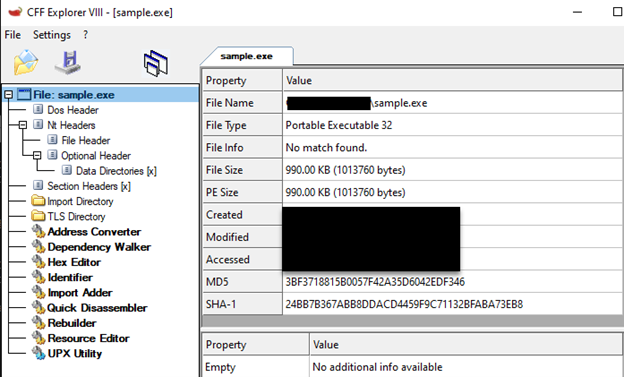 

1. **PEStudio**: It is a static analysis tool. In addition to offering all the features that CFF Explorer offers, it can also scan the file through VirusTotal. It is a more capable tool in the .NET part than CFF.
 

4. **DIE**: It is often used to detect packed software. Here, section names, entropy (irregularity) value and signatures of some known packaging software are determined by checking. Entropy represents the irregularity of the machine code contained within an executable. There is a theory here. In a written software, the functions/concept are usually specific and the entropy value is between 40-70% on average. An entropy value of 70% or more is doubtful. The reason for this is that; When we look at the packaging logic, when the sections in the executable file are encrypted and the new file is created, the encrypted section and the code block responsible for decrypting are placed inside. At the runtime, the encrypted part is decyrpted and operated. The entropy value is extremely high in the encrypted parts. This tool calculates the irregularity here and gives us information about whether the software is packaged or not.
 

    In the image above, the interface of the tool is presented. The state of irregularity can be analyzed by clicking on the "Entropy" button. Here section names can also be clues for us. For example, when we look at the entropy window below, we see that the section names are "UPX". When we search for the word UPX from the search engine, we can determine that it is a packaging software. In the following articles, it will be explained how these section names should be, which sections contain what information.
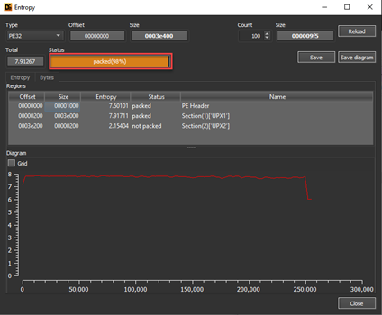 

5. **Process Hacker**: It is a tool with which we can examine running processes instantly. In addition, it provides us with useful information such as instant memory sections of the running processes, authorization status, values taken as handle, etc.
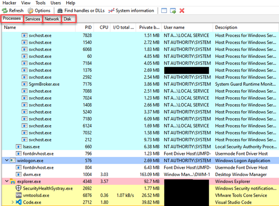

6. **Regshot**: Many malwares makes changes on the registry. The Regshot tool reports these changes to us. Before running the malware, a copy of the registry is made, then the software is run and finish its activities, a second copy is taken. When we click the compare button, the tool presents us with the differences by comparing these two copies.
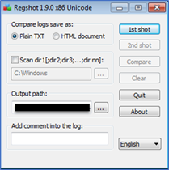

7. **Procmon**: Procmon, one of the Sysinternals tools, provides us with instant reporting by monitoring certain system calls made by running processes. Here, you can record all the processes and then obtain information such as file operations, registry changes, process operations made by the malware. There are many filter options.

8. **HxD**: It is a hexadecimal editing tool. It is a tool with which we can view and modify the contents of any file hexadecimally.

9. **IDA**: The Interactive Dissassembler tool has both dissassemble and debugger properties. It is the tool that has dozens of interfaces such as the strings of the file, the functions that are called, the exported and defined functions, etc. It is typically used in the static code analysis phase. It is a nice option to solve the flow of the program and follow the API calls.  The use of this tool will be discussed in detail in future blog posts.
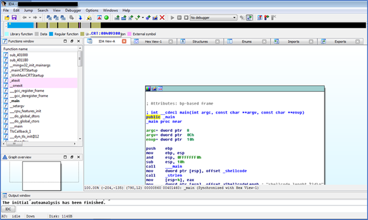

10. **x86Debugger**: It is the tool that allows us to analyze executable files at run time. The use of this tool will be discussed in detail in future blog posts.
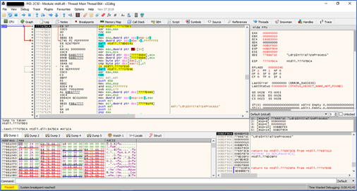
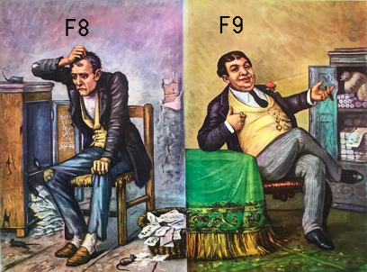

11. **TCPView**: It is the tool that we can monitor TCP/UDP connections on the device instantly.

12. **Wireshark**: It is a tool with which we can monitor network packets instantaneously and then make a copy of the generated record.
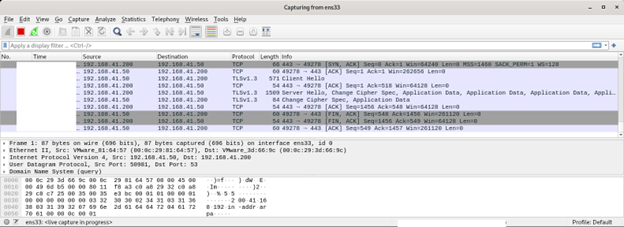

13. **Inetsim**: It is the tool that allows us to simulate the virtual network that we have created by simulating certain ports like a real network. A large number of configurations can be made on this tool. A different port can be opened, port forwarding can be done, a port can be closed, etc. When we stop the simulation, it presents us with the contents of the packets sent throughout the simulation.

14. **Fakedns**: Fakedns allows our RemNux machine to behave like a DNS Server. When we look at internet connection control, which is one of the simplest anti-vm techniques, the malware simply makes a DNS query to the "google.com", if the result of this query does not return, the malware understands that there is no internet connection, it may not perform its main functionality and terminate itself. This serves to mislead an analyst. It is an extremely useful tool used to circumvent such techniques and examine DNS queries.

---
<h2 style="text-align:center"> Compiling C/C++ Source Code from the Command Line </h2>

I recommend that people who want to improve themselves in malware analysis, develop malware in C/C++ using known techniques and APIs that are widely used by malware, and then analyze the executable file. This will give you a little insight into how malware is written, and understanding what the malware you are writing looks like when dissassamble will improve significantly. In this context, let's look at how we can compile C/C++ source code from the command line. We first install MinGW and then add the "MinGW/bin/" directory to the PATH on system environment variables. In this way we can run the "g++.exe" application in the "MinGW/bin/" directory from each directory. 

The command line that we are going to use will be as follows:

**g++ --std-c++11 file.cpp -o file.exe -s -lws2_32 -Wno-write-strings -fno-exceptions -fmerge-all-constants -static-libstdc++ -static-libgcc**

The parameters used here mean the following:

**-std=c++11** indicates that we are going to use C++ standard 11. Compiling with C++17 gives us a of new features such as quick conversion from string to int, using numbers in Case:break conditions, but at the same time it increases the size of the binary. Compiling with C++17 gave us a size of 32Kb as the final size of binary, whereas C++11 gave us the size of 24Kb. Thus, c++11 was choosen.

**-s** strips off any metadata left in the binary, debug symbols, information about where the binary was compiled, username of the compiler, hostname of the compiler, directory where it was compiled and so on.

    Tip: When compiling the final binary, always make sure you do it in a new VM with clean install so that it does not leave back any trace of the author and the coding environment.

**-Wno-write-strings** is required to convert string to char. This is only useful when debugging the binary. During final compilation this has no effect since we will not be using strings.h or the iostream header.

**-fno-exceptions** as describes itself is used to specify the compiler that the binary that is getting compiled has no exceptions. If exception is enabled, it slows down the processing time of the execution of the binary. Although at this stage, the process execution time is miniscule, when we import large functions in the malware which can also include exploits, the processing time tends to slow down a lot. This is the main reason for not using exceptions in our malware.

**-fmerge-all-constants** will combine all the constant arrays/integers and chars and initialize them at the very start. This is very useful in code optimization since this will increase the speed of processing/comparing buffers and find addresses of the buffers in memory quickly. This option will merge all the addresses and store them at a location which is known and thus it will be quicker to access these locations.

**-static-libstdc++** and -**static-libgcc** are used to compile C and C++ headers statically together in a C++ program. Since we are going to mix up C and C++ code, we would be needing these two a lot. Also, when dynamic links are performed, its easier for antiviruses to detect the binary as malicious. We will not be linking any DLL to our binary atleast for now. And so we will require static linking

Then we package it with the UPX packaging algorithm to reduce the size of the file and make its detection/analysis difficult.

Thanks to Chetan Nayak for allowing me to get the information here. For more detailed information  [click.](https://niiconsulting.com/checkmate/2018/03/malware-development-welcome-dark-side-part-2-2/)

---
<h2 style="text-align:center"> Sample Analysis Steps </h2>

The first thing we need to look at in a software is its type. The fact that its extension is ".exe" is not enough by itself to make this software executable. Extensions can't fool us! When we look at the characteristics of the file from the CFF tool, we determine that it is an executable file and compiled in 32bit architecture.

When we look at strings with the PEStudio tool, strings such as **"cmd.exe" "/c z save HKLM\SAM"** catch our attention, we think that the malware can run a command with **"cmd.exe"** without even running the file, and we continue our analysis with this in mind. The next point we need to look at is whether the software is packaged, for this we analyze the file with the help of the DIE tool and it tells us that it is packaged with a packaging software called **"UPX"** as seen in the screenshot. When we look at the entropy part, it tells us that it has a very high value and is packaged.

From there, we can continue our analysis by obtaining the original version of the file with the UPX analysis tool, but we continue as normal to show what a packaged software looks like.

When we analyze the file with the IDA tool, we see that there are 2 functions. This is a near-impossible event for a normal file. When we look at the bar above, the gray parts represent the parts where there is data identification. We may suspect that software with such a large amount of data identification is packed. We are not moving to the x86Debugger and dynamic analysis phase as the use of the debugger and dynamic analysis will be the subject of subsequent blog posts.

Before running our software to implement the **Dynamic Behavioral Analysis**  stage, which is one of the analysis steps; We run the **"fakedns, inetsim and Wireshark"** tools on our RemNux machine and the **"Procmon, Process Hacker and TCPView"**  tools on our Windows machine, but when we run it, we find that the malware does not perform any activity. **Malware is like a child, you get a headache if you don't give it what it wants**. What do I mean? Malware may be looking for certain conditions, not performing its main activities when the conditions are not met. Here we can try it with normal user-administrator privilege, by providing different conditions such as Windows 10-Windows 7, or we can provide this condition by finding the process that prevents it from working. Here we think of the string **"HKLM/SAM"** that we see in the PEStudio tool, and we know that we cannot access this registry without administrator privilege. Therefore, this software will not work when we run it with normal user authorization. We start monitoring by running it with administrator privilege. First of all, when we look at the Process Hacker tool, we  find that multiple **nslookup.exe** are running.

When we look at any **nslookup.exe** process run from the Process Hacker tool, we get the following result.

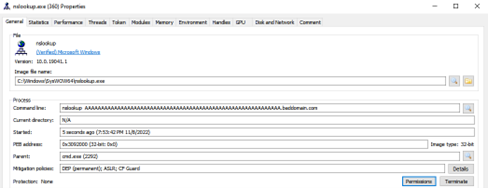

When we monitor the **fakedns** tool on our RemNux machine, we detect DNS requests here as well.

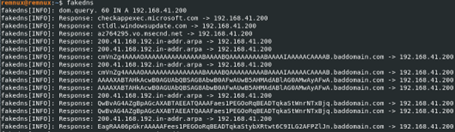

Then in the light of **HKLM/SAM,  nslookup, baddomain[.]com** information, Procmon tool by making the necessary filters and continue our analysis. First of all,  we look at the records that contain **"SAM"** in the Path  column, and here we find that a file named **"C:\ProgramData\sam.copy"**  has been created.

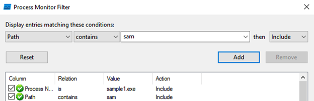

Then we think of the string **"cmd.exe"** that we saw, and when we look at the records whose Operation part  is **Process Create**  to  look at the process creations, we  first determine that the contents of the **HKLM/SAM**  registry are written to this file named **sam.copy** and then deleted.

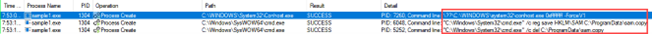

Based on our findings, we can conclude that this malware **reads the SAM registry**, converts its contents to  **Base64**, and then sends this Base64 value to the remote server with the **DNS Tunneling**  technique.

Thanks to Nurcan İLHAN for her great contribution to the preparation of this blog post.

