<h1 style="text-align:center"> Zararlı Yazılım Analizi Temelleri</h1>
<b>İçerik</b>

+	Zararlı yazılım lab ortamı hazırlama
+	Zararlı yazılım nedir?
+	Analiz türleri nelerdir?
+	Araç seti
+	C/C++ Kaynak dosyası derleme
+	Örnek

---
<h2 style="text-align:center"> Giriş</h2>

Yapılacak olan analizlerde kullanılmak üzere bir adet Windows ( 7/10 ) sanal makine, bir adet RemNux sanal makine gereklidir. Burada Windows olarak FlareVM kullanılabilir. Bu makinelerin kullanım amacına gelecek olursak;
1.	Yapacağımız analizler tehlikeli sonuçlar doğurabilecek aktivitelere yol açabilir. 
2.	Sistemlerin geri döndürülebilir olması gerekmektedir.
3.	Sistemlerin izlenebilir olması gerekmektedir.
4.	Hali hazırda kurulu olarak gelen araç setinin bulunması.
5.	Normal sistemleri taklit edebilme yeteneği.
Bu sanal makinelerin kurulumlarının yanısıra belirli network ayarları yaparak, sanal makineleri tamamen izole edeceğiz. Bunun bize faydası şu olacaktır; host cihazımıza sıçrayabilecek bir saldırının önüne geçebileceğiz ve analiz makinemiz üzerindeki network hareketlerini izleyebileceğiz.

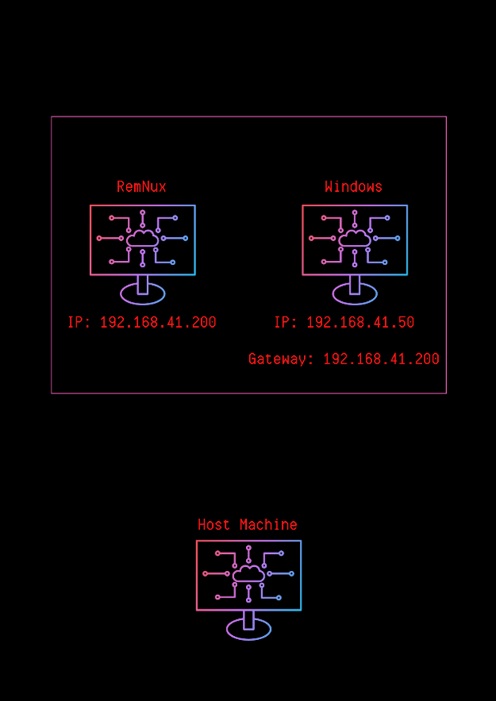

Kuracağımız mimari şekildeki gibi olacaktır. Windows cihazımızdan çıkan bütün trafik RemNux üzerinden geçecek ve aynı zamanda DNS server olarak da RemNux kullanılacaktır.

Bu blog serisinde hypervisor olarak VMWare Pro ürünü kullanılacaktır. 

---

<h2 style="text-align:center"> VMWare Ayarları</h2>

Yapacağımız network ayarlarının geçerli olması ve makinelerin host cihazdan izole edilmesi için gerekli adımlar şu şekildedir;

1. Virtual Network Editor aracılığıyla network oluşturma.

    + Edit -> Virtual Network Editor

   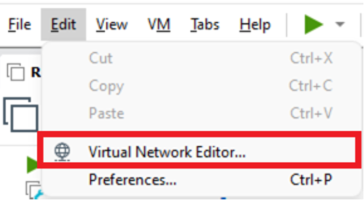

    + Change Settings
   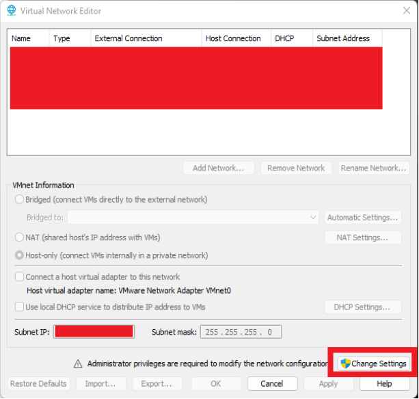
    + Add Network
   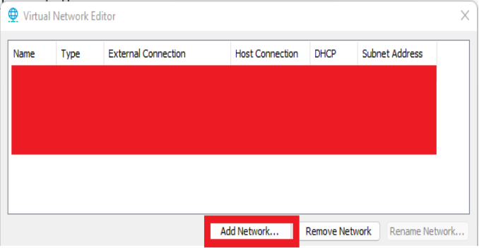
    + Görseldeki şekilde ayarlayıp kaydediyoruz. Sanal adaptörü bu network’e bağlamıyoruz, bunun sebebi sanal network’ümüzün host cihazımız ile bağlantısı olmamalı, DHCP servisini çalıştırmıyoruz, makinelere kendimiz manuel olarak IP ve Gateway ataması yapacağız.
   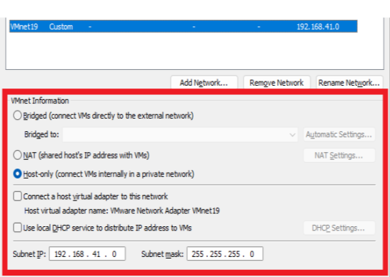
2. Makinelerin network ayarlarını yapma
   + Sanal makine ayarlarından subnet’e atama (iki makine için de yapıyoruz)
   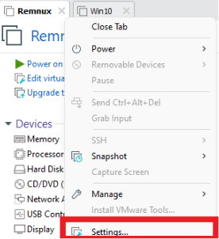

   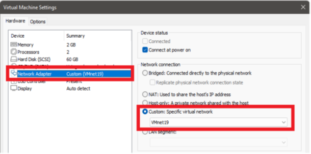

   + RemNux bir Linux dağıtımıdır. Burada cihaz üzerinde network ayarları yaparak kalıcı bir IP ataması da yapabilirsiniz ya da aşağıdaki komut yardımı ile statik IP ataması da yapabilirsiniz. Eğer statik IP ataması yapacak iseniz her defasında bu ayarları yapmamak için yaptıktan sonra makinenin bir snapshot’ını almanızı tavsiye ederim. Hem elinizde makinenin temiz hali olacaktır (geri döndürülebilir) hem de ayarları tekrar tekrar yapmak zorunda kalmayacaksınız.
   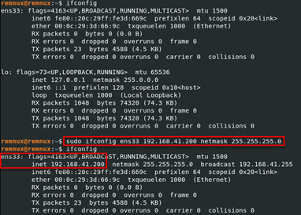
   + Windows cihazlarda statik IP atamasını; Ağ Bağlantıları -> Ethernet Arayüzü -> Ayarlar -> IPv4 kısmından yapacağız. Gateway ve DNS server olarak RemNux makinemizin IP’sini veriyoruz. Bunu yapmamızın sebebi ise RemNux üzerinde çalıştıracağımız toollar sayesinde hem network’ü dinleyebileceğiz hem de zararlı yazılımların kullandığı bazı kontrol mekanizmalarını atlatmayı sağlayacağız.

   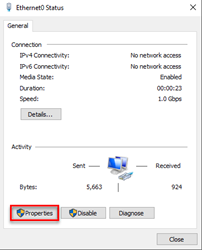

   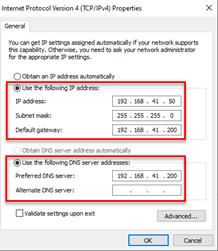

    + Windows Firewall üzerinde Dosya ve Yazıcı Paylaşımı IPv4 ayarlarını (Inbound-Outbound) aktifleştirip, ping atarak makineler arasındaki bağlantıyı kontrol edeceğiz.
    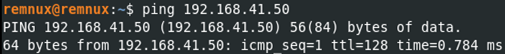

   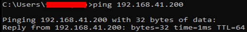
---
<h2 style="text-align:center"> Zararlı yazılım nedir?</h2>

Zararlı yazılım, kullanıcının **bilgisi** ve **isteği** dışında aktivite gerçekleştiren yazılımlara verilen isimdir. Burada yapılabilecek en net ve keskin tanım budur. Örneğin bir truva atı (trojan) türünü de, fidye yazılımlarını da bu tanımla açıklayabilirsiniz. Teknik özelliklerine baktığımızda ise; bilgi hırsızlığı, sistemlerin işleyişini bozma, sistemin bilgi dışı kullanımı (botnet), keylogger gibi aktiviteler bulunmaktadır. Bu aktivitelerden herhangi birini gerçekleştiren yazılımlara, zararlı yazılım denir.

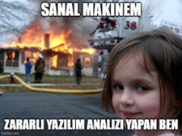

Bu bağlamda en sık yapılan yanlışlardan birisi de zararlı yazılım yerine “virüs” kelimesinin kullanılmasıdır. Bu konuyu en net şekilde açıklayan cümle şudur; “Her virüs (solucan) bir zararlı yazılımdır, her zararlı yazılım bir virüs değildir.”. Virüsler sistemler üzerinde yayılmayı hedefleyen zararlı yazılımlardır. Zararlı yazılımların geçmişine baktığımızda sadece yayılmayı hedefleyen türler de bulunmaktadır. Bkz. [**Creeper**](https://tr.wikipedia.org/wiki/Creeper) (1971). 

Zararlı yazılım türleri ise şunlardır;

1. **Trojan**: Truva atı olarak da adlandırılan Trojan’ler, legal bir uygulama gibi görünüp aslında zararlı aktiviteler gerçekleştiren zararlı yazılımlardır.
2. **RAT**: Remote Access Trojan, hedef sistemde yetki sahibi olmak için kullanılır ve amacı sisteme zarar vermek değil sistemden veri sızdırmaktır. Saldırgan kurban sistem üzerinde komutlar çalıştırabilir.
3. **Ransomware**: Fidye yazılımı olarak da bilinirler. Temel amaç kurbanın sistemindeki verileri okunamaz/erişilemez yapmak veya kurban sistemini kullanılamaz hale getirerek kurbanda panik-endişe yaratmak ve fidyeyi ödemesini sağlamaktır.
4. **Spyware**: Diğer bir adıyla Casus Yazılımlar, sisteme kurulan lisanslı ve güvenilir olan bir programın yanında kurulan yazılımlardır. Amaçları kullanım alanlarına göre özelleştirilebilir fakat temelde hedef hakkında bilgi toplayıp saldırgana göndermektir.
5. **Adware**: Kurbanın farkında olmadan pazarlama ya da reklam amaçlı bilgi toplayan ve arama motorları üzerinde yapılan manipülasyonlarla kullanıcıyı farklı sitelere yönlendiren veya pop-up çıkartan yazılımlardır.
6. **Rootkit**: Sistemde çalışan processler arasında kendini gizleyebilen, saldırgana uzaktan yetki sağlayan zararlı yazılımlardır.
7. **Virüs (Worm)**: Sistemler arası yayılmayı amaçlayan sistemin bütünlüğünü, erişilebilirliğini ve gizliliğini tehdit eden yazılımlardır.

---
<h2 style="text-align:center"> Zararlı Yazılım Analizi Teknikleri </h2>

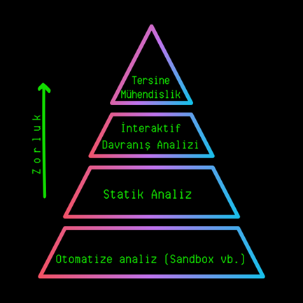

Yapılan analizlerde öncelikli hedefimiz en kısa yoldan gerekli bilgileri elde edebilmektir. Örneğin IOC (Indicator of Compromise) bilgisini almak için zararlı yazılım içerisindeki stringlerden direkt olarak IP veya Domain bilgisini almak, yazılımın çalıştırılıp içerisinde bağlantı kurulan kısmı bulmaktan çok daha kısa süren bir tekniktir. Yukarıdaki grafiğe bakıldığında, yukarı doğru gidildiğinde zorluk ve harcanan zaman artmaktadır. Bazen Sandbox kullanarak gereken tüm bilgilere erişebilecekken bazen tersine mühendislik yapıp zararlı yazılımın yapısını/işleyişini çözümleyip bu bilgilere erişmemiz gerekebilir. Burada analize başlamadan önce asıl amaç belirlenip, o noktaya odaklı bir şekilde analiz yapılması tavsiye edilir. Örneğin C&C sunucusunun IP/Domain bilgisinin ele geçirilmesi, şifreleme anahtarı/algoritmasının çözümlenmesi, cihaz içerisindeki dokunduğu noktalar gibi hedef belirlenmelidir. Yazılan bir zararlı yazılımın tüm kodlarını okuyup analiz etmek bazen günlerce/haftalarca sürebilir, bu yüzden amaç/hedef belirleyerek analiz yapmak bize zaman kazandıracaktır. 

Hiç bir zaman tek bir yol yoktur. Her zaman alternatif yollar oluşturabilmeli, alternatif araçlar kullanabilmeliyiz. Her bir zararlı yazılım kendine has özellikler barındırmaktadır. **Zararlı yazılımlar eşsiz sanat eserleridir**. Bu yüzden bu blog serisinde “Bir zararlı yazılıma nasıl yaklaşılmalıdır?” düşüncesi üzerine yoğunlaşılacaktır.

---

<h2 style="text-align:center"> Analiz Teknikleri </h2>

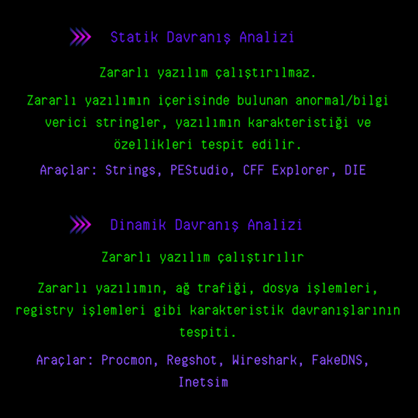

1. **Statik Davranış Analizi**: Burada asıl amaç, zararlı yazılım analizine başlamadan önce fikir edinmektir. Bu analiz biçimi, önceki bölümde bahsettiğimiz “amaç/hedef oluşturma” aşamasında önemli rol oynamaktadır. Programın çağırdığı DLL’ler, içerisinde bulunan stringler analiz edilerek yazılım hakkında bilgi edinilir. Örneğin ws32.dll dosyasını import eden bir yazılımın soket işlemleri yapacağını, buradan bir bilgi sızdırılması veya uzak sunucudan alınan komutların çalıştırılması durumu söz konusu olabilir. Bu bilgi ışığında amaç belirlenip bir sonraki aşamaya geçilebilir. Bu bize zaman kazandırmak açısından önemlidir.

2. **Dinamik Davranış Analizi**: Analiz/izleme araçları çalıştırıldıktan sonra zararlı yazılım çalıştırılır. Buradaki ana amaç, tersine mühendislik yapıp zaman harcamadan zararlı yazılımın davranışlarını tespit etmektir. Örneğin Procmon aracı çalıştırılarak yaptığı dosya ve registry gibi işlemleri tespit edebiliriz veya Wireshark/TCPView üzerinden yapılan bağlantıları izleyerek C&C sunucusunun bilgisini elde edebiliriz.

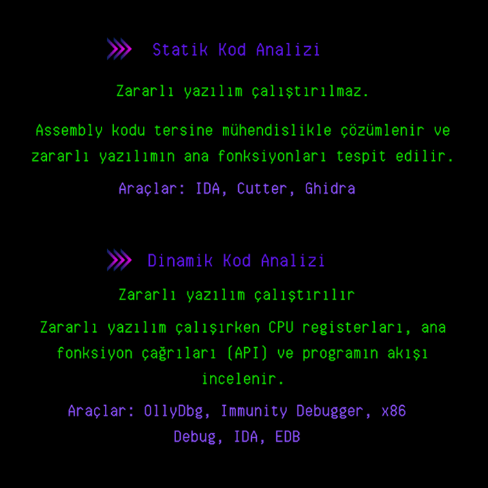

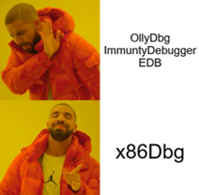

1. **Statik Kod Analizi**: İlk 2 adımda yeterince bilgiye ulaşmadığımız durumlarda bir sonraki aşama olan Statik Kod Analizine geçeriz. Burada çeşitli Dissassembler araçları kullanılarak zararlı yazılımın Assembly dilindeki kodlarını analiz ederiz. Buradaki asıl amaç programın işleyişini, ana fonksiyonlarını, API çağrılarını analiz ederek bir sonraki aşama olan Dinamik Kod analizi aşamasında analiz edeceğimiz/inceleyeceğimiz kısımları tespit etmektir.

2. **Dinamik Kod Analizi**: Debugger araçları yardımıyla programa çalışma anında müdahale edilerek yapılan analiz aşamasıdır (sonraki yazılarda bu araçların kullanımı detaylı olarak açıklanacaktır). CPU registerları, flagler, yüklenen değişkenler gibi programın akışını etkileyen durumları değiştirebildiğimiz, çalışma anında çözümlenen verilere erişebildiğimiz ve bunları manipüle edebildiğimiz analiz aşamasıdır.
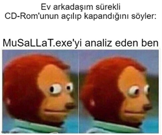

--- 
<h2 style="text-align:center"> Kullanılan Araçlar </h2>

Burada kullanılan araçların birden fazla alternatifi vardır. Nasıl bir inşaat ustası kendini çalışırken rahat hissedeceği araç setini oluşturuyorsa, zararlı yazılım analizinde de aynı mantık geçerlidir. Hangi araç sizin için daha kullanışlı ve rahat ise onu seçebilirsiniz :)

1. **Strings**: Sysinternals araçlarından birisidir. Çalıştırılabilir dosyanın içerisindeki okunabilir karakterlerden oluşan stringleri ekrana çıktı olarak verir.
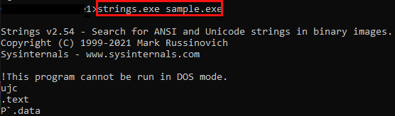

2. **CFF**: Statik analiz aracıdır. Dosyanın karakteristik bilgilerine erişebildiğimiz (derlenen işlemci türü, DLL veya EXE olduğu, boyutu, hash değeri vs.), çağrılan DLL’lerin veya dışa aktarılan fonksiyonların bilgisini ve bunların yanında bir çok yararlı bilgi barındırır.
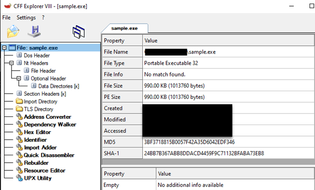 

3. **PEStudio**: Statik analiz aracıdır. CFF Explorer’ın sunduğu bütün özelliklerini sunmasının yanında, VirusTotal üzerinden dosyayı taratarak çıktı sunabilmektedir. CFF’e göre .NET kısmında daha yetenekli bir araçtır.
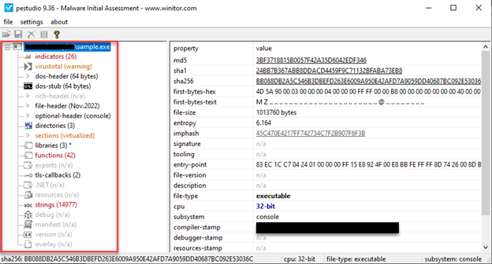 

4. **DIE**: Genellikle paketli yazılımları tespit etmek için kullanılır. Burada section isimleri, entropi (düzensizlik) değeri ve bazı bilinen paketleme yazılımlarının imzaları kontrol edilerek tespit yapılmaktadır. Entropi, bir çalıştırılabilir dosyanın içerisinde bulunan makine kodlarının düzensizliğini temsil eder. Burada şöyle bir teori vardır. Yazılan bir yazılımda genellikle fonksiyonlar/konsept belirlidir ve entropi değeri ortalama olarak %40-70 arasıdır. %70 ve üzeri entropi değeri şüphelidir. Bunun sebebi ise şudur; paketleme mantığına baktığımızda, çalıştırılabilir dosya içerisindeki bölümlerin şifrelenip yeni dosya oluşturulduğunda içerisine şifreli bölüm ve şifreyi çözmekle sorumlu kod bloğu yerleştirilir. Çalışma anında şifreli kısım deşifre edilerek çalıştırılır. Şifrelenen kısımlarda entropi değeri son derece yüksektir. Bu araç buradaki düzensizliği hesaplayarak bize yazılımın paketli olup olmadığı konusunda bilgi verir.
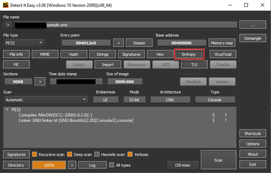 

    Yukarıdaki görselde aracın arayüzü sunulmuştur. “Entropy” butonuna tıklayarak düzensizlik durumu analiz edilebilir. Burada section isimleri de bizim için ipucu olabilir. Örneğin aşağıdaki entropi penceresine baktığımızda section isimlerinin “UPX” olduğunu görmekteyiz. Arama motorundan UPX kelimesini arattığımızda bir paketleme yazılımı olduğunu tespit edebiliriz. İlerleyen yazılarda bu section isimlerinin nasıl olması gerektiği, hangi sectionların ne gibi bilgiler içerdiği açıklanacaktır.
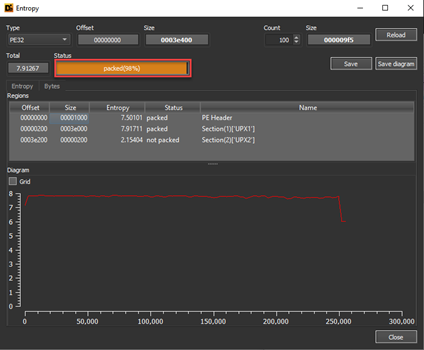 

5. **Process Hacker**: Çalışan prosesleri anlık olarak inceleyebildiğimiz bir araçtır. Bunun yanısıra çalışan proseslerin anlık hafıza bölümlerine, yetki durumlarına, handle olarak aldığı değerleri vb. yararlı bilgileri bize sunar.
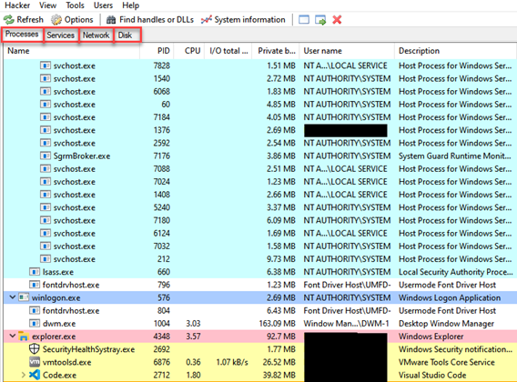

6. **Regshot**: Birçok zararlı yazılım kayıt defteri üzerinde değişiklikler yapmaktadır. Regshot aracı bu değişiklikleri bize rapor olarak sunar. Zararlı yazılımı çalıştırmadan önce kayıt defterinin bir kopyası alınır, ardından yazılım çalıştırılıp aktivitelerini bitirmesi beklenir, ikinci bir kopya alınır. Karşılaştır dediğimizde araç bize bu iki kopyayı karşılaştırarak farklılıkları sunar.
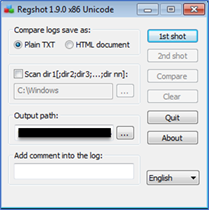

7. **Procmon**: Sysinternals araçlarından birisi olan Procmon, çalışan proseslerin yaptığı belirli sistem çağrılarını izleyerek bize anlık raporlama sunar. Burada bütün işlemleri kaydedip sonrasında zararlı yazılımın yaptığı dosya işlemleri, kayıt defteri değişiklikleri, proses işlemleri gibi bilgiler elde edilebilir. Birçok filtre seçeneği bulunmaktadır.
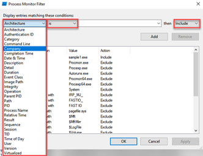
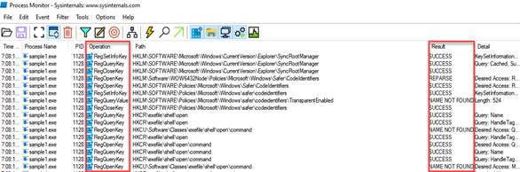

8. **HxD**: Hexadecimal editleme aracıdır. Herhangi bir dosyanın hexadecimal olarak içeriğini görüntüleyebildiğimiz ve değişiklik yapabildiğimiz bir araçtır.
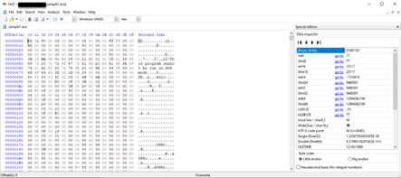

9. **IDA**: Interactive Dissassembler aracı, hem dissassemble hem de debugger özelliği vardır. Dosyanın stringlerine, çağrılan fonksiyonlarına, dışa aktarılan ve tanımlanmış fonksiyonlara vb. onlarca arayüze sahip olan araçtır. Genellikle statik kod analizi aşamasında kullanılır. Programın akışını çözmek ve API çağrılarını takip etmek için güzel bir seçenektir. Bu aracın kullanımına ilerdeki blog yazılarında detaylı olarak değinilecektir.
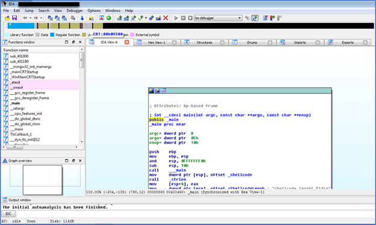

10. **x86Debugger**: Çalıştırılabilir dosyaları çalışma anında analiz edebilmemize yarayan araçtır. Bu aracın kullanımına ilerdeki blog yazılarında detaylı olarak değinilecektir.
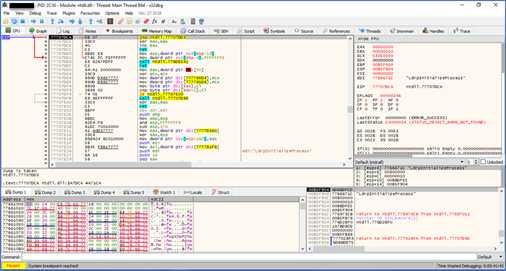

11. **TCPView**: Cihaz üzerindeki TCP/UDP bağlantılarını anlık olarak izleyebildiğimiz araçtır.
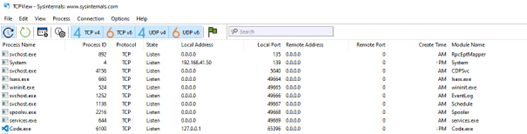

12. **Wireshark**: Network paketlerini anlık olarak izleyebildiğimiz ve sonrasında oluşturulan kaydın bir kopyasını alabildiğimiz bir araçtır.
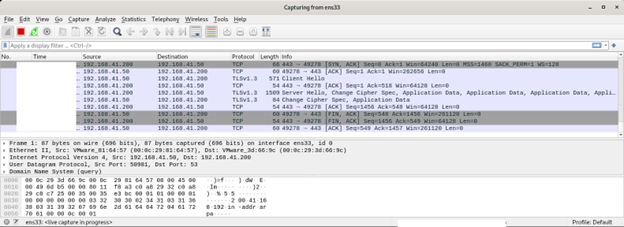

13. **Inetsim**: Belirli portları simüle ederek oluşturduğumuz sanal ağı gerçek ağ gibi simüle etmemizi sağlayan araçtır. Bu tool üzerinde çok sayıda konfigürasyon yapılabilir. Farklı bir port açılabilir, port yönlendirmesi yapılabilir, bir port kapatılabilir vs. Simülasyonu durdurduğumuzda ise bize simülasyon boyunca yollanılan paketlerin içeriğini sunmaktadır.
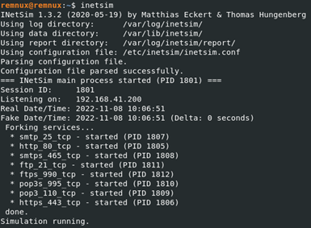

14. **Fakedns**: RemNux makinemizin DNS Serveri gibi davranmasını sağlamaktadır. En basit anti-vm tekniklerinden birisi olan internet bağlantısı kontrolüne baktığımızda, zararlı yazılım basitçe “google.com”a bir DNS sorgusu yapar, eğer bu sorgunun sonucu dönmezse bir internet bağlantısı olmadığını anlayan zararlı yazılım asıl işlevlerini gerçekleştirmeyip kendisini sonlandırabilir. Bu da bir analisti yanlış yönlendirmeye yarar. Bu gibi teknikleri atlatmak ve DNS sorgularını incelemek için kullanılan son derece faydalı bir araçtır.
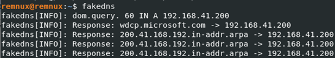

---
<h2 style="text-align:center"> Komut Satırından C/C++ Kaynak Kodu Derleme </h2>

Zararlı yazılım analizi konusunda kendisini geliştirmek isteyen kişiler, bilinen teknikleri ve zararlı yazılımlar tarafından çokça kullanılan API’ları kullanarak C/C++ dilinde zararlı yazılım geliştirip ardından çalıştırılabilir dosyayı analiz etmelerini tavsiye ederim. Bu hem bir zararlı yazılımın nasıl yazıldığı konusunda az da olsa fikir verir hem de yazdığınız zararlı yazılımın dissassamble edildiğinde nasıl gözüktüğünü anlamak önemli ölçüde gelişim sağlayacaktır. Bu bağlamda komut satırından nasıl C/C++ kaynak kodlarını derleyebileceğimize bakalım. Öncelikle MinGW yükleyip ardından “MinGW/bin/” dizinini sistem çevre birimlerindeki PATH kısmına ekliyoruz. Bu şekilde “MinGW/bin/” dizinindeki “g++.exe” uygulamasını her dizinden çalıştırabiliriz. 
Kullanacağımız komut satırı şu şekilde olacaktır:
**g++ --std-c++11 file.cpp -o file.exe -s -lws2_32 -Wno-write-strings -fno-exceptions -fmerge-all-constants -static-libstdc++ -static-libgcc**

Burada kullanılan parametreler ise şu anlamlara gelmektedir:

**-std=c++11** C++ 11'i kullanacağımızı gösterir. C++17 ile derlemek bize stringden integer’a hızlı dönüştürme, Case:break koşullarında sayıları kullanma gibi yeni özellikler sunuyor, ancak aynı zamanda dosyanın boyutunu da artırıyor. C++17 ile derlemek bize dosyanın son boyutu olarak 32Kb'lik bir boyut verirken, C++11 24Kb boyutunu verdi. Bundan dolayı C++11 kullanacağız.

**-s** dosyada kalan meta verileri, debug sembollerini, dosyanın nerede derlendiği hakkındaki bilgileri, derleyicinin kullanıcı adını, derleyicinin ana bilgisayar adını, derlendiği dizini vb. Dosyanın içerisinden çıkarır.
**İpucu**: Son dosyayı derlerken, yazarın ve kodlama ortamının izini bırakmaması için her zaman temiz yükleme ile yeni bir VM'de yaptığınızdan emin olun.

**-Wno-write-strings** string’i char'a dönüştürmek için gereklidir. Bu yalnızca dosyayı debug edeceğimizde işe yaracaktır. Son derleme sırasında **strings.h** veya **iostream** header’ını kullanmayacağımız için bunun bir etkisi yoktur.

**-fno-exceptions** derlenen dosyada exception olmadığını derleyiciye belirtmek için kullanılır. Exception etkinleştirilirse, dosyanın yürütülmesini yavaşlatır. Kötü amaçlı yazılımlarda istisnalar kullanmamanın ana nedeni budur.

**-fmerge-all-constants** tüm sabit dizileri/integer değerleri ve karakterleri birleştirecek ve initialize edecektir. Bu seçenek tüm adresleri birleştirecek ve bilinen bir konumda saklayacak ve böylece konumlara erişmek daha hızlı olacaktır.

**-static-libstdc++** ve **-static-libgcc** C ve C++ üstbilgilerini bir C++ programında statik olarak derlemek için kullanılır. C ve C++ kodlama dilleri yapı olarak birbirlerine benzediği için, bu parametreler bu yüzden kullanışlı olacaktır. Ayrıca, dinamik bağlantılar gerçekleştirildiğinde, antivirüslerin dosyayı kötü amaçlı olarak algılaması daha kolaydır.

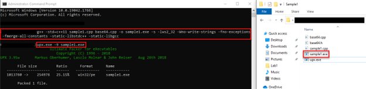

Ardından dosyanın boyutunu azaltmak ve tespit/analizini zorlaştırmak için UPX paketleme algoritması ile paketliyoruz.

Buradaki bilgileri almamı sağlayan Chetan Nayak’a teşekkürler. Daha detaylı bilgi için [tıklayınız](https://niiconsulting.com/checkmate/2018/03/malware-development-welcome-dark-side-part-2-2/)

---
<h2 style="text-align:center"> Örnek Analiz Adımları </h2>

Bir yazılımda ilk bakmamız gereken şey türüdür. Uzantısının “.exe” olması bu yazılımı çalıştırılabilir yapması adına tek başına yeterli değildir. Uzantılar bizi yanıltamaz! CFF aracından dosyanın karakteristiğine baktığımızda bir çalıştırılabilir dosya olduğu ve 32bit mimaride derlendiğini tespit ediyoruz.
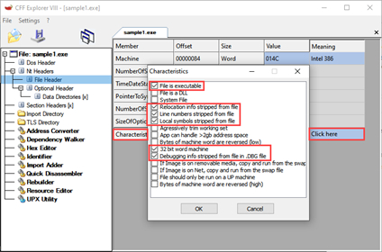
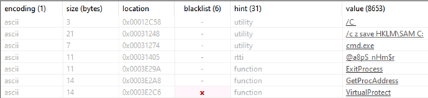

PEStudio aracıyla stringlere baktığımızda **“cmd.exe” “/c z save HKLM\SAM"** gibi stringler dikkatimizi çekiyor, daha dosyayı çalıştırmadan **“cmd.exe”** ile bir komut çalıştırabileceğini düşünüyoruz ve analizimize bunu aklımızda tutarak devam ediyoruz. Bir sonraki bakmamız gereken nokta yazılımın paketli olup olmadığı, bunun için DIE aracı yardımıyla dosyayı analiz ediyoruz ve ekran görüntüsünde görüldüğü üzere **“UPX”** isminde bir paketleme yazılımı ile paketlendiğini bize söylüyor. Entropi kısmına baktığımızda ise oldukça yüksek bir değere sahip olduğu ve paketli olduğunu bize söylüyor.

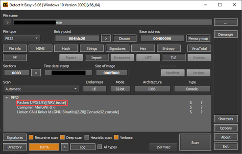
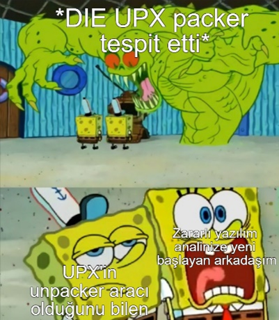
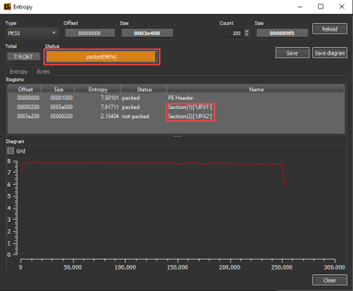
Buradan sonra analizimize UPX çözümleme aracıyla dosyanın orjinal halini elde edip devam edebiliriz fakat paketlenmiş bir yazılımın nasıl gözüktüğünü göstermek amacıyla normal devam ediyoruz.
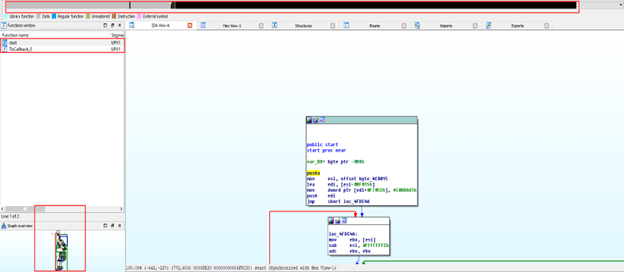
IDA aracıyla dosyayı analiz ettiğimizde, 2 adet fonksiyon olduğunu görmekteyiz. Bu normal bir dosya için imkansıza yakın bir olaydır. Yukarıdaki bara baktığımızda gri kısımlar veri tanımlamasının olduğu kısımları temsil etmektedir. Bu kadar büyük oranda veri tanımlamasının olduğu bir yazılımın paketli olduğundan şüphelenebiliriz. Debugger kullanımı ve dinamik analiz sonraki blog yazılarının konusu olacağı için x86Debugger ve dinamik analiz aşamasına geçmiyoruz.

Analiz adımlarından birisi olan **Dinamik Davranışsal Analiz** aşamasını uygulamak üzere yazılımımızı çalıştırmadan önce; RemNux makinemizde **“fakedns, inetsim ve Wireshark”** araçlarını, Windows makinemizde **“Procmon, Process Hacker ve TCPView”** araçlarını çalıştırıyoruz fakat çalıştırdığımızda zararlı yazılım herhangi bir aktivite gerçekleştirmediğini tespit ediyoruz. Burada şunu unutmamak gerekir. **Zararlı yazılımlar çocuk gibidir, istediğini vermezseniz başınız ağrır.** Ne demek istiyorum? Zararlı yazılımlar belirli koşulları arıyor olabilir, koşullar sağlanmadığında asıl aktivitelerini gerçekleştirmeyebilir. Burada normal kullanıcı yetkisi-yönetici yetkisi ile, Windows 10-Windows 7 gibi farklı koşullar sağlanarak deneyebiliriz veya çalışmasına engel olan işlemi bularak bu şartı sağlayabiliriz. Burada PEStudio aracında gördüğümüz **“HKLM/SAM”** stringi aklımıza geliyor ve şunu biliyoruz ki yönetici yektisi olmadan bu kayıt defterine erişemeyiz. Bundan dolayı normal kullanıcı yetkisi ile çalıştırdığımızda bu yazılım çalışmayacaktır. Yönetici yetkisi ile çalıştırarak izlemeye başlıyoruz. Öncelikle Process Hacker aracına baktığımızda birden çok **nslookup.exe** çalıştırıldığını tespit ediyoruz.
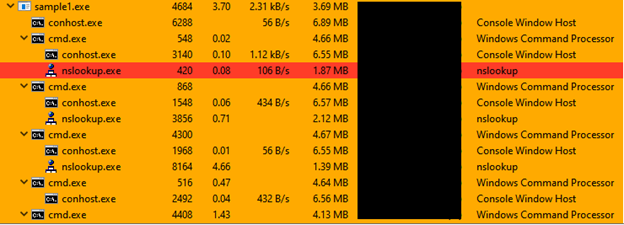

Process hacker aracından çalıştırılan herhangi bir **nslookup.exe** prosesine baktığımızda aşağıdaki sonucu elde ediyoruz.
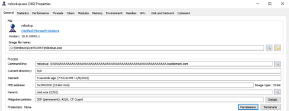

RemNux makinemizdeki **fakedns** aracını izlediğimizde ise DNS isteklerini burada da tespit etmiş oluyoruz.
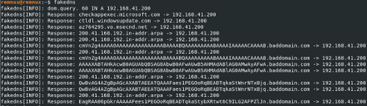

Ardından **HKLM/SAM**, **nslookup**, **baddomain[.]com** bilgilerinin ışığında Procmon aracımda gerekli filtrelemeleri yaparak analizimize devam ediyoruz. Öncelikle **Path** sütununda **“sam”** içeren kayıtlara bakıyoruz ve burada **“C:\ProgramData\sam.copy”** isminde bir dosya oluşturulduğunu tespit ediyoruz.

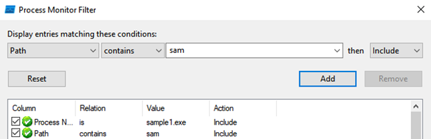
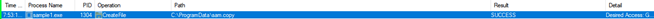
Ardından gördüğümüz **“cmd.exe”** stringi aklımıza geliyor ve proses oluşumlarına bakmak için **Operation** kısmı **Process Create** olan kayıtlara baktığımızda öncelikle **HKLM/SAM** kayıt defterinin içeriğinin bu **sam.copy** isimli dosyaya yazıldığı ve sonrasında silindiğini tespit ediyoruz.
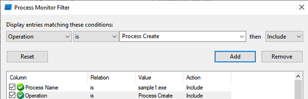

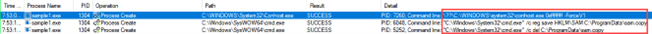

Bulduğumuz bulgular ışığında şu sonucu çıkarabiliyoruz, bu zararlı yazılım; **SAM** kayıt defterini okuyup içeriğini Base64’e çevirdiğini ve ardından **DNS Tünelleme** tekniği ile birlikte bu Base64 değerini uzak sunucuya gönderdiğini tespit etmiş olduk.

Bu blog yazısının hazırlanmasında büyük emeği geçen Nurcan İLHAN’a teşekkürler.

---

Eleştiri/düzeltme/öneri için lütfen iletişim adreslerimden bana ulaşınız. Yorumlarınız benim için değerli :)