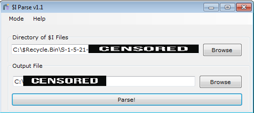
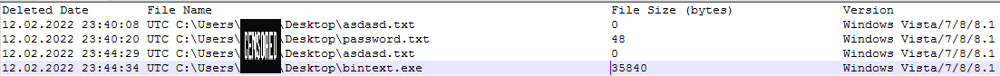
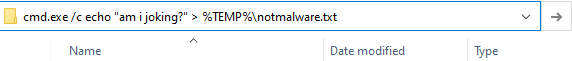
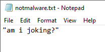
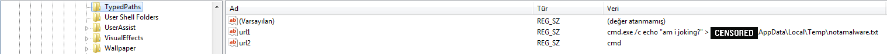

# İçerik

- RecycleBin Analizi
- TypedPaths
- ShellBags

---

<h1 style="text-align:center"> RecycleBin Nedir? Nasıl Analiz Edilir?</h1>

Windows sistemlerde bulunan RecycleBin yani Geri Dönüşüm Kutusu kullanıcının sildiği dosyaları saklamak için oluşturulmuş bir dizin/mekanizmadır. Nasıl ki çöp kutusu bir evin aynası ise bilgisayarların aynası da geri dönüşüm kutularıdır. Geri Dönüşüm Kutusu yapılan adli bilişim ve olay müdahalesi aşamasında oldukça önemli deliller barındırır. Burada analiz edilebilecek olan dosyalar "DEL" tuşuyla veya sağ tıklayıp sil butonuna tıklanarak silinen dosyalardır. "SHIFT+DEL" makrosu ile silinen dosyalara erişmek farklı yöntemler gerektirmektedir.

Masaüstünde bulunan "Geri Dönüşüm Kutusu" klasörü haricinde **"C:\\$Recycle.bin"** dizini içerisinde **"SID\\$I<rastgele 6 karakter>"** ve **"SID\\$R<rastgele 6 karakter>"** şeklinde iki tür dosya bulunmaktadır. **"$R"** ile başlayan dosyalar, silinen dosyanın orjinal halini barındırırken **"$I"** ile başlayan dosyalar, aynı isimdeki (rastgele 6 karakterlik kısmın aynı olduğu) **"$R"** dosyasının metadatasını içermektedir.

**"$I"** dosyaları şu verileri içermektedir;

+ Silinen Dosyanın Silinme Tarihi
+ Silinen Dosyanın Boyutu
+ Silinen Dosyanın Tam Dosya Yolu

**$I Parse** [1]

$I dosyalarını analiz etmemize yardımcı olan araçtır. **$Recycle.bin** dizinine erişmek için uygulama yönetici olarak çalıştırılması gerekmektedir.

Çıktı dosyasının sonucu işe şu şekildedir: 

---
<h1 style="text-align:center"> TypedPaths Nedir? Nasıl Analiz Edilir?</h1>

Windows dosya yöneticisinde bulunan dosya yolu kısmından yapılan son 25 aramanın kaydının tutulduğu kayıt defteri anahtarıdır. Buradan yapılan aramaların kayıt defteri anahtarına kaydedilmesi için kullanıcının dosya yöneticisin kapatması gerekmektedir. **"HKCU\Software\Microsoft\Windows\CurrentVersion\Explorer\TypedPaths"** kayıt defteri anahtarı altında bulunmaktadır. 

Şimdi bu ne işimize yarayacak? Zararlı yazılım penceresinden bakalım :) Örneğin bir dizinde komut satırı çalıştırmak istiyorsunuz. Bunun için **cmd.exe** çalıştırıp dizin değiştirmek yerine dosya yolu kısmına **cmd.exe** yazıp enter'a bastığımızda o dizinde bir komut satırı açılmaktadır. Buradan şunu anlıyoruz, dosya yolu kısmına komut yazıp çalıştırabiliyoruz :) Hemen deneyelim :)

Bu şekilde yazıp çalıştırdığımızda komut penceresi açılmadan istediğimiz komutu çalıştırabiliyoruz. Pekala bakalım işlemimiz istediğimiz gibi gerçekleşmiş mi? 

İşlem başarılı :) Şimdi bir de kayıt defteri üzerinde oluşan kayda bakalım. 

---

<h1 style="text-align:center"> ShellBags Nedir? Nasıl Analiz Edilir?</h1>

Windows sistemlerde açılan dosya pencerelerinin boyutu ve konumunun kaydını tutan kalıntıdır. Şimdi neden bunun önemli olduğunu soruyorsunuz biliyorum. Silinen bir dosyanın/dizinin açılıp açılmadığı hakkında bilgi sunduğu için bizim için kanıt niteliği taşımaktadır. **"HKCR\Local Settings\Software\Microsoft\Windows\Shell\Bags\"** içerisinde dosya gezgini hiyerarşisi şeklinde saklanır. Her bir klasör bir öncekinin alt veya üst dizinini temsil eder. Burada 3 adet veri bulunmaktadır. Bunlar; MRUListEx, NodeSlot, NodeSlots;

+ MRUListEx, BagMRU sıralama sistemindeki her alt klasöre son erişilme sırasını gösteren 4 bytelık bir değer içerir. Örneğin bir klasörün 4 adet alt klasörü varsa ve en son erişilen 3 ise, MRUListEx önce 3 sonra 0,1,2 şeklinde doğru erişim sırasını listeler.

+ NodeSlot, Bags kayıt defteri anahtarı ve o klasör için orada saklanan belirli bir görünüm ayarına karşılık gelmektedir. 

+ NodeSlots, yalnızca ana BagMRU alt anahtarında bulunur ve her yeni kayıt eklendiğinde güncellenir. [2]

Buradaki kayıtları incelemek için **Eric Zimmerman** tarafından yazılan **ShellBags Explorer** aracı kullanılabilir. 

---

Eleştiri/düzeltme/öneri için lütfen iletişim adreslerimden bana ulaşınız. Yorumlarınız benim için değerli :)

---

# Referans

[1] df-stream[.]com/recycle-bin-i-parser/

[2] www[.]magnetforensics.com/blog/forensic-analysis-of-windows-shellbags/