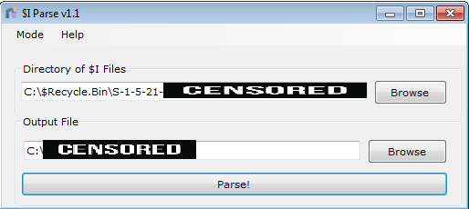
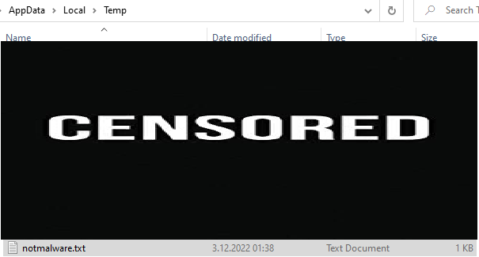

# Content

- RecycleBin 
- TypedPaths
- ShellBags

---

<h1 style="text-align:center"> What is RecycleBin? How to Analyze?</h1>

RecycleBin, which is available on Windows systems, is a directory/mechanism created to store the files that the user deletes. Just as a trash can is the mirror of a house, the mirror of computers is a recycle bin. The Recycle Bin contains very important evidence during the forensic and incident intervention phase. The files that can be analyzed here are those that have been deleted with the "DEL" button or by right-clicking on the delete button. Accessing deleted files with the "SHIFT+DEL" macro requires different methods.

Apart from the "Recycle Bin" folder on the desktop, there are two types of files in the **"C:\\$Recycle.bin"** directory: **"SID\\$I<6 random characters>"** and **"SID\\$R<random 6 characters>"**. Files that begin with **"$R"** contain the original version of the deleted file, while files that begin with **"$I"** contain metadata of the **"$R"** file of the same name (where the random 6 characters are the same).

**"$I"** files contain the following data;

+ Date of Deleted File Deleted
+ Size of Deleted File
+ Full file path of deleted file

**$I Parse** [1]

It is the tool that helps us analyze $I files. The application must be run as an administrator to access the **$Recycle.bin** directory.

The result of the output file is as follows: 

---
<h1 style="text-align:center"> What is TypedPaths? How to Analyze?</h1>

This is the registry key that keeps a record of the last 25 searches  file path section from the Windows File Manager. In order for searches made from here to be recorded in the registry key, the user must close the file manager. **HKCU\Software\Microsoft\Windows\CurrentVersion\Explorer\TypedPaths"** is located under the registry key. 

Now what is this going to do? Let's look at the malware window :) For example, you want to run a command line in a directory. For this, instead of running **cmd.exe** and changing the directory, when we type **cmd.exe** in  the file path and  press enter, a command line opens in that directory. From this we understand that we can write and run commands in the file path :) Let's try it right away, :)

When we write and run it in this way, we can run the command we want without opening the command window. Well, let's see if our transaction went the way we wanted.

Operation successful :) Now let's look at the record that occurs on the registry. 

---

<h1 style="text-align:center"> What is ShellBags? How to Analyze?</h1>

It is the artifact that keeps a record of the size and location of file windows opened on Windows systems. Now I know you're asking why this is important. It is evidence for us as it provides information about whether a deleted file/directory has been opened or not. Keep records on **HKCR\Local Settings\Software\Microsoft\Windows\Shell\Bags\"** as a file explorer hierarchy. Each folder represents the parent or child directory of the previous one. There are 3 pieces of data here. These; MRUListEx, NodeSlots, NodeSlots;

+ MRUListEx contains a 4-byte value that indicates the last accessed order of each subfolder in the BagMRU queuing system. For example, if a folder has 4 subfolders and the most recently accessed is 3, MRUListEx lists the correct access order as 3 and then 0,1,2.

+ NodeSlot corresponds to the Bags registry key and a specific view setting stored there for that folder. 

+ NodeSlots exist only in the main BagMRU subkey and are updated every time a new record is added. [2]

The **ShellBags Explorer** tool  by **Eric Zimmerman** can be used  to review the records here.

---

Please contact me at my contact addresses for criticism/correction/suggestion. Your comments are valuable to me :)
---

# Reference

[1] df-stream[.]com/recycle-bin-i-parser/

[2] www[.]magnetforensics.com/blog/forensic-analysis-of-windows-shellbags/

