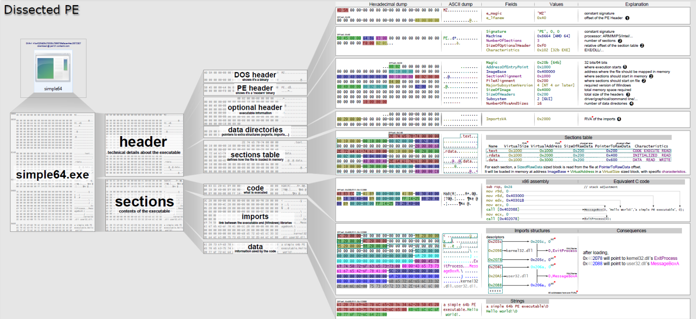
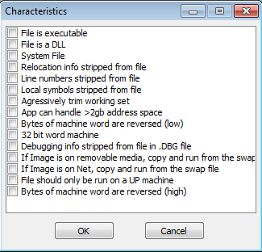
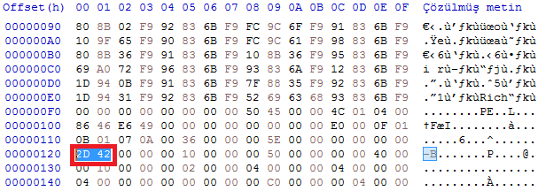
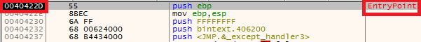
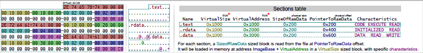

# What is PE ?

PE (Portable Executable) are files that can be moved and run between Windows systems without compatibility problems. To be portable, a common language/architecture must be defined for all devices, data that means "A" on one device must mean "A" on another device. Here, too, an architecture emerges. For example, at the 0x24 address of a portable file, it is known by all devices that the ImageBase data is represented, and the file is interpreted and executed accordingly. In this article, we will look at what is present in a PE structure in general terms and what they mean.

" The Portable Executable (PE) format is a file format for executables, object code, DLLs and others used in 32-bit and 64-bit versions of Windows operating systems. The PE format is a data structure that encapsulates the information necessary for the Windows OS loader to manage the wrapped executable code. This includes dynamic library references for linking, API export and import tables, resource management data and thread-local storage (TLS) data. On NT operating systems, the PE format is used for EXE, DLL, SYS (device driver), MUI and other file types." **[1]**

---



In the image above, the detailed structure of a PE is visualized by Ange Albertini **[2]** . Today, various tools analyze this structure and present the appropriate output to analysts. Examples of these tools include PEBear, CFF Explorer, PEStudio, etc. So why is the information here important to us? It guides us on issues such as "What does it mean if the difference between Raw Size and Virtual Size is high?" which we will talk about in the following sections and provides certain evidence. 

# Virtual Adress (VA) vs Relative Virtual Adress (RVA)

Virtual Address is the memory address assigned to an application. Applications running on the device cannot directly access physical memory, only virtually created memory. This virtualization structure created for the management of the RAM of the devices provides flexibility to the applications, making it easier to manage their own memory and at the same time providing security over the physical memory.

Relative Virtual Address is the difference between two Virtual Addresses. Virtual Adress shows the actual address of the application on the memory but references the Relative Virtual Adress Image Base. So we come across the equation => ** RVA= VA - Image Base**. For example; Whether our application's Image Base is 0x400000 (usually the default Image Base address of user mode applications) and our Virtual Address is 0x00401000. In this case, our RVA value is 0x00001000.

---

# DOS Headers
DOS Header is a 64-byte data structure and is located at the top of an executable file. This part, which does not affect the functionality of the file, was created so that the file does not pose a compatibility problem. When run on MS-DOS, the MS-DOS Stub message **"This program cannot be run in DOS mode" is shown instead of the actual  program. Any PE file will not work without this header. the 64-byte data content is as follows: 

```
typedef struct _IMAGE_DOS_HEADER {      // DOS .EXE header
    WORD   e_magic;                     // Magic number
    WORD   e_cblp;                      // Bytes on last page of file
    WORD   e_cp;                        // Pages in file
    WORD   e_crlc;                      // Relocations
    WORD   e_cparhdr;                   // Size of header in paragraphs
    WORD   e_minalloc;                  // Minimum extra paragraphs needed
    WORD   e_maxalloc;                  // Maximum extra paragraphs needed
    WORD   e_ss;                        // Initial (relative) SS value
    WORD   e_sp;                        // Initial SP value
    WORD   e_csum;                      // Checksum
    WORD   e_ip;                        // Initial IP value
    WORD   e_cs;                        // Initial (relative) CS value
    WORD   e_lfarlc;                    // File address of relocation table
    WORD   e_ovno;                      // Overlay number
    WORD   e_res[4];                    // Reserved words
    WORD   e_oemid;                     // OEM identifier (for e_oeminfo)
    WORD   e_oeminfo;                   // OEM information; e_oemid specific
    WORD   e_res2[10];                  // Reserved words
    LONG   e_lfanew;                    // File address of new exe header
  } IMAGE_DOS_HEADER, *PIMAGE_DOS_HEADER;   
``` 
**[3]**

There are 2 important values for us here; 

1. e_magic: It is the first element of the DOS Header and has a constant 0x5A4D (MZ) value. This value tells us that it is a PE file. 
2. e_lfanew: It is the last element of the DOS Header and holds the starting address of the NT Headers. 


---

# COFF File Header

It is the part that comes at the beginning of a PE file or immediately after its signature. 

| Offset | Size | Name| Description|
|--------|-------|------|---------|
|0 | 2 | Machine | The number that identifies the type of target machine. For more information, ([see Machine Types](https://learn.microsoft.com/en-us/windows/win32/debug/pe-format#machine-types)) |
|2 | 2 | NumberOfSections| The number of sections. This indicates the size of the section table, which immediately follows the headers. | 
|4 | 4 | TimeDateStamp The low 32 bits of the number of seconds since 00:00 January 1, 1970 (a C run-time time_t value), which indicates when the file was created.|
|8 | 4 | PointerToSymbolTable| The file offset of the COFF symbol table, or zero if no COFF symbol table is present. This value should be zero for an image because COFF debugging information is deprecated.|
|12 | 4 | NumberOfSymbols | The number of entries in the symbol table. This data can be used to locate the string table, which immediately follows the symbol table. This value should be zero for an image because COFF debugging information is deprecated. | 
|16 | 2 | SizeOfOptionalHeader | The size of the optional header, which is required for executable files but not for object files. This value should be zero for an object file| 
|18 | 2 | Characteristics | The flags that indicate the attributes of the file.| 

**[4]**

The values in the File Characteristics section are as follows:



---

# Optional Headers

```
typedef struct _IMAGE_OPTIONAL_HEADER {
  WORD                 Magic;
  BYTE                 MajorLinkerVersion;
  BYTE                 MinorLinkerVersion;
  DWORD                SizeOfCode;
  DWORD                SizeOfInitializedData;
  DWORD                SizeOfUninitializedData;
  DWORD                AddressOfEntryPoint;
  DWORD                BaseOfCode;
  DWORD                BaseOfData;
  DWORD                ImageBase;
  DWORD                SectionAlignment;
  DWORD                FileAlignment;
  WORD                 MajorOperatingSystemVersion;
  WORD                 MinorOperatingSystemVersion;
  WORD                 MajorImageVersion;
  WORD                 MinorImageVersion;
  WORD                 MajorSubsystemVersion;
  WORD                 MinorSubsystemVersion;
  DWORD                Win32VersionValue;
  DWORD                SizeOfImage;
  DWORD                SizeOfHeaders;
  DWORD                CheckSum;
  WORD                 Subsystem;
  WORD                 DllCharacteristics;
  DWORD                SizeOfStackReserve;
  DWORD                SizeOfStackCommit;
  DWORD                SizeOfHeapReserve;
  DWORD                SizeOfHeapCommit;
  DWORD                LoaderFlags;
  DWORD                NumberOfRvaAndSizes;
  IMAGE_DATA_DIRECTORY DataDirectory[IMAGE_NUMBEROF_DIRECTORY_ENTRIES];
} IMAGE_OPTIONAL_HEADER32, *PIMAGE_OPTIONAL_HEADER32; 
```
**WORD** stands for 16 bits (2 bytes) unsigned number, **DWORD** stands for 32 bits (4 bytes) of unsigned number. 

In general, important data include:

**Magic**: Specifies the type of image file. 0x010B indicates that the image file is 32-bit, 0x020B indicates that the image file is 64-bit.

**SizeOfCode:** Specifies the total size of executable code.

**SizeOfInitializedData**: This field holds the size of the initialized data (**.data**) section, or the sum of all initialized data sections if there are multiple sections.

**SizeOfUninitializedData**: This field holds the size of the uninitialized data (**.bss**) section, or the sum of all uninitialized data sections if there are multiple sections.

**AddressOfEntryPoint**: An RVA of the entry point when the file is loaded into memory. The documentation states that for program images this relative address points to the starting address and for device drivers it points to initialization function. For DLLs an entry point is optional, and in the case of entry point absence the AddressOfEntryPoint field is set to 0. We'll talk about the sections later, but here's a quick note:  **EntryPoint at a point other than the text section is suspicious!**.





**ImageBase**: Holds the value of the address from which the PE format will be loaded. For executables for 32-bit architecture, in general, this section contains a value of **0x00400000 **. You can change this part of your compiler's Linker settings. 

**[5]**

---
# Section Table

Section table is the part where section definitions are made. It is found immediately after the Optional Header (if any) because there is no data in the headers pointing to this part. The position of the Section table begins where the headers end. 

The number of sections found in this table is stored in the **NumberOfSections** value specified in the **File Header** section  . Each section header (each entry value of the table) is 40 bytes and is as follows:

|Offset| Size | Name | Description| 
|------|-------|------|----------|
|0 | 8 |Name | An 8-byte, null-padded UTF-8 encoded string. If the string is exactly 8 characters long, there is no terminating null. For longer names, this field contains a slash (/) that is followed by an ASCII representation of a decimal number that is an offset into the string table. Executable images do not use a string table and do not support section names longer than 8 characters. Long names in object files are truncated if they are emitted to an executable file.| 
|8 | 4 |VirtualSize | The size of the Section when it is loaded into memory. If this value is greater than SizeOfRawData the empty parts of the section are filled with 0's. |
|12 | 4 | VirtualAdress| For executable files, the section holds the value of the address that is relative to the Image Base when loaded into memory. | 
|16 | 4 | SizeOfRawData | For executable images, this should be a multiple of FileAlignment found in the Optional Header. If this is less than VirtualSize, the rest of the section is filled in with zero. Because the SizeOfRawData field is rounded but the VirtualSize field is not, it may be greater than the VirtualSize of SizeOfRawData. if a partition contains only uninitialized data this field must be zero.|
|20 | 4 | PointerToRawData| The pointer value of the first page of the section in the COFF (Common Object File Format) file. For executable files, this must be a multiple of FileAlignment in the Optional Header. if a section contains only uninitialized data, this field must be zero.|
|24 | 4 | PointerToRelocations| The pointer value of the beginning of the relocation entry values for the Section.|
|28 | 4 | PointerToLinenumbers | The pointer value of the beginning of the line number entries for Section. If there is no COFF line number, this value is zero. This value should be zero for an image because the COFF Debug Information has been deprecated.|
|32 | 2 | NumberOfRelocations| The number of relocation entries for Section. For executable files this value is zero.|
|34 | 2 | NumberOfLinenumbers| The number of line number entries for Section. This value should be zero for a file because the COFF Debug Information has been deprecated.|
|36 | 4 | Characteristics | The flags that describe the characteristics of the section. For more information, [see Microsoft Documentation](https://learn.microsoft.com/en-us/windows/win32/debug/pe-format#section-flags)|

**[6]**



---

# Sections

Sections are the parts that contain the actual data of the file. The sections starts immediately after the Header section. Executable codes, variables, information about the file, etc. are found in these sections. 
 
Sections can externally be defined, but there are predefined sections for special purposes. You can access these special sections [from the Microsoft Documentation](https://learn.microsoft.com/en-us/windows/win32/debug/pe-format#special-sections). Some of the important sections are: 

+ **.text**: Contains the executable code. 
+ **.data**: It contains initialized data that is defined in the code.
+ **.bss**: Contains uninitialized data.
+ **.rdata**: Contains read-only initialized data.
+ **.edata**: Contains the Export tables.
+ **.idata**: Contains the Import tables.
+ **.rsrc**: Contains the resources (icon, photo, embedded binaries) used by the file.
+ **.tls**: Thread Local Storage provides storage space for threads. 

---

# Example

Let's look at how to find the DLL imported in a sample file and the functions imported from these DLLs.

First, we look at the last value of the Optional Header, Data Directories, the **Import Directory RVA** value. This value gives us the address of the Import table when the file is loaded into memory. For example, the program is installed at the 0x0040000 address of the memory, our Import Directory is located at the 0x004< ImportDirectoryRVA >. But how can we find this table in the file (file offset )? 


We need to find out which section the value here is in. For this, we look at the Virtual Offset values of the sections.


+ **Name** values in the **Green** boxes
+ **Virtual Offset** values in **Red** boxes
+ **Raw Offset** values in **Yellow** boxes

Here we come across the ** Section Table** structure. Here the 12th offset value refers to the Virtual Address of this section. So the sections here are as follows:

|Name|Raw Offset|Virtual Offset|
|----|----------|--------------|
|.text|0x400|0x1000|
|.rdata|0x1200|0x2000|
|.data|0x1E00|0x3000|
|.rsrc|0x2000|0x4000|
|.reloc|0x2200|0x5000|

What we need to look at is which range of our Import Directory is in the **Virtual Offset** range? Since our value is => 0x263C, we understand from here  that it is in the **.rdata** section of our Import table  . The formula we will use here is:

**File Offset= Raw Offset + RVA - Virtual Offset** if we apply it to our examples; 

File Offset= 0x1200 + 0x263C - 0x2000 => 0x183C, When we look at the address, we see the **IMAGE_IMPORT_DESCRIPTOR** structure. 


```
public struct IMAGE_IMPORT_DESCRIPTOR
  {
      [FieldOffset(0)]
      public uint Characteristics;

      [FieldOffset(0)]
      public uint OriginalFirstThunk;

      [FieldOffset(4)]
      public uint TimeDateStamp;

      [FieldOffset(8)]
      public uint ForwarderChain;

      [FieldOffset(12)]
      public uint Name;

      [FieldOffset(16)]
      public uint FirstThunk;
  }
```

When we look at the structure here, each of the bytes consists of 20 bytes and the bytes between 12-16 contain the address where the name of the imported DLL is located, and when we look at the image above, we see that our 12-16 byte value in the  selected part is **0x27C6**. We need to calculate the File Offset value again. RVA(0x27C6) + Raw Offset(0x1200) - Virtual Offset(0x2000) => 0x19C6.


And the part where the APIs imported from this DLL are located is in the **OriginalFirstThunk** section, so we will look at the 0-4 bytes in the **IMAGE_IMPORT_DESCRIPTOR** structure. In our example, this value is **0x26F0**. We need to calculate the File Offset value again. RVA(0x26F0) + Raw Offset(0x1200) - Virtual Offset(0x2000) => 0x18F0.


The values found here are in the ** IMAGE_THUNK_DATA** struct.

```
[StructLayout(LayoutKind.Explicit)]
  public struct IMAGE_THUNK_DATA32
  {
      [FieldOffset(0)]
      public uint ForwarderString;

      [FieldOffset(0)]
      public uint Function;

      [FieldOffset(0)]
      public uint Ordinal;

      [FieldOffset(0)]
      public uint AddressOfData;
  }

  [StructLayout(LayoutKind.Explicit)]
  public struct IMAGE_THUNK_DATA64
    {
      [FieldOffset(0)]
      public ulong ForwarderString;

      [FieldOffset(0)]
      public ulong Function;

      [FieldOffset(0)]
      public ulong Ordinal;

      [FieldOffset(0)]
      public ulong AddressOfData;
  }
```

The name of each API is stored as a 4byte RVA, and when a DLL runs out of thunk data, the 0x00000000 value is seen. For example, let's look at the 1st and 2nd functions that are called. First we calculate the File Offset value again: 

**1. API için File Offest: RVA(0x27B8) + Raw Offset(0x1200) - Virtual Offset(0x2000) = 0x19B8** 

**1. API için File Offest: RVA(0x2BB2) + Raw Offset(0x1200) - Virtual Offset(0x2000) = 0x1DB2** 


In this way we can detect all the called DLLs and APIs.

---

Please contact me at my contact addresses for criticism/correction/suggestion. Your comments are valuable to me :)

---

# Reference

[1] en[.]wikipedia.org/wiki/Portable_Executable

[2] github[.]com/corkami/pics/tree/master/binary/pe101

[3] 0xrick[.]github.io/win-internals/pe3/

[4] learn[.]microsoft.com/en-us/windows/win32/debug/pe-format#coff-file-header-object-and-image

[5] 0xrick[.]github.io/win-internals/pe4/#optional-header-image_optional_header

[6] learn[.]microsoft.com/en-us/windows/win32/debug/pe-format#section-table-section-headers

