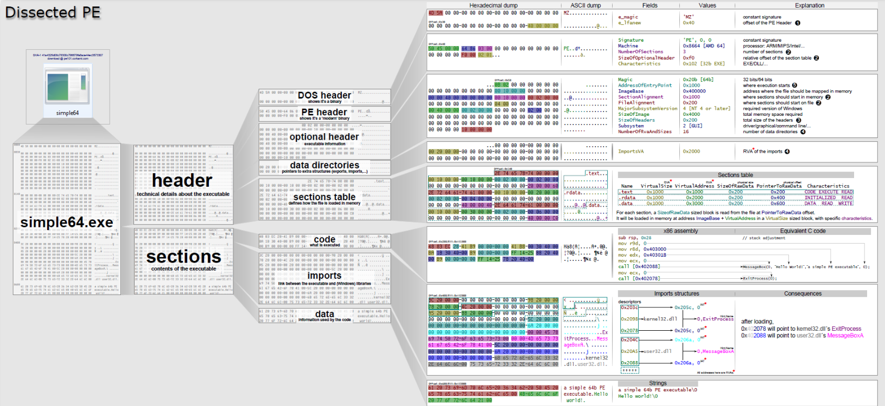
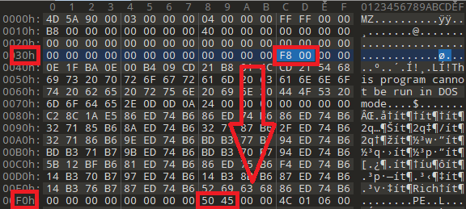
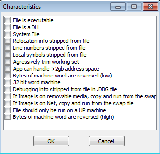
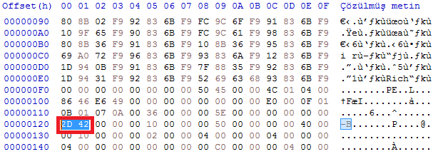
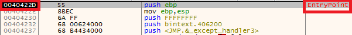
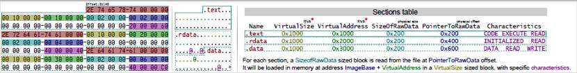

# PE Nedir?

PE(Portable Executable) yani taşınılabilir yürütülebilir dosyalar Windows sistemler arasında uyumluluk sorunu yaşamadan taşınıp çalıştırılabilen dosyalardır. Taşınabilir olması için tüm cihazlar için ortak bir dil/mimari tanımlanması gerekmektedir, bir cihazda "A" anlamına gelen veri diğer cihazda da "A" anlamına gelmelidir. Burada da ortaya bir mimari çıkıyor. Örneğin bir taşınabilir dosyanın 0x24 adresinde ImageBase verisinin taşındığı bütün cihazlar tarafından bilinmektedir ve ona göre yorumlanıp dosya çalıştırılmaktadır. Bu yazıda genel hatlarıyla bir PE yapısında neler bulunduğuna ve bunların ne anlamlara geldiğine bakılacaktır.

"Portable Executable (PE) biçimi, Windows işletim sistemlerinin 32 bit ve 64 bit sürümlerinde kullanılan yürütülebilir dosyalar, DLL'ler vb. için bir dosya biçimidir. PE biçimi, Windows işletim sistemi yükleyicisinin kapsüllenmiş yürütülebilir kodu yönetmesi için gerekli bilgileri içeren bir veri yapısıdır. Buna; bağlantı için dinamik kitaplık referansları, API dışa aktarma(export table) ve içe aktarma (import table) tabloları, kaynak yönetimi verileri(resources) ve iş parçacığı yerel depolama (TLS) verileri dahildir. NT işletim sistemlerinde PE formatı EXE, DLL, SYS (cihaz sürücüsü), MUI ve diğer dosya türleri için kullanılır."[1]

---



Yukarıdaki görselde bir PE yapısının detaylı yapısı Ange Albertini[2] tarafından görselleştirilmiştir. Günümüzde çeşitli araçlar bu yapıyı analiz edip uygun çıktıyı analistlere sunmaktadır. PEBear, CFF Explorer, PEStudio vb. bu araçlara örnek olarak verilebilir. Peki buradaki bilgiler bizim için neden önemlidir ? İlerleyen kısımlarda bahsedeceğimiz "Raw Size ve Virtual Size arasındaki fark yüksek olursa ne anlama gelmektedir?" gibi konularda bize yol göstermektedir ve belirli kanıtlar sunmaktadır. 

# Virtual Adress (VA) vs Relative Virtual Adress (RVA)

Virtual Adress, bir uygulamaya atanmış hafıza adresidir. Cihaz üzerinde çalıştırılan uygulamalar direkt olarak fiziksel hafızaya erişemez, yalnızca sanal olarak oluşturulan hafızaya erişebilir. Cihazların RAM'lerinin yönetimi için oluşturulan bu sanallaştırma yapısı uygulamalara esneklik sağlayarak kendi hafızalarını yönetme konusunda kolaylık sağlar ve aynı zamanda fiziksel hafıza üzerinde güvenlik sağlar.  
Relative Virtual Adress, iki Virtual Adress arasındaki farktır. Virtual Adress hafıza üzerindeki uygulamanın gerçek adresini gösterir fakat Relative Virtual Adress Image Base'i referans alır. Yani şu denklem karşımıza çıkar => **RVA= VA - Image Base**. Örnek vermek gerekirse; Uygulamamızın Image Base'i 0x400000 (genellikle user mode uygulamaların default Image Base adresidir) olsun, Virtual Adress'imiz de 0x00401000 olsun. Bu durumda RVA değerimiz 0x00001000 olmaktadır.

---

# DOS Headers
DOS Header 64 byte boyutundaki bir veri yapısıdır ve çalıştırılabilir bir dosyanın en başında bulunur. Dosyanın işlevini etkilemeyen bu kısım dosyanın uyumluluk sorunu oluşturmaması için oluşturulmuştur. MS-DOS üzerinde çalıştırıldığında gerçek program yerine MS-DOS Stub mesajı olan **"This program cannot be run in DOS mode"** yazısı gösterilmektedir. Bu header olmadan herhangi bir PE dosyası çalışmayacaktır. 64 byte boyutundaki veri içeriği şu şekildedir: 

```
typedef struct _IMAGE_DOS_HEADER {      // DOS .EXE header
    WORD   e_magic;                     // Magic number
    WORD   e_cblp;                      // Bytes on last page of file
    WORD   e_cp;                        // Pages in file
    WORD   e_crlc;                      // Relocations
    WORD   e_cparhdr;                   // Size of header in paragraphs
    WORD   e_minalloc;                  // Minimum extra paragraphs needed
    WORD   e_maxalloc;                  // Maximum extra paragraphs needed
    WORD   e_ss;                        // Initial (relative) SS value
    WORD   e_sp;                        // Initial SP value
    WORD   e_csum;                      // Checksum
    WORD   e_ip;                        // Initial IP value
    WORD   e_cs;                        // Initial (relative) CS value
    WORD   e_lfarlc;                    // File address of relocation table
    WORD   e_ovno;                      // Overlay number
    WORD   e_res[4];                    // Reserved words
    WORD   e_oemid;                     // OEM identifier (for e_oeminfo)
    WORD   e_oeminfo;                   // OEM information; e_oemid specific
    WORD   e_res2[10];                  // Reserved words
    LONG   e_lfanew;                    // File address of new exe header
  } IMAGE_DOS_HEADER, *PIMAGE_DOS_HEADER;   [4]
``` 

Burada bizim için önemli 2 adet değer bulunmaktadır; 

1. e_magic: DOS Header'ının ilk elemanıdır ve sabit olarak 0x5A4D (MZ) değerine sahiptir. Bu dosyanın bize PE dosyası olduğunu ifade etmektedir. 
2. e_lfanew: DOS Header'ının son elemanıdır ve NT Headerlarının başlangıç adresini tutmaktadır. 



---

# COFF File Header

Bir PE dosyasının başlangıcında veya imzasının hemen ardından gelen kısımdır. 

| Offset | Boyut | İsim | Açıklama|
|--------|-------|------|---------|
|0 | 2 | Machine | Hedef cihazın tipini belirtir. ([Bkz. Machine Types](https://learn.microsoft.com/en-us/windows/win32/debug/pe-format#machine-types)) |
|2 | 2 | NumberOfSections| İmaj üzerindeki section boyutu| 
|4 | 4 | TimeDateStamp| Dosyanın ne zaman oluşturulduğunu gösteren 00:00 1 Ocak 1970'ten bu yana geçen saniye sayısının low (sağ) 32 biti.|
|8 | 4 | PointerToSymbolTable| COFF sembol tablosunun dosya ofseti veya COFF sembol tablosu mevcut değilse sıfır. COFF hata ayıklama bilgisi kullanımdan kaldırıldığı için bu değer bir görüntü için sıfır olmalıdır. |
|12 | 4 | NumberOfSymbols | Sembol tablosundaki entry sayısı. Bu veriler, sembol tablosunu hemen takip eden string tablosunu bulmak için kullanılabilir. COFF hata ayıklama bilgisi kullanımdan kaldırıldığı için bu değer bir görüntü için sıfır olmalıdır. | 
|16 | 2 | SizeOfOptionalHeader | OptionalHeader kısmının boyutunu belirtir. | 
|18 | 2 | Characteristics | Dosyanın özelliklerini belirten değerlerini içeren kısım | [3]

File Characteristics kısmındaki değerler ise şu şekildedir:



---

# Optional Headers

```
typedef struct _IMAGE_OPTIONAL_HEADER {
  WORD                 Magic;
  BYTE                 MajorLinkerVersion;
  BYTE                 MinorLinkerVersion;
  DWORD                SizeOfCode;
  DWORD                SizeOfInitializedData;
  DWORD                SizeOfUninitializedData;
  DWORD                AddressOfEntryPoint;
  DWORD                BaseOfCode;
  DWORD                BaseOfData;
  DWORD                ImageBase;
  DWORD                SectionAlignment;
  DWORD                FileAlignment;
  WORD                 MajorOperatingSystemVersion;
  WORD                 MinorOperatingSystemVersion;
  WORD                 MajorImageVersion;
  WORD                 MinorImageVersion;
  WORD                 MajorSubsystemVersion;
  WORD                 MinorSubsystemVersion;
  DWORD                Win32VersionValue;
  DWORD                SizeOfImage;
  DWORD                SizeOfHeaders;
  DWORD                CheckSum;
  WORD                 Subsystem;
  WORD                 DllCharacteristics;
  DWORD                SizeOfStackReserve;
  DWORD                SizeOfStackCommit;
  DWORD                SizeOfHeapReserve;
  DWORD                SizeOfHeapCommit;
  DWORD                LoaderFlags;
  DWORD                NumberOfRvaAndSizes;
  IMAGE_DATA_DIRECTORY DataDirectory[IMAGE_NUMBEROF_DIRECTORY_ENTRIES];
} IMAGE_OPTIONAL_HEADER32, *PIMAGE_OPTIONAL_HEADER32; 
```
**WORD** 16 bit (2 byte) işaretsiz sayı, **DWORD** 32 bit (4 byte) işaretsiz sayıyı ifade etmektedir.

Genel olarak önemli veriler şunlardır:

**Magic**: İmaj dosyasının türünü belirtir. 0x010B ise 32-bit 0x020B ise 64-bit imaj dosyası olduğunu belirtir.

**SizeOfCode:** Çalıştırılabilir kodların toplam boyutunu belirtir.

**SizeOfInitializedData**: Tanımlanırken değer atanmış verilerin bulunduğu kısmın boyutunu belirtir.(Genelde **.data** sectionında bulunurlar)

**SizeOfUninitializedData**: Tanımlanırken değer atanmamış verilerin bulunduğu kısmın boyutunu belirtir.(**.bss** sectionında bulunurlar)

**AddressOfEntryPoint**: Bu değer çalıştırılabilir dosyaların Entry Point(başlangıç noktası) Relative Virtual Adress değerini, DLL dosyalarının ise **DllMain** fonksiyonunun Relative Virtual Adress değerini tutar. Genellikle **.text** sectionında bir yer belirtir. Sectionlarda ileride bahsedeceğiz fakat buraya şöyle ufak bir not düşülebilir: **Text section'ı dışında bir noktadaki EntryPoint şüphelidir!**.





**ImageBase**: PE formatının yükleneceği adresin değerini tutar. Genel olarak 32-bit mimari için çalıştırılabilir dosyalar için bu kısımda **0x00400000** değeri bulunur. Derleyicinizin Linker ayarlarından bu kısım değiştirebilirsiniz.

---
# Section Table

Section tanımlamalarının yapıldığı kısımdır. Optional Header'dan hemen sonra bulunur (varsa) çünkü headerlarda bu kısmı işaret eden bir veri yoktur. Section tablosunun konumu headerların bittiği yerde başlamaktadır. 

Bu tablodaki bulunan section sayısı **File Header** kısmında belirtilen **NumberOfSections** değerinde saklanmaktadır. Her bir section header'ı (tablonun her bir entry değeri) 40 byte'tır ve aşağıdaki şekildedir:

|Offset| Boyut | İsim | Açıklama | 
|------|-------|------|----------|
|0 | 8 |Name | 8 byte, UTF-8 ve boş karakterler NULL olarak doldurulan bir değerdir. 8 byte'tan uzun isimler için slash (/) karakteri ve sonrasında string tablosundaki bu ismin string değerinin saklandığı offset değeri içerir.| 
|8 | 4 |VirtualSize | Section hafızaya yüklendiğindeki boyutu. Bu değer SizeOfRawData değerinden büyükse section'ın boş kısımları 0'lar ile doldurulmuştur. |
|12 | 4 | VirtualAdress| Çalıştırılabilir dosyalar için section hafızaya yüklendiğinde Image Base ile relatif olan adresin değerini tutar. | 
|16 | 4 | SizeOfRawData | Yürütülebilir imajlar için bu, Optional Header'da bulunan FileAlignment'ın katı olmalıdır. Bu, VirtualSize'dan küçükse, bölümün geri kalanı sıfırla doldurulmuştur. SizeOfRawData alanı yuvarlanır fakat VirtualSize alanı yuvarlanmadığından, SizeOfRawData'nın VirtualSize'dan büyük olabilir. Bir bölüm yalnızca başlatılmamış(uninitialized) veriler içeriyorsa, bu alan sıfır olmalıdır.|
|20 | 4 | PointerToRawData| COFF (Common Object File Format) dosyası içindeki sectionın ilk sayfasının pointer değeri. Çalıştırılabilir dosyalar için bu Optional Header'daki FileAlignment'ın katı olmalıdır. Bir section yalnızca başlatılmamış(uninitialized) veriler içeriyorsa, bu alan sıfır olmalıdır.|
|24 | 4 | PointerToRelocations| Section için relocation entry değerlerinin başlangıcının pointer değeri. Çalıştırılabilir dosyalar için veya yer değiştirme yoksa bu değer sıfırdır.|
|28 | 4 | PointerToLinenumbers | Section için satır numarası girişlerinin başının pointer değeri. COFF satır numarası yoksa bu değer sıfırdır. COFF hata ayıklama bilgisi(debug information) kullanımdan kaldırıldığı için bu değer bir görüntü için sıfır olmalıdır.|
|32 | 2 | NumberOfRelocations| Section için relocation entry'lerinin sayısı. Çalıştırılabilir dosyalar için bu değer sıfırdır.|
|34 | 2 | NumberOfLinenumbers| Section için satır numarası entry'lerinin sayısı. COFF hata ayıklama bilgisi(debug information) kullanımdan kaldırıldığı için bu değer bir dosya için sıfır olmalıdır.|
|36 | 4 | Characteristics | Bölümün izinlerinin bulunduğu kısımdır. Bu değerler için [Bkz. Microsoft Dokümantasyon](https://learn.microsoft.com/en-us/windows/win32/debug/pe-format#section-flags)|




---

# Sections

Sectionlar dosyanın asıl verilerini içeren kısımlardır. Section Header kısmından hemen sonra başlamaktadır. Çalıştırılabilir kodlar, değişkenler, dosya hakkında bilgiler vs. bu kısımlarda bulunur. 
 
Harici olarak section tanımlanabilir fakat özel amaçlı ön tanımlı sectionlar vardır. Bu özel sectionlara [Microsoft Dokümantasyonundan](https://learn.microsoft.com/en-us/windows/win32/debug/pe-format#special-sections) ulaşabilirsiniz. Önemli sectionlardan bazıları ise şunlardır : 

+ **.text**: Dosyanın çalıştırılabilir kodlarının bulunduğu kısımdır. 
+ **.data**: Kod içerisinde tanımlanmış(initialize) verileri içerir.
+ **.bss**: Kod içerisinde tanımlanmamış(uninitialized) verileri içerir.
+ **.rdata**: Read-only tanımlanmış(initialize) verileri içerir.
+ **.edata**: Export tablosunu içerir.
+ **.idata**: Import tablosunu içerir.
+ **.rsrc**: Dosya tarafından kullanılan kaynakları (icon, fotoğraf, gömülü binaries) içerir.
+ **.tls**: Thread Local Storage, threadler için saklama alanı sağlar. 

---

Eleştiri/düzeltme/öneri için lütfen iletişim adreslerimden bana ulaşınız. Yorumlarınız benim için değerli :)

---
# Referans

[1] en[.]wikipedia.org/wiki/Portable_Executable

[2] github[.]com/corkami/pics/tree/master/binary/pe101

[3] learn[.]microsoft.com/en-us/windows/win32/debug/pe-format#coff-file-header-object-and-image

[4] 0xrick[.]github.io/win-internals/pe3/