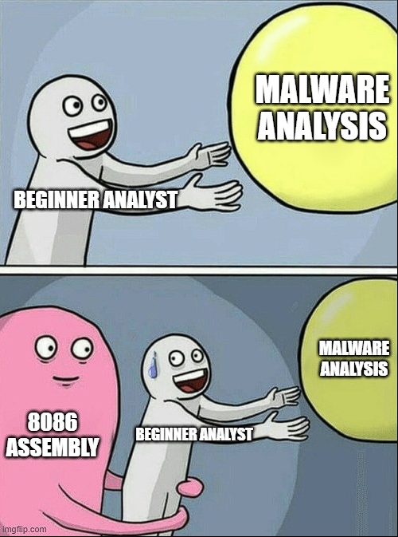
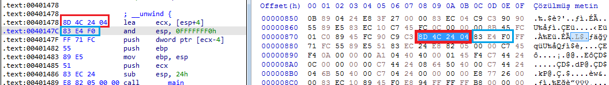
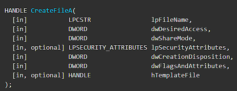
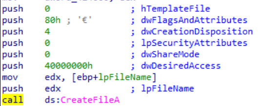
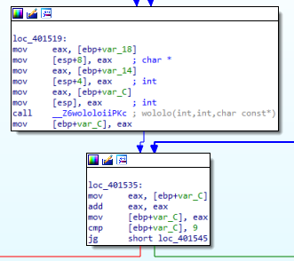
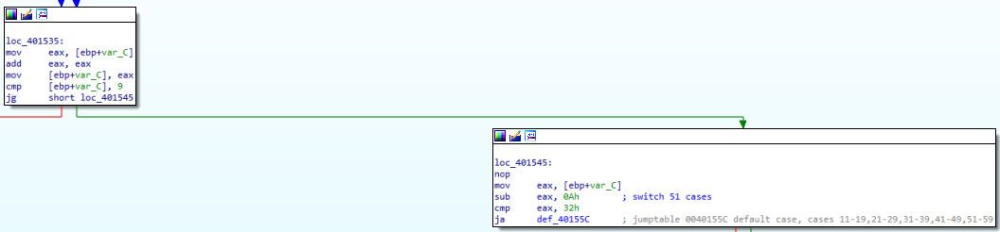
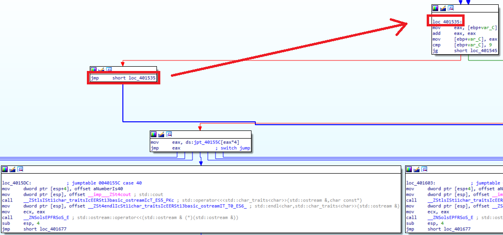
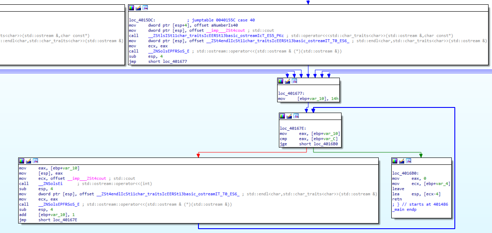

<h1 style="text-align:center"> Assembly Nedir? </h1>

Bilgisayarların ilk yıllarında birbirinden farklı işlemci mimarileri üretilmeye başlandı. Bu mimariler üzerinde çalıştırılabilecek kodları ve çalıştırılan kodların sonuçlarını belirleyen kurallardır. Çok fazla tarihine dalmak istemiyorum(çok fazla bilgim yok :) ), günümüze kadar ulaşan ve bu blog yazısında konusu geçecek olan Assembly dili ise Intel 8086 mimarisi için oluşturulmuş olan x86 Assembly dilidir. Assembly düşük seviye dillerden birisidir. Makine kodundan daha kullanıcı dostu fakat yine de yüksek seviyeli diller gibi değildir. Makine koduna en yakın olan dillerden birisidir. Bu blog yazısında genel olarak x86 Assembly dilinin yapısı ve analizine değinilecektir.

--- 

<h1 style="text-align:center"> Linker - Loader - Compiler </h1>

Derinlere dalmadan örneğin bir C/C++ kaynak kodu dosyası derlendiğinde arka planda neler oluyor bakalım. Burada karşımıza üç adet kavram çıkmakta; **Compiler, Linker ve Loader**. 

1. **Compiler**: Yazılan kaynak kod dosyasını makine diline çevirip **object** dosyası oluşturan aracı yazılımlardır. 
    >> Object dosyaları içerisinde derleyici veya assembler tarafından oluşturulmuş makine kodlarını içeren dosyalardır. Direkt olarak çalıştırılamazlar. 
2. **Linker**: Oluşturulan object dosyaları ve bu object dosyalarının ihtiyaç duyduğu ek kaynakları (DLL vb.) birleştirerek tek bir çalıştırılabilir dosya haline getiren yazılımlardır.
3. **Loader**: İşletim sistemlerinin bir parçasıdır. Çalıştırılabilir dosyaları hafızaya yazmaktan sorumludur. 

Basitçe bir kaynak kod dosyası derlendiğinde oluşan yapı şu şekildedir:

[1]


Peki bunlar bizi neden ilgilendiriyor? Bu noktada Polyanna olamayacağım; zararlı yazılım analiz etmek isteyen bir kişi 101 seviyesinde Assembly dili bilmelidir. Benim görüşüm şudur; Assembly dili bilmeyen birisi zararlı yazılım analisti olamaz. O yüzden zararlı yazılım analizi blog serimde bu dilin temellerinden bahsetmem gerekiyor.



Bizi burada ilgilendiren kısım derlenmiş (compile edilmiş) dosyaları Disassambler araçları yardımıyla analiz etmek. Bunu yapmamızın sebebi de programı tersine mühendislik teknikleriyle analiz edip içerisindeki teknikleri ve IOC değerlerini ortaya çıkartmak.

---

<h1 style="text-align:center"> Registerlar </h1>

Assembly dilinde ön tanımlı ve belirli amaçlar için kullanılan register değerleri bulunmaktadır. Geleneksel kodlama dillerindeki gibi **"int a=5"** yapamıyoruz. Peki nedir bu registerlar? 

### Çok Amaçlı Registerlar

1. **RAX**: 32-bit hali(EAX) akümülator olarak bilinir. Genel olarak; çarpma, bölme, toplama ve çıkarma gibi matematiksel işlemlerde kullanılır. **Fonksiyonların dönüş değerleri RAX üzerinden taşınır!**.
2. **RBX**: Base Index olarak bilinir. Bazen hafıza üzerindeki bir offset adresine erişmek için kullanılır.
3. **RCX**: Counter olarak bilinir. Döngülerde kullanılır.
4. **RDX**: Data register'ı olarak bilinir. Çarpma işlemlerinden sonra sonucun bir kısmını ya da bölme işlemlerinden önce bölünen sayının bir kısmını tutmaktadır.
5. **RBP**: Base Pointer olarak bilinir. Veri taşıma işlemlerinde hafızanın konumlarını işaret eden pointer değerlerini tutar.
6. **RDI**: Destination Index olarak bilinir. Genellikle string işlemlerinde hedef stringin adresini tutar.
7. **RSI**: Source index olarak bilinir. Genellikle string işlemlerinde kaynak stringin adresini tutar. 
8. **R8-15**: 64-bit mimarinin ortaya çıkmasıyla birlikte ek registerlara ihtiyaç duyulması sebebiyle ortaya çıkmış registerlardır. 

### Özel Amaçlı Registerlar 

1. **RIP**: Instruction Pointer olarak bilinir. Çalıştırılacak olan komutun adresini tutmaktadır. Debuggerlarda bazen komutlar arasında gezerken nerede olduğunuzu kaybedebilirsiniz, **RIP** register'ında bulunan değerin adresine giderseniz kaldığınız yeri bulabilirsiniz :)
2. **RSP**: Stack Pointer olarak bilinir. Programın verilerinin işlendiği stack'in en üstünde bulunan elemanın adresini göstermektedir.

Belki de bir zararlı yazılım analisti için en önemli iki adet register bunlardır. Ne kadar çok kullanıldığını ilerleyen yazılarda göreceksiniz :)

Yukarıda bahsedilen tüm registerlar 64 bit üzerinden isimlendirilmiştir. Register isimleri taşıyabilecekleri maksimum sayısal değere göre farklı isimler alır. 64-bit register "R", 32-bit register "E" karakteri ile başlar. Örneğin; AL => 8-bit, AH => 8-bit, bu ikisinin bir araya gelip oluşturduğu register AX => 16-bit, 2 adet AX'in bir araya gelip oluşturduğu register EAX => 32 bit vs.


### Bayraklar

Yukarıda bahsedilen Çok Amaçlı Registerlar sayısal değerler taşımaktadır fakat bu bölümde bahsedeceğimiz bayraklar mantıksal değerler taşır. Yalnızca "0" ve "1" değerlerini alabilirler.

1. **Carry Flag (C)**: Toplama işlemlerindeki fazlalık, çıkartma işlemlerindeki komşu basamaktan alınan değerleri tutar. 
2. **Parity Flag (P)**: İşlem sonucunda oluşan/değişen register değerlerinin içerisindeki mantıksal "1"lerin çiftlik/teklik durumunu belirtir. Oluşan/değişen register değerinde tek sayıda mantıksal "1" var ise Parity değeri 0, çift sayıda ise 1 olmaktadır.
3. **Zero Flag (Z)**: Aritmetik veya mantıksal bir işlemin sonucunu "0" olduğunda "set" edilen bayraktır. 
> "Set" etmek, bir bayrağın değerinin "1" olarak değişmesi olması anlamına gelmektedir.

Farklı bayraklar da bulunmaktadır fakat zararlı yazılım analizi için bilinmesi gereken önemli bayraklar bunlardır.


### Segment Registerları

Diğer registerların aksine hafıza adresi üretmek/saklamak için kullanılan registerlardır. Bir önceki yazıdaki **"Section"** kısımlarına benzer yapıları vardır. [Bkz. PE 101](pe-mimarisi)


1. **Code (CS)**: İşlemci tarafından kullanılan komutları tutar.
2. **Data (DS)**: Programlar tarafından kullanılan verileri içeren kısımlardır.
3. **Extra (ES)**: Bazı komutlar için hedef bilgisini tutmak için kullanılır.
4. **Stack (SS)**: Stack giriş noktası bilgisini tutar.

---

<h1 style="text-align:center"> Komutlar </h1>

Assembly dilinin yapısı genel olarak **"KOMUT HEDEF,KAYNAK"** şeklindedir fakat bazı komutlar için bu durum farklılık gösterebilir. Örneğin;

```
MOV(Komut) AX(Hedef),0020H(Kaynak)
```
AX register'ı içerisine 0x0020 değerini yüklemek için kullanılacak olan komut yukarıdaki gibidir. Assembly dilinde kullanılan sayısal değerlerin türü belirtilmelidir. Örneğin hexadecimal sayılar için "0x"(tüm emülatörlerde çalışmayabilir) veya sayıdan sonra "H" karakteri, ikilik veriler için "B" karakteri kullanılmalı. Onluk sayılar için bir karakter kullanılmasına gerek yoktur. 

Komutlar çalıştırırken belirli parameterler alır ve Assembly dilinde bu parametrelere **"Operand"** denir. Örneğin yukarıdaki komutta **AX** bir **operand**'dır. 

Burada opcode yani operation code'dan bahsetmemiz gerekiyor. Temel olarak Disassemble araçlarının yaptığı şey OPCODE değerlerini ve dosya yapısının kurallarını tanımlayıp verilen çalıştırılabilir dosyayı yorumlamaktır(bu kadar kolay olmadığını biliyorum:D ). 8086 mimarisi için OPCODE tablosuna internet üzerinden ulaşabilirsiniz. Örnek olarak IDA aracının içerisinden bir görüntüye bakalım: (Option-> General -> Number of opcodes kısmındaki değeri değiştirerek görebilirsiniz.)




Dosya içerisinde çalıştırılabilir sectionda bulunan hexadecimal değerleri yorumlayarak bize yapılan işlemlerin assembly dilinde karşılığını sunduğunu ve bunun sıralı bir işlem olduğunu görüyoruz.

## Genel Komutlar (Instructions) ve Kullanımları

1. **MOV**: Veri taşımak için kullanılır. **MOV HEDEF,KAYNAK** şeklinde kullanılır.
2. **ADD**: Toplama işlemi için kullanılır. **ADD HEDEF,KAYNAK** şeklinde kullanılır. Kaynaktaki ve hedefteki değer toplanır, sonuç hedefte saklanır.
3. **AND**: Mantıksal AND işlemini yapar. **AND HEDEF,KAYNAK** şekline kullanılır. 
Mantıksal AND tablosu:

	| Değer | Değer |Sonuç|
	|-|-|-|
	|0|0|**0**|
	|0|1|**0**|
	|1|0|**0**|
	|1|1|**1**|

4. **XOR**: Mantıksal XOR işlemini yapar. **XOR HEDEF,KAYNAK** şekline kullanılır. XOR, farklı değerler için "1" aynı değerler için "0" sonucunu üretir. Genellikle register değerlerini sıfırlamak için kullanılır çünkü **"XOR EAX,EAX"**, **EAX** register'ının içeriğini sıfırlar.
Mantıksal XOR tablosu:

	| Değer | Değer |Sonuç|
	|-|-|-|
	|0|0|**0**|
	|0|1|**1**|
	|1|0|**1**|
	|1|1|**0**|

5. **CMP**: Karşılaştırma için kullanılır. **"CMP Operand1,Operand2"** şeklinde kullanılır. Aritmetik çıkartma işlemi yaparak aradaki farka göre sonuç üretir. Çıkartma işlemi yapılmasına rağmen operandlarda herhangi bir değişiklik olmaz. İşlemin sonucu 0 olursa **Zero Flag** set edilir.
6. **TEST**: Genellikle fonksiyon çağrılarından sonra dönen sonucun 0 olup olmadığını test etmek için kullanılır. Mantıksal **AND** işlemi yapar. **TEST Operand1,Operand2** şeklinde kullanılır. 0 olup olmadığını test etmesinin mantığı şudur; AND işleminde iki değer de "0" ise "0" sonucu üretilir. Örneğin **"TEST EAX,EAX"** yapıldığında, bu işlemin sonucunun "0" olmasının tek ihtimali **EAX** register'ının değerinin "0" olmasıdır.
7. **JMP**: Dallanma komutudur. **"JMP ADRESS"** şeklinde kullanılır. 
8. **CALL**: Fonksiyon çağırma komutudur. **"CALL ADRESS"** veya **"CALL Fonksiyon İsmi"** şeklinde kullanılır.
9. **Şartlı Dallanmalar**: Yapılan karşılaştırma sonucuna göre dallanmak için kullanılır. Örneğin yüksek seviyeli dillerde **"if(a>5){...}"** yaptığımızda aslında bir şart sağlanırsa bir yere git ve o adresteki komutları çalıştır, sağlanmazsa farklı bir yere git veya normal akışta devam et şeklinde düşünebiliriz. Bu gibi durumlarda compiler şartlı dallanma komutları üretir. 
10. **INC ve DEC**: **INC**rement yani arttırmak, **DEC**rement yani azaltmak. **INC/DEC OPERAND** şeklinde kullanılır. INC operandın değerini 1 arttırır, DEC operandın değerini 1 azaltır.

---

<h1 style="text-align:center"> Veri Adresleme Türleri </h1>

|Tür|Kaynak|Hedef|Örnek|
|--|--|--|--|
|Register|Register|Register|MOV AX,BX|
|Immediate|Data|Register|MOV AX,03H|
|Direct|Register|Memory Adress|MOV [2022H],AX|
|Register Indirect|Register|Memory Adress|MOV [BX],AX|
|Base-plus-index|Register|Memory Adress|MOV [BX+SI], BP|
|Base relative-plus-index|Register|Memory Adress| MOV ARRAY[BX+SI],DX|
|Scaled Index|Register|Memory Adress| MOV [EBX+4*SI],AX|
|Register Relative|Memory Adress|Register| MOV AX,[BX+8]|

---

<h1 style="text-align:center"> Fonksiyon Çağrımları ve Stack Yapısı </h1>

Yüksek seviyeli yazılım dillerinde fonksiyon çağrımları genelde **"fonksiyon_ismi(parametre1,parametre2)"** gibi çağrılır ve dönüş değeri varsa direkt o satırda atama yapılır vs vs. Peki bunu derlediğimizde nasıl gözüküyor ? Burada stack yapısına bakmamız gerekiyor. Stack, veri yönetimi ve saklamak için kullanılan bir veri yapısıdır. LIFO yani **L**ast **I**n **F**irst **O**ut yapısında çalışır. Şu şekilde görselleştirebiliriz :


Çalıştırılan dosya veri alış-verişini, fonksiyon çağrımlarını (dönüş değeri, fonksiyon adresi vs) stack üzerinden yapmaktadır. Örnek vermek gerekirse, **"fonksiyon_ismi(parametre1,parametre2)"** şeklinde çalıştırıldığında stack içerisine önce **parametre2** sonra **parametre1** "push"lanır. Ardından fonksiyon çağrılır. Fonksiyon başlamadan önce aldığı parametre sayısı kadar **POP** yaparak stack'in en üstündeki 2 veriyi alır. Bu şekilde parametreler fonksiyona taşınır. Fonksiyon çalışıp işlevini bitirip, değeri döndürdükten sonra stack'in en üstünde bu dönüş değeri bulunmaktadır. Buradaki önemli nokta şu; parametreler stack içerisine ters sıra ile yüklenir.

Örneğin **CreateFileA** API'ına bakalım:



1.parametre olarak dosya ismi, 2. parametre olarak istenilen erişim seviyesi vs. olarak parametreler tanımlanmış. Peki bu fonksiyon bir kodda çağrıldığında Disassambler/Debugger üzerinde nasıl gözüküyor?



Görselde görüldüğü üzere; 7 adet parametre için 7 kere push komutu çalıştırılmış ve parametreler ters sıra ile stack üzerine pushlanmış. Push komutları arasında stack üzerinde değişiklik yapmayan farklı komutlar bulunabilir.

---

<h1 style="text-align:center"> Alıştırma </h1>

Genel olarak bir zararlı yazılım analistinin bilmesi gereken Assembly temellerinden bahsettik. Şimdi buradaki bütün bilgileri bi toparlayarak alıştırma yapalım.

```
#include <windows.h>
#include <iostream>
using namespace std;
int woho=100;

int wololo(int x, int b,const char* k){
	b=b+b;
	int value1;
	value1=12;
	value1=value1+x;
	x=x^value1;
	return x;
}

int main(){
	int value1=10;
	int value2=61;
	const char* value3="A";
	value1=value1&1;
	
	value1=woho+value1;
	if(!value2 > 100)
		int a=MessageBoxA(0,"Onlyf8.com","Hello World A",0);
	else if (value2 > 50)
		int b=MessageBoxA(0,"Onlyf8.com","Hello World B",0);
	else 
		int c=MessageBoxA(0,"Onlyf8.com","Hello World :)",0);
	value1=wololo(value1,value2,value3);
	
	while(1){
		value1=value1+value1;
		if(value1 >= 10)
			break;
	}
	switch(value1){
		case 10:
			cout << "Number is 10"<< endl;break;
		case 20:
			cout << "Number is 20"<< endl;break;
		case 30:
			cout << "Number is 30"<< endl;break;
		case 40:
			cout << "Number is 40"<< endl;break;
		case 50:
			cout << "Number is 50"<< endl;break;
		case 60:
			cout << "Number is 60"<< endl;break;
		default:
			cout <<"None"<<endl;break;
	}
	
	for (int i=20;i<value1;i++){
		cout << i<<endl;
	}
	return 0;
}
```

Yukarıdaki örnek kodu derleyip IDA aracında inceleyelim. Öncelikle programın başlangıç kısmına bakıyoruz. 3 adet **MOV** komutu ile başlangıç değerlerimiz atanmış. Ardından **AND** işlemi yapılmış ve global olarak tanımladığımız değişken üzerinden local değişkenimize atama yapılmış. Normalde bizim kodumuzda ilk başta "100" sayısı ile karşılaştırma yapılıyor fakat derleyicinin kodu optimize etmesinin sonuçlarını burada görüyoruz :) **"CMP [EBP+VAR_14],32h"** satırında **[EBP+VAR_14]** içerisindeki veriyi "50" ile karşılaştırıyor. Ardından **JLE** komutu görüyoruz, bu komutun açılımı **J**ump **L**ess or **E**qual, yani küçük ya da eşitse dallan. Burada sola kırmızı, sağa yeşil bir ok gittiğini görüyoruz. Eğer bu şart sağlanmazsa kırmızı blok, şart sağlanırsa yeşil blok çalışacaktır ve kod çalışmaya o kısımdan devam edecektir.


Normalde API çağrımlarında Push yapıldığını söylemiştik. Burada da farklı bir kullanımını görüyoruz. Push stack içerisine veri yerleştiriyordu, buradaki örnekte **Mov** komutu ile **ESP** yani Stack Pointer baz alınarak veri taşıma işlemi yapıldığı görülüyor. Aslında aynı işlevi farklı komutlarla yapmış oluyor. Sağ ve sol bloktaki komutlar çalıştırıldıktan sonra iki kısım da aynı bloka bağlanıyor. 



Alt blokta tanımladığımız **"wololo"** ismindeki fonksiyonun çağrıldığını görüyoruz. Yine Push yerine ESP içerisine veri taşınarak parametre geçildiğini görmekteyiz. Kodumuzdaki **"value1=wololo(value1,value2,value3);"** satırında fonksiyonun dönüş değerini **"value1"** değerine atıyoruz. Fonksiyon dönüş değerleri nerede saklanıyordu? Evet, **EAX**. **Call** işleminin hemen ardından **"mov [EBP+Var_C], EAX"** komutu ile dönüş değerinin **"[EBP+Var_C]"** adresine atandığını görüyoruz. Yukarıya baktığımızda bunun fonksiyona geçilen ilk parametre olduğunu görüyoruz. Ardından **"cmp [EBP+Var_C], 9"** ve **"JG"** komutlarıyla **"[EBP+Var_C]"** adresindeki değer 9'dan büyük ise sağa, değilse sola dallanması sağlanmıştır. Bunun **while** döngüsünün sorgusu olduğunu anlıyoruz.



Sağ kısıma baktığımızda **while** döngüsünden çıkıp switch-case kısmına geldiğini görüyoruz. **"cmp eax, 32h"** ve **"JA"** komutlarıyla **"EAX"** içerisindeki veri 40'dan büyük mü diye kontrol edildiğini görüyoruz. Aslında ilk yazdığımız case "10" olmasına rağmen kodun optimize edilmesi sonucu bu hale geldiğini anlıyoruz. Sol kısımda da **while** döngüsü olduğunu görüyoruz.



Switch-case komutları bittikten sonra **For** döngüsü kısmına geliyoruz. Burada öncelike **"14h"** yani **"20"** sayısal değerinin atandığını ardından bu değerin **EAX**'a atanıp **"[EBP+Var_C]"** ile karşılaştırıldığını görüyoruz. Kodun **"for (int i=20;i<value1;i++)"** satırına baktığımızda aslında **value1** değerinin 20'den büyük olma durumuna baktığımızı görüyoruz. Ama derlenmiş koda baktığımızda 20'den büyük veya eşit olma durumunun kontrol edildiğini görmekteyiz. Büyük veya eşit olmadığı durumlarda kırmızı yani sol kısma gitmekte ve döngü içerisindeki kodlar çalıştırılmakta, 20'den büyük veya **eşit** olduğu anda döngüden çıktığını görmekteyiz. Bunu belirtmemin amacı şu; kodda yazan mantığın birebir aynısını derlenmiş dosya içerisinde beklemeyin. Yapılan işlem aynı olur fakat mantık farklı olabilir.
 



---

Eleştiri/düzeltme/öneri için lütfen iletişim adreslerimden bana ulaşınız. Yorumlarınız benim için değerli :)

---

# Referans 

[1] geeksforgeeks[.]org/difference-between-linker-and-loader/