# What is Assembly? 

In the first years of computers, different processor architectures began to be produced. These architectures are the rules that determine the code that can be run on and the results of the code that is run. I don't want to dive too far into its history (I don't know too much :)), the Assembly language that has survived to the present day and will be discussed in this blog post is the x86 Assembly language created for the Intel 8086 architecture.  Assembly is one of the low-level languages. It's more user-friendly than machine code, but still not like high-level languages. It is one of the languages closest to machine code. In this blog post, the structure and analysis of x86 Assembly language in general will be discussed.

--- 

# Linker - Loader - Compiler

Without digging deeper, let's see, for example, what happens in the background when a C/C++ source code file is compiled. Here we come across three concepts.; **Compiler, Linker ve Loader**. 

1. **Compiler**: Software that translates the given source code file into machine language and  creates an **object** file. 
    >> Object files are files that contain machine code generated by the compiler or assembler. They cannot be execute directly. 
2. **Linker**: Software that combines the created object files and the additional resources (DLLs, etc.) needed by these object files into a single executable file.
3. **Loader**: It is part of operating systems. Responsible for writing executable files to memory. 

Simply when a source code file is compiled, the structure that occurs is as follows:

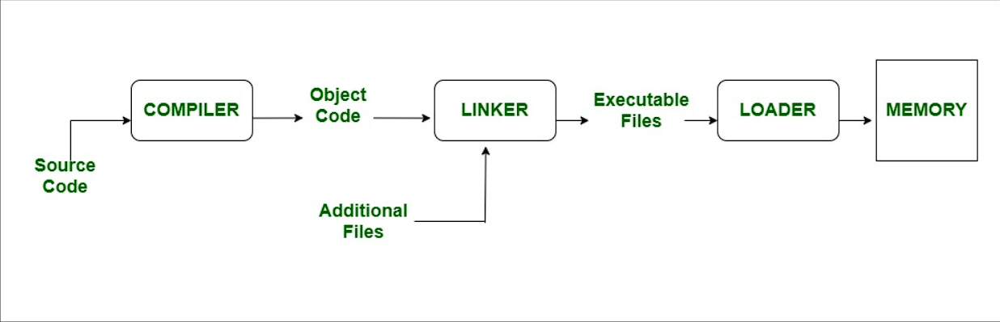[1]

So why do they concern us? I won't be Polyanna at this point; A person who wants to analyze malware should know the Assembly language at least the level of 101. My view is this; Someone who doesn't know assembly language can't be a malware analyst. That's why I need to talk about the basics of this language in my malware analysis blog series.

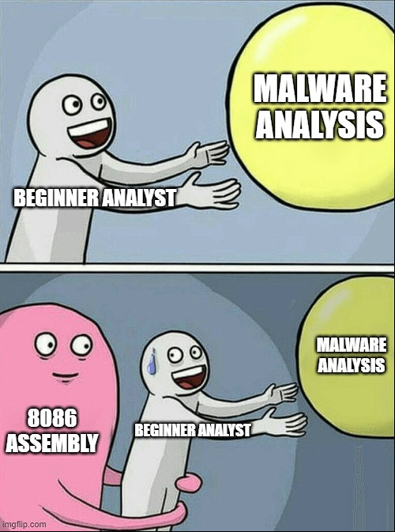

The part that interests us here is to analyze the compiled files with the help of Disassambler tools. The reason we do this is to analyze the program with reverse engineering techniques and to reveal the techniques and IOC values in it.

---

# Registers

There are predefined register values in assembly language that are used for specific purposes. We cannot do **"int a=5"** as in traditional coding languages. So, what are these registers? 

### Multipurpose Registers

1. **RAX**: The 32-bit state (EAX) is known as the accumulator. In general; It is used in mathematical operations such as multiplication, division, addition and subtraction. **The return values of the functions are carried over RAX!**.
2. **RBX**: It is known as Base Index. It is sometimes used to access a memory offset.
3. **RCX**: It is known as Counter. Used in loops.
4. **RDX**: It is known as the data register. It holds a part of the result after multiplication operations or part of the number divided before the division operations.
5. **RBP**: It is known as a Base Pointer. Holds pointer values that point to the locations of the memory during data transfer.
6. **RDI**: It is known as Destination Index. It usually holds the address of the target string in string operations.
7. **RSI**: It is known as the source index. Usually holds the address of the source string in string operations. 
8. **R8-15**: These are registers that emerged due to the need for additional registers with the advent of 64-bit architecture. 

### Special Purpose Registers 

1. **RIP**: It is known as an Instruction Pointer. It holds the address of the command to be executed. In debuggers, you can sometimes lose where you are when navigating between commands,  if you go to the address of the value in the **RIP** register, you can find where you left off :) 
2. **RSP**: It is known as a Stack Pointer. Shows the address of the data located at the top of the stack where the program's data is processed.

Perhaps these are the two most important registers for a malware analyst. You will see how much it is used in the following articles:)

All the above-mentioned registers are named in 64 bits. Register names take different names according to the maximum numeric value they can carry. The 64-bit registers begins with the character "R" and 32-bit registers begins with the character "E". For example, AL => 8-bit, AH => 8-bit, the register AX => 16-bit, the register formed by 2 AXs together EAX => 32 bits, and so on.

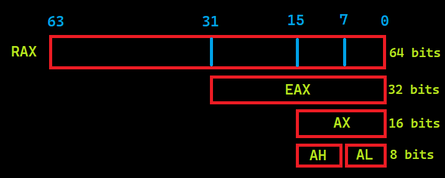

### Flags

The Multipurpose Registers mentioned above have numeric values, but the flags we will talk about in this section have logical values. They can only take the values "0" and "1".

1. **Carry Flag (C)**: Holds the values taken from the neighboring digit in the addition, the excess in the subtraction. 
2. **Parity Flag (P)**: Count of ones in a number expressed as even or odd. Logic 0 for odd parity; logic 1 for even parity. 
3. **Zero Flag (Z)**: The flag is set when the result of an arithmetic or logical operation is "0". 

Farklı bayraklar da bulunmaktadır fakat zararlı yazılım analizi için bilinmesi gereken önemli bayraklar bunlardır.

### Segment Registers

Unlike other registers, they are registers used to generate/store memory addresses. It  has similar structures to the **"Section"** sections in the previous article.. [See PE 101](2022-12-05-pe-format.md).

1. **Code (CS)**: Holds the instructions used by the processor.
2. **Data (DS)**: Contains the data that is used by the programs.
3. **Extra (ES)**: Used to hold target memory adress for some instructions.
4. **Stack (SS)**: Defines the area of memory used for the stack.

---

# Instructions

The structure of assembly language is generally **" INSTRUCTION TARGET, SOURCE"**, but for some commands this may vary. For example;

```
MOV(Instruction) AX(Target),0020H(Source)
```
The instruction to be used to load the 0x0020 value into the AX register is as above. The type of numeric values used in assembly language must be specified. For example, "0x" (may not work in all emulators) for hexadecimal numbers, the "H" character after the number and the "B" character for binary data. There is no need to use a character for decimal numbers. 

It takes specific parameters when running instructions and in Assembly language these parameters are called **"Operand"**. For example, in the command above, **AX** is a **operand**. 

We need to talk about opcode here. Basically, what Disassemble tools do is define the OPCODE values and rules of the file structure and interpret the given executable file (I know it's not that easy:D). The OPCODE table for the 8086 architecture is available online. As an example, let's look at an image from inside the IDA tool: (You can see it by changing the value in the General-> Number of opcodes section in the Option->.)

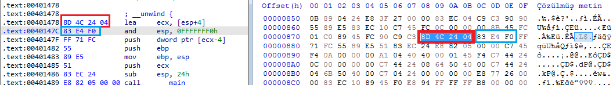

By interpreting the hexadecimal values in the executable section of the file, we see that the operations performed shows us the equivalent in assembly language and that this is a sequential process.

## Instructions and Usages

1. **MOV**: Used to transfer data. Used as **MOV TARGET,SOURCE** .
2. **ADD**: Used for addition. Used as **ADD TARGET,SOURCE**. The value at the source and destination is add, the result is stored at the destination.
3. **AND**: Performs the logical AND operation. Used as **AND TARGET,SOURCE**. 
Logical AND table:

| 1. Value | 2. Value |Result|
|-|-|-|
|0|0|**0**|
|0|1|**1**|
|1|0|**1**|
|1|1|**1**|

4. **XOR**: Performs the logical XOR operation. Used as**XOR TARGET,SOURCE**. XOR produces a result of "1" for different values and "0" for the same values. It is often used to reset register values because **"XOR EAX,EAX"**  resets the contents of the **EAX** register.
Logical XOR table:

| 1. Value | 2. Value |Result|
|-|-|-|
|0|0|**0**|
|0|1|**1**|
|1|0|**1**|
|1|1|**0**|

5. **CMP**: Used for comparison. **CMP Operand1,Operand2". It produces results according to the difference by performing arithmetic subtraction. Although the removal process is done, there is no change in the operands. If the result of the operation is 0 **Zero Flag** is set.
6. **TEST**: It is often used to test whether the result returned after function calls is 0. Performs a logical **AND** operation.  Used as **TEST Operand1,Operand2**. The logic of testing whether 0 is or not is as follows; In an AND operation, only if both values are "0", a result of "0" is generated. For example, when **"TEST EAX,EAX"**  is performed, the only chance that the result of this operation is  "0" is that the value of the **EAX** register is "0".
7. **JMP**: Branching command. Used as **"JMP ADRESS"**. 
8. **CALL**: Used for calling functions. Used as **"CALL ADRESS"** or  **"CALL Function Name"**.
9. **Şartlı Dallanmalar**: It is used to branch according to the result of the comparison. For example, when we do **"if(a>5){...}" ** in high-level languages, we can actually think of it as going somewhere and running the commands at that address if a condition is met, if not, go to a different place or continue in the normal flow. In such cases, the compiler generates conditional branching commands. 
10. **INC ve DEC**: Used as **INC/DEC OPERAND**. INC increases the value of operands by 1, DEC decreases the value of operands by 1.

---

#  Data Addressing Modes

|Type|Source|Target|Example|
|--|--|--|--|
|Register|Register|Register|MOV AX,BX|
|Immediate|Data|Register|MOV AX,03H|
|Direct|Register|Memory Adress|MOV [2022H],AX|
|Register Indirect|Register|Memory Adress|MOV [BX],AX|
|Base-plus-index|Register|Memory Adress|MOV [BX+SI], BP|
|Base relative-plus-index|Register|Memory Adress| MOV ARRAY[BX+SI],DX|
|Scaled Index|Register|Memory Adress| MOV [EBX+4*SI],AX|
|Register Relative|Memory Adress|Register| MOV AX,[BX+8]|

---

# Function Calls and Stack Structure

In high-level software languages, function calls are usually called like **"function_name(parameter1,parameter2)"** and if there is a return value, they are assigned directly on that line etc. So how does it look when we compile it? Here we need to look at the stack structure. A stack is a data structure used for data management and storage. LIFO i.e. **L**ast  **I**n  **F**irst  **O**ut structure:


The executed file exchanges data, function calls (return value, function address, etc.) via stack. For example, when run as **"function_name(parameter1,parameter2)"**, **parameter2** is "pushed"  into the stack first  **parametre2** and then  **parameter1**. Then the function is called. Before the function starts, it takes the top 2 data of the stack by making **POP** as many parameters it takes. In this way, the parameters are moved to the function. After the function runs and finishes its function and returns the value, this return value is at the top of the stack. The important point here is the parameters are loaded into the stack in reverse order.

For example look at **CreateFileA**:

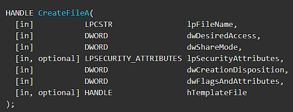

Parameters are defined as file name as 1st parameter, desired access level as 2nd parameter, etc. So how does this function look on Disassambler/Debugger when called in code?

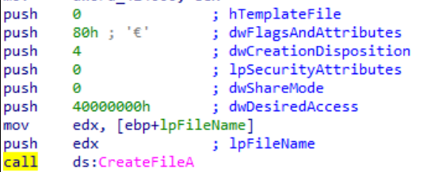

As seen in the image; The push command was executed 7 times for 7 parameters and the parameters were pushed onto the stack in reverse order. Instructions can include different from Push that don't modify the stack.

---

# Exercise

In general, we talked about the basics of Assembly that a malware analyst should know. Now let's gather all the information here and practice.

```
#include <windows.h>
#include <iostream>
using namespace std;
int woho=100;

int wololo(int x, int b,const char* k){
    b=b+b;
    int value1;
    value1=12;
    value1=value1+x;
    x=x^value1;
    return x;
}

int main(){
    int value1=10;
    int value2=61;
    const char* value3="A";
    value1=value1&1;
    
    value1=woho+value1;
    if(!value2 > 100)
        int a=MessageBoxA(0,"Onlyf8.com","Hello World A",0);
    else if (value2 > 50)
        int b=MessageBoxA(0,"Onlyf8.com","Hello World B",0);
    else 
        int c=MessageBoxA(0,"Onlyf8.com","Hello World :)",0);
    value1=wololo(value1,value2,value3);
    
    while(1){
        value1=value1+value1;
        if(value1 >= 10)
            break;
    }
    switch(value1){
        case 10:
            cout << "Number is 10"<< endl;break;
        case 20:
            cout << "Number is 20"<< endl;break;
        case 30:
            cout << "Number is 30"<< endl;break;
        case 40:
            cout << "Number is 40"<< endl;break;
        case 50:
            cout << "Number is 50"<< endl;break;
        case 60:
            cout << "Number is 60"<< endl;break;
        default:
            cout <<"None"<<endl;break;
    }
    
    for (int i=20;i<value1;i++){
        cout << i<<endl;
    }
    return 0;
}
```

Let's compile the sample code above and examine it in the IDA tool. First of all, we look at the beginning of the program.  Our initial values are assigned with 3 **MOV** instruction. Then **AND** operation was performed and assigned to our local variable through the variable we defined as global. Normally, in our code, the number "100" is compared to at first, but here we see the results of the compiler's optimization of the code:) On the line **"CMP [EBP+VAR_14],32h"** compares the data in **[EBP+VAR_14]** with "50". Then we see the **JLE** command, which stands for **J**ump **L**ess or **E**qual, which means branch if it is less than or equal. Here we see a red arrow going to the left and a green arrow to the right. If this condition is not met, the red block will run, and if the condition is met, the green block will run, and the code will continue to work from that section.

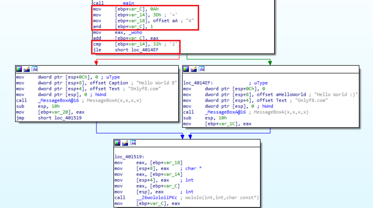

Normally, we have said that API calls are Pushed. Here we see a different use. He was placing data in a push stack, in this example the **Mov** instruction is used to move data based on **ESP**, or Stack Pointer. In fact, it does the same function with different instructions. After executing the instructions in the right and left blocks, the two parts are connected to the same block. 

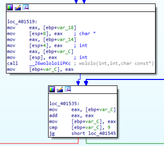

We  see that the function called **"wololo"** that we have defined  in the block at the bottom is called. Again, instead of push, we see that the parameter is passed by moving the data into ESP. We assign the  return value of the function  in **"value1"**. in **"value1=wololo(value1,value2,value3);"** line. Where were the function return values stored? Yes, **EAX**.   Immediately after **Call**, we see that the return value is assigned to **"[EBP+Var_C]"** with the **"mov [EBP+Var_C],EAX"** instruction. When we look above, we see that this is the first parameter to be put into the function. Then the **"cmp [EBP+Var_C], 9"** and **"JG"** instructions allow it to branch to the right if the value at **"[EBP+Var_C]"** is greater than 9, and   to the left if it is not. We understand that this is the query of the **while** loop.

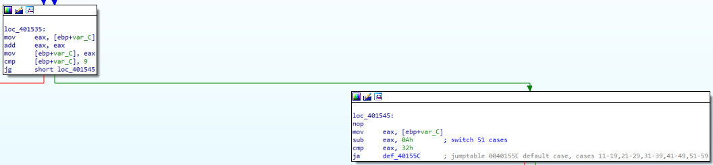

When we look at the right part, we see that it comes out of the **while** loop and comes to the switch-case part.  With the **"cmp eax, 32h"** and **"JA"** instructions, we see that the data in **"EAX"** is checked to see if it is greater than 40. In fact, although the first case we wrote was "10", we understand that the code became this way as a result of optimization. On the left, we see that there is a **while** loop.

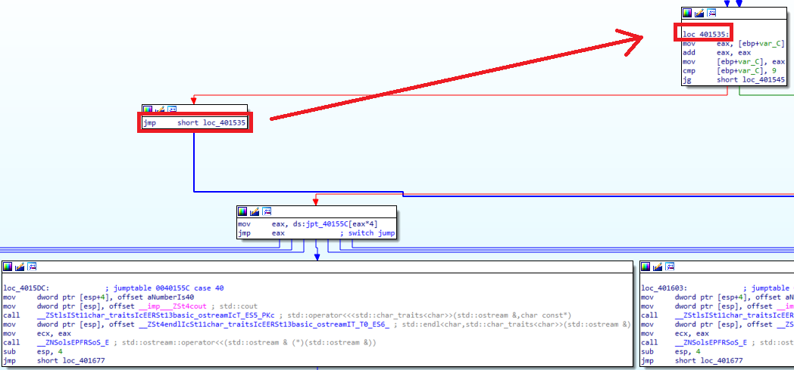

After the switch-case commands are finished, we come to the **For** loop section. Here we see that the numeric value **"14h"**, that is **"20"** is assigned  to **EAX**, then compared to **"[EBP+Var_C]"**.  When we look at the **"for (int i=20;i<value1;i++)"** line of the code, we see that  we are actually looking at the  **value1** value greater than 20. But when we look at the compiled code, we see that it is greater than or equal to 20. In cases where it is not greater or equal we go to the red part, that is to the left part, and the codes in the loop are executed, and we see that they exit the loop as soon as they are greater than 20 or **equal**. The purpose of my stating this is that; Do not expect exactly the same logic as in the code in the compiled file. The process will be the same, but the logic may be different.  
 
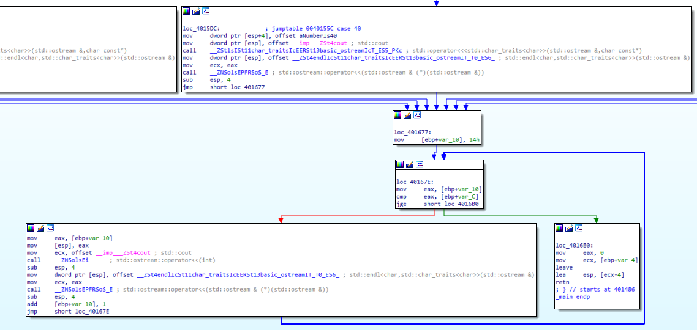

---

Please contact me at my contact addresses for criticism/correction/suggestion. Your comments are valuable to me :)

---

# Reference 

[1] geeksforgeeks[.]org/difference-between-linker-and-loader/

