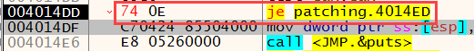
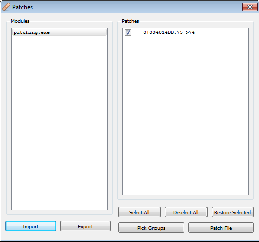
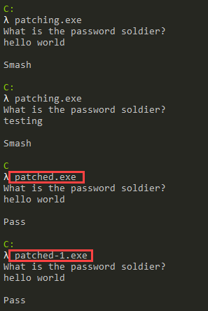

<h1 style="text-align:center"> What is Patching? </h1>

It is a concept known to everyone who used a computer in the 2000s and somehow thought, "How can I use this software for free?"; **Patching**. There were **cracker** brothers/sisters who were cool to us back then, behaviors that seemed extremely mysterious to us because we didn't know what was going on inside this machine in general. This article will not answer the question "How do we **break** a piece of software?" because it now requires much more in-depth analysis. The more mischievous children know, the more they take precautions for organizations that aim to make money :) .

The concept of patching is actually basically about changing the behavior of a software. For example, if you reverse an **IF** query, the story can go in completely different places. And that's where it all starts. As soon as you save the slightest change as a new file, you have done a patching process. 

So if we're not going to **crack** a piece of software, why do we need to patch it?
Let's create a scenario like this; Before the malware in your hand performs its actual malicious activities, it performs a number of checks and asks, **"Am I working in a virtual machine environment?"** or **"Am I working under a debugger?"** It complicates/misleads your analysis with queries. You've successfully identified these techniques and then figured out how to **bypass**. Well done. You've completed the hard part. But now we have a new problem; **"Will I repeat this bypass every time I run this software again?"**, of course not. By making the **bypass** technique we apply at this point permanent, we will facilitate the analysis process and prevent us from going in the wrong directions.

## Usages

1. Verification
    > Verifications used by malware written for specific environments in the environment check. For example, the Active Directory structure, discovered services (a special service), a specific registry key, etc.
2. User login
    > There are customized malwares that runs in environments with a specific user/system name. Apart from logging into an account, there can also be a **"key"** argument that the malware is waiting for.
3. Anti-Analysis Techniques
    > The most well-known and simple example; IsDebuggerPresent.

---

# How it’s Done? 

As I mentioned in the **"PE File Structure"** in previous articles; The written commands are encoded in assembly language in a certain section of the file. Basically, what we're going to do is; 

1. I'll find the piece of code I want to change

2. I will make sure that the change I make is appropriate for the structure and size of the file

3. I will determine which **offset** this command is in the file, make the change and save it.

Now let's look at a simple software sample.


When we run the application, it asks us for a password and responds according to the password entered (from here we cannot obtain the information that it writes "Smash" when it enters the wrong password directly). Now let's look at what this looks like in the Debugger and whether it makes a comparison. 


First, an input is received from the user with **scanf**, then the input received from the user and a value(?) are compared with the **strcmp** function. Received input is compared; We can understand that the value taken after **scanf** is stored in the **EAX** register, and then immediately written to **stack** with **ESP**, after which **strcmp** is executed. Here I can also find the correct password by looking at the parameters of the **strcmp** function, but I cross this route because this is not usually the case in real-life scenarios :) The control made here;

```
call strcmp
test eax,eax
jne OFFSET
```

I can see that it consists of the above 3 steps.

```
int strcmp(
   const char *string1,
   const char *string2
);

Return value;
< 0	string1 is less than string2 
0	string1 is the same as string2
> 0	string1 is greater than string2 
```

Now let's evaluate the code in our heads. If I consider the scenario where I enter the correct password, the return value of **strcmp** should be **"0"**. When **EAX** is 0, the logical result of the **test** command will also be **"0"**, so **Zero flag** will be set, i.e. **"1"**. The next check is **"JumpNotEqual"**, a command that performs branching when the Zero flag is 0. In this case, I can say this; If the value I enter is the same as the compared value, branching will not occur, and if it is different, branching will occur. Here it is extremely critical to know which command to replace with what. Because an unconscious change can put our analysis in a complete deadlock. 

Another important point is the **size** of the commands. In assembly language, not all commands are the same size, the column between the address and the commands in the debugger window contains the opcodes of the commands. From here sizes can be understood. For example, the **JNE** command is 2 bytes in size and exists in the file as **75 0E** (the hex equivalent of opcode). If I want to change the **JNE** command; My change cannot be larger than 2 bytes, it will cause overflow in the file. It can be less than 2 bytes, the missing parts are filled with **NOP**.  

The only change I need to make here is; To replace **JNE** with **JE** is simply to replace **"IF(str1==str2)"** with **"IF(str1!=str2)"**. 

There are two ways to patch it here. The first is to find the place and the command we want to make changes in the file and make changes in its raw form. It can be done with various hex editors. The second is to modify the readable commands from the debugger and save them as a new file with the **Patch** feature.

First, let's look at the first way. The place I want to change is the **"75 0E"** value in the file (make sure you change it in the right place, you can look at the virtual and real address calculations in the PE File Structure article to find where the command is located in the file) **"74 0E"**(opcode value of the JE command) I will replace it with **"74 0E"**(opcode value of the JE command):


Here you can also make sure that the correct place has been changed by looking at the before and after of the corresponding opcode in the file. What I'm going to do is simply replace **75** with **74** here and save the file.

When we look at the second way, I can make changes to the command on the screen that opens when you double-click on the commands on the debugger or when you select the command and press the **Space** key.


The changes made are shown in red in the opcode tab.



Then I can see the changes made by opening the **Patch** window with **CTRL+P** and click the **Patch File** button to save the new file. 



Results of the changes we made (patched.exe made with HxD, patched-1.exe made with the debugger):



---

Please contact me at my contact addresses for criticism/correction/suggestion. Your comments are valuable to me :)

---


