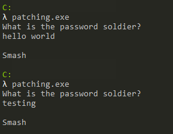
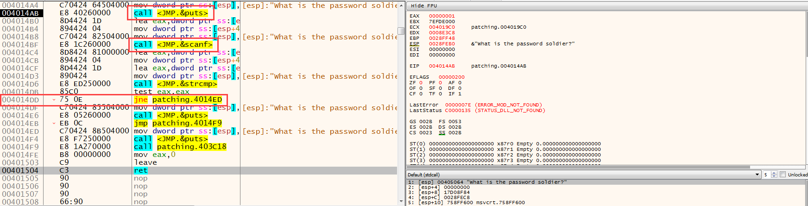
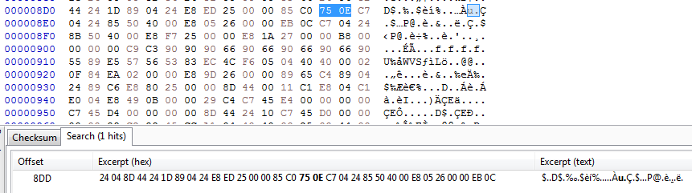
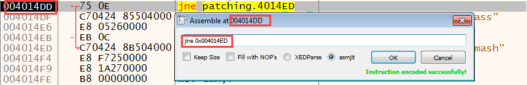
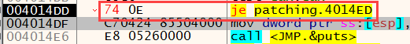
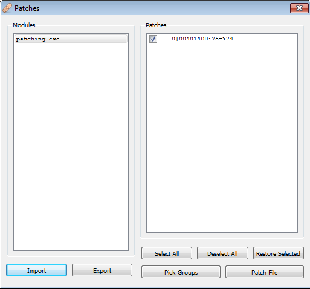
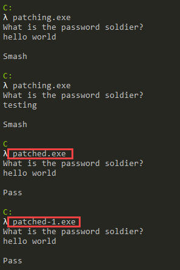

<h1 style="text-align:center"> Yamalama(Patching) Nedir? </h1>

2000'li yıllarda bilgisayar kullanıp bir şekilde "Ben bu paralı yazılımı nasıl bedava kullanırım acaba?" diye düşünmüş herkesin bildiği bir kavram; **Yamalama**. O zamanlar bize havalı gelen **cracker** abiler/ablalar vardı, genel olarak bu kasanın içinde neler dönüyor bilmediğimiz için bize son derece gizemli gelen davranışlardı bunlar. Bu yazıda "Bir yazılımı nasıl **kırarız**?" sorusunun cevabı olmayacak, çünkü bu konu artık çok daha derinlemesine analiz gerektirmekte. Haylaz çocuklar ne kadar şey biliyorsa, para kazanma amacı güden kuruluşlar da o kadar önlem alıyor :).

Yamalama kavramı aslında temelde bir yazılımın davranışlarını değiştirmekten geçmektedir. Örneğin bir **IF** sorgusunu tersine çevirdiğinizde hikaye bambaşka yerlere gidebilmektedir. Olay tam olarak da burada başlıyor. Yaptığınız en ufak değişikliği yeni bir dosya olarak kaydettiğiniz anda nur topu gibi bir yamalama işlemi yapmış oluyorsunuz. 

Peki madem bir yazılımı **crack**lemeyeceğiz, neden yamalamaya ihtiyaç duyarız?
Şöyle bir senaryo oluşturalım; elinizdeki zararlı yazılım asıl zararlı aktivitelerini gerçekleştirmeden önce bir takım kontroller yaparak, **"Sanal makine ortamında mı çalışıyorum?"** veya **"Debugger altında mı çalışıyorum?"** gibi sorgularla analizinizi zorlaştırıyor/yanlış yönlendiriyor. Bu teknikleri başarılı bir şekilde tespit ettiniz ve sonrasında da nasıl **bypass** edebileceğinizi tespit ettiniz. Bravo. Zor kısmı tamamladınız. Fakat şimdi yeni bir sorunumuz var; **"Ben bu yazılımı her tekrar çalıştırmamda bu bypass işlemini tekrarlayacak mıyım?"**, elbette hayır. Tam bu noktada uyguladığımız **bypass** tekniğini kalıcı hale getirerek analiz sürecini kolaylaştırıp, yanlış yönlere gitmemizin önüne geçeceğiz.

## Kullanım Alanları

1. Doğrulama
    > Spesifik ortamlar için yazılmış zararlı yazılımların ortam kontrolünde kullandığı doğrulamalar. Örneğin Active Directory yapısı, bulunan servisler (özel bir servis), belirli bir kayıt defteri anahtarı vb.
2. Kullanıcı girişi
    > Belirli bir kullanıcı/sistem adına sahip ortamlarda çalışan, özelleştirilmiş zararlı yazılımlar bulunmakta. Bir hesaba giriş dışında, zararlı yazılımın beklediği bir **"anahtar"** argüman da olabilir.
3. Anti-Analiz Teknikleri
    > En bilinen ve basit örneği; IsDebuggerPresent.

---

# Nasıl Yapılır? 

Önceki yazılarda bulunan **"PE Dosya Yapısı"** konusunda bahsettiğim gibi; yazılan komutlar dosya içerisinde belirli bir bölümde assembly dilinde kodlanmış şekilde bulunmaktadır. Temelde yapacağımız şey şu olacak; 

1. Değiştirmek istediğimiz kod parçasını bulacağız

2. Yapacağımız değişikliğin, dosyanın yapısına ve boyutuna uygun olmasına dikkat edeceğiz

3. Dosya içerisinde bu komut hangi **offset**'de bulunduğunu tespit edip, değişikliği yapıp kaydedeceğiz.

Şimdi örnek basit bir yazılıma bakalım.



Uygulamayı çalıştırdığımızda bizden bir adet parola istemekte ve girilen parolaya göre cevap vermekte (buradan direkt olarak yanlış parola girince "Smash" yazdığı bilgisini elde edemeyiz). Şimdi Debugger içerisinde bu durumun nasıl gözüktüğüne ve bir karşılaştırma yapıp yapmadığına bakalım. 



Önce **scanf** ile kullanıcıdan bir input alınmakta, ardından **strcmp** fonksiyonu ile birlikte kullanıcıdan alınan input ve bir değer(?) karşılaştırılmakta. Alınan input'un karşılaştırıldığını; **scanf**'ten sonra alınan değer **EAX** register'ında saklandığı ve hemen ardından **ESP** ile **stack** içerisine yazıldığı, sonrasında **strcmp** çalıştırıldığından dolayı anlayabiliyoruz. Burada **strcmp** fonksiyonunun parametrelerine bakarak doğru parolayı da bulabiliriz fakat gerçek hayat senaryolarında genellikle böyle olmadığı için bu yolu geçiyoruz :) Burada yapılan kontrolün;

```
call strcmp
test eax,eax
jne OFFSET
```

yukarıdaki 3 adımdan oluştuğunu görebiliyoruz.

```
int strcmp(
   const char *string1,
   const char *string2
);

Dönüş değeri;
< 0	string1 string2'den küçüktür 
0	string1 ile string2 aynıdır
> 0	string1 string2'den büyüktür 
```

Şimdi kodu kafamızda değerlendirelim. Doğru parolayı girdiğimiz senaryoyu düşünürsek, **strcmp** dönüş değeri **"0"** olmalıdır yani **EAX**. **EAX**'ın 0 olduğu durumda **test** komutunun mantıksal sonucu da **"0"** olacağı için **Zero flag** set edilecektir yani **"1"** olacaktır. Bir sonraki adımda yapılan kontrol ise **"JumpNotEqual"** yani Zero flag'in 0 olduğu durumlarda dallanma gerçekleştiren bir komut. Bu durumda şunu söyleyebiliriz; eğer girdiğimiz değer ile karşılaştırılan değer aynı ise dallanma gerçekleşmeyecek, farklı ise dallanma gerçekleşecek. Burada hangi komutu ne ile değiştireceğimizi bilmek son derece kritiktir. Çünkü bilinçsiz yapılan bir değişiklik analizimizi tamamen çıkmaza sokabilir. 

Önemli bir diğer nokta ise komutların **boyut**ları. Assembly dilinde her komut aynı boyutta değildir, debugger penceresinde adres ve komutların arasında bulunan sütunda komutların opcode'ları bulunmaktadır. Buradan boyutları anlaşılabilir. Örneğin **JNE** komutu 2 byte boyutundadır ve dosya içerisinde **75 0E** olarak (opcode'un hex karşılığı) bulunmaktadır. Eğer **JNE** komutunu değiştirmek istiyorsak; yapacağımız değişiklik 2 byte'tan büyük olamaz, dosya içerisinde overflow'a yol açar. 2 byte'tan küçük olabilir, eksik kalan kısımlar **NOP** ile doldurulur.  

Burada yapmamız gereken tek değişiklik ; **JNE** yerine **JE** yazmak, basit mantıkla bakıldığında **"IF(str1==str2)"** yerine **"IF(str1!=str2)"** yazmaktır. 

Yamalama'nın iki yolu var burada. Birincisi değişiklik yapmak istediğimiz yeri ve komutu dosyanın içerisinde bulup ham haliyle değişiklik yapmak. Çeşitli hex editörler ile yapılabilir. İkincisi de debugger üzerinden okunabilir komutları değiştirip **Patch** özelliği ile yeni bir dosya olarak kaydetmek.

Öncelikle birinci yola bakalım. Değiştirmek istediğimiz yer dosya içerisinde bulunan **"75 0E"** değerini (doğru yerdekini değiştirdiğinize emin olun, dosya içerisinde komutun nerede bulunduğu bulabilmek için PE Dosya Yapısı yazımdaki sanal ve gerçek adres hesaplamalarına bakabilirsiniz) **"74 0E"**(JE komutunun opcode değeri) ile değiştireceğiz:



Burada dosya içerisinde ilgili opcode'un öncesi ve sonrasına bakarak da doğru yerin değiştirildiğinden emin olabilirsiniz. Yapacağımız şey basitçe burada bulunan **75** değerini **74** değeri ile değiştirip dosyayı kaydetmek.

İkinci yola baktığımızda ise debugger üzerinde komutların üstüne çift tıkladığınızda veya komutu seçip **Space** tuşuna bastığınızda açılan ekranda komut üzerinde değişiklik yapabiliyoruz.



Yapılan değişiklikler opcode sekmesinde kırmızı ile gözükmekte.



Ardından **CTRL+P** ile birlikte **Patch** penceresi açılarak yapılan değişiklikleri görebiliyoruz ve **Patch File** butonuna tıklayarak yeni dosyayı kaydedebiliyoruz. 



Yaptığımız değişikliklerin sonuçları(patched.exe, HxD ile yapılan, patched-1.exe debugger ile yapılan):



---

Eleştiri/düzeltme/öneri için lütfen iletişim adreslerimden bana ulaşınız. Yorumlarınız benim için değerli :)

---


