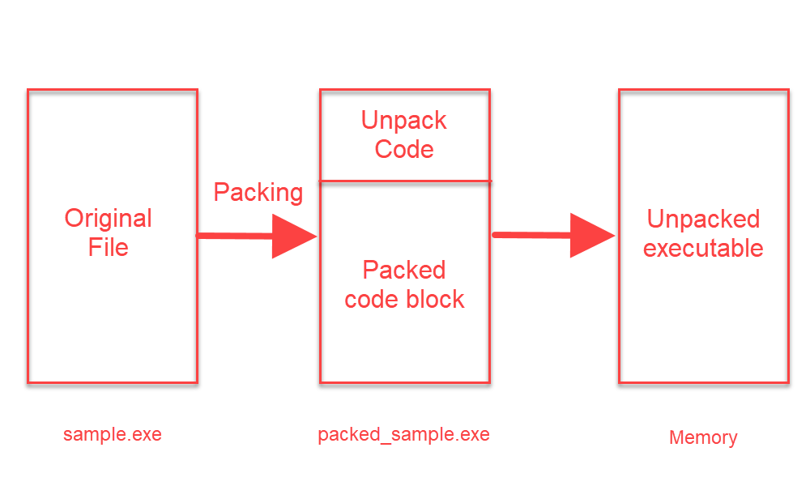

<h1 style="text-align:center"> What is Unpacking? </h1>

One of the primary goals of malware developers is to make it difficult to analyze and, for the reasons that arise, to detect. More than one technique is used for this purpose. The subject of this article will be the "packing" technique, which is perhaps the most important of these techniques. First of all, we will look for answers to the questions "What is the 'packing' of a piece of software?" and "How can we get the original software by reversing the packing algorithm?"

We can explain the packing of a software as simply "compressing". Take a "zip" application; We have an original file in our hands, we want to compress it and protect it with a password. With various tools, we can both reduce the size of the file and make it encrypted. In the same way, a person who knows the password can read the content, but a person who does not know it receives meaningless data. Here, we can think of "zipping" as "packing" and the given "password" as "packing algorithm". 

If we come to the main logic; With the help of the packing tool, the original software is compressed and written into a new file. In this file; There is a section written to **"unpack"** a packaged code block and a packaged code block. As initially expected, the code written to "unpack" will work, and the packaged (compressed) part will be translated into its original form and executed. 

Packaged software usually doesn't have a lot of strings in it. Because the part where the codes that will work is encrypted / compressed. Therefore, it is quite difficult to perform static analysis on a packaged software.

---

# How to Detect?

There are many ways and methods to detect that a piece of software is packed. As we always say; It is valuable for us to reach information in the easiest way. With the help of static analysis tools, which are actually part of static analysis, packaged software can be detected. We can say that the current software used here is successful in terms of known packing algorithms and usually detects a packaged software. The clues to detect a packing algorithm whose algorithm is unknown / written as custom are as follows; 

1. High entropy value of the software itself/parts
2. Finding a non-standard section name
3. Any section other than the ".text" section has "executable" privileges or a "self-modifying" feature (does not mean it is 100% packaged)
4. Starting the software with "pushad/pusha" instructions

To understand whether a piece of software is packaged or not, we need to think about the packing logic. The logic here is as we explained in the previous section; There is an encrypted/compressed part in the file and this part will be decrypted/extracted in some way and then run. Detecting these logical behaviors during the dynamic analysis phase can also help us understand whether a software is packaged or not.

**NOTE:** Just because a piece of software is packed doesn't mean it contains any harmful software.

---

# How to Unpack?

There are 3 ways here:

1. Automatized Unpacking
    > If the packing software used when packing the software is an algorithm known and unpack tool is available, the original file can be accessed using the corresponding unpack application or various online unpack tools can be used.
2. Dynamic Analysis and Dump
    > The software is expected to be run with the help of the debugger and perform the unpack operation. After the unpack process is finished by placing breakpoints in the necessary places, a new (unpacked) software is obtained (dumped) with the help of various tools with the help of the current version of the program. The new software obtained is unpacked software and static analysis will be available.
3. Accepting reality
    > We may not always be able to reverse the algorithm that the attacker is using. A small mistake or an overlooked point we make can make the unpack process fail. In such cases, the software is unpacked on the debugger (with the help of breakpoints) and the analysis is continued without dumping. A new file is not created.

    

---

# Dynamic Unpack

First of all, we pack a software with the UPX tool. A different packing tool can also be used here. Generally, unpack operations follow the same logic.

We can see that the size of the packaged file has decreased. Let's look at the difference between the original file and the packaged software on PeStudio.

Here too, we can see that the number of imported functions and strings has decreased.  

Packaged software usually starts with **"pushad/pusha"** instructions. What is the reason for this? The push command is used to write data to the stack. **Pushad** writes all general-purpose registers into the stack. When the initial registers of the program are kept and the packed part is unpacked, it removes these registers from the stack and brings the program to the starting state. Now let's imagine a stack, initially a data block is written into this stack and when the unpack process is completed, this block is removed from the stack. When we think with a simple logic; If we assign a breakpoint to the memory address where the **ESP** Stack Pointer is located after the **"push"** command, the program will hang on the breakpoint when the unpack process is finished.

This is the basic logic of the dynamic unpack process. Of course, different counter techniques to different packing algorithms need to be produced. When we come to the entrypoint of the application on the debugger, we can see the **pushad** instruction.

On the x86 Debugger, we run the **pushad** instruction by simply running an instruction with the **F8** key, and then we can see that the ESP value changes.

By right-clicking on the ESP value and clicking on the **Follow in dump** button, we display the memory address indicated by the ESP value. Then, from this address, we select 2 bytes and toggle a breakpoint of the **Hardware Access ** type and press the **F9** key to make it work until it comes to the breakpoint.

When we see **Paused** on the lower left, we can see why it is standing on the side of it in the same way. When we look at the next instruction of the instruction, where the program stops, we will see the **popad/popa** instruction. This tells us that; The program has processed the data to be unpacked on the stack and finished the unpack process, removing the startup registers of the program from the stack and starting the actual code to run. 

Now that we've completed the unpack process, where is the actual code block? Here, too, there is a basic logic; The place where the unpack operation is done is in a different memory block, and the code that performs the unpack operation is located in a different block. In other words, the program needs to be branched to the unpacked part that will actually work. 3 types of branching can be found here; conditional branching (jne/je etc.), unconditional branching (jmp), and call (calls to the memory address). So which branching will get us to the unpacked part? Large branching is usually seen here, which can be a clue for us. For example, the address where the JMP instruction is located is **0x0004018F**, but the address it will branch from is **0x0004119A**. In our example, we encounter this situation; The address where the JMP is located is **0x0040C37B** and the address from which it will branch is **0x4012E0**.

When we perform the branching, we can see that we have come to the starting address of the unpacked code block. 

In addition to this large branching, the application that we will use to receive the dump when we unpack will also help us whether the unpack process is complete or not. When **Scylla**, one of the x86 plugins, is opened, if we click on the **IAT (Import Address Table) Autosearch** button and find the IAT, our operation is successful. Then, by clicking on the **Get Imports** button, we ensure that the file we will dump is made executable. Then we finish the unpack process by clicking on the **Dump** and **Fix Dump** buttons. 

---

Please contact me at my contact addresses for criticism/correction/suggestion. Your comments are valuable to me :)

---
