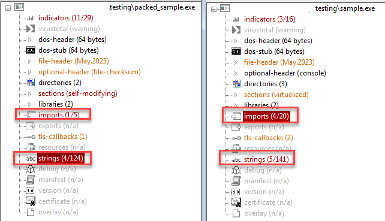
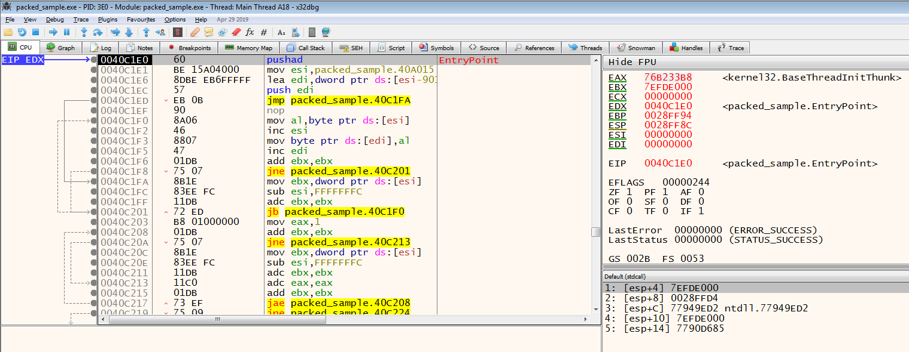
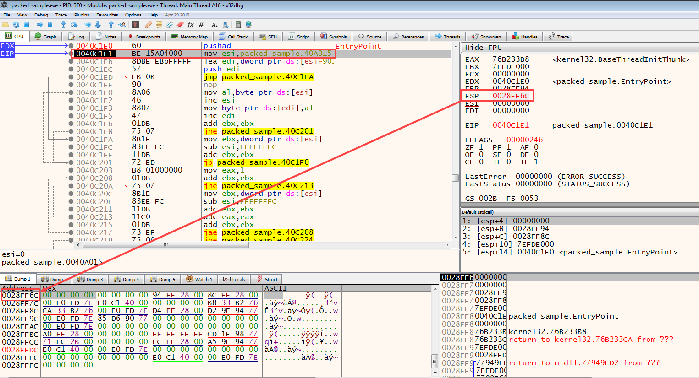
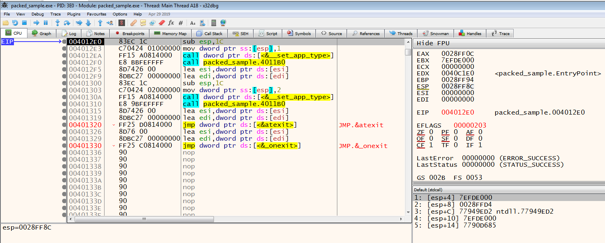
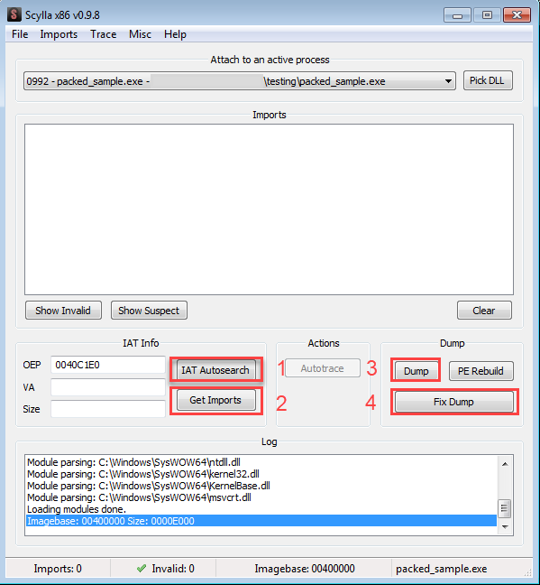

<h1 style="text-align:center"> Unpacking Nedir? </h1>

Zararlı yazılım geliştiricilerinin öncelikli amaçlarından biri analiz ve bundan kaynaklı sebeplerden dolayı tespitini zorlaştırmaktır. Bu amaçla birden fazla teknik kullanılmaktadır. Bu yazının konusu bu tekniklerin belki de en başında gelen "paketleme" tekniği olacaktır. Öncelikle "Bir yazılımın 'paketlenmesi' nedir?" ve "Paketleme algoritmasını tersine çevirerek nasıl orjinal yazılımı elde edebiliriz?" sorularına cevap arayacağız.

Bir yazılımın paketlenmesini basit olarak "sıkıştırmak" olarak açıklayabiliriz. Bir "zip" uygulamasını ele alalım; elimizde orjinal bir dosya var, sıkıştırıp ve parola ile korumak istiyoruz. Çeşitli araçlarla hem dosyanın boyutunu küçültüp hem de şifreli hale getirebiliyoruz. Aynı şekilde parolayı bilen bir kişi içeriği okuyabilir fakat bilmeyen bir kişiyi anlamsız veriler karşılar. Burada "zip"lemeyi "paketlemek" olarak, verilen "parola"yı da "paketleme algoritması" olarak düşünebiliriz. 

Asıl mantığına gelirsek; paketleme aracı yardımıyla orjinal yazılım sıkıştırılarak yeni bir dosya içerisine yazılır. Bu dosya içerisinde; paketlenmiş kod bloğunu **"unpack"** etmek üzere yazılmış bir kısım ve paketlenmiş kod bloğu bulunur. Başlangıçta beklendiği üzere "unpack" etmek için yazılan kodlar çalışır ve paketlenmiş(sıkıştırılmış) kısım orjinal haline çevrilir ve çalıştırılır. 

Paketlenmiş yazılımlar içerisinde genellikle çok fazla string bulunmaz. Çünkü asıl çalışacak olan kodların bulunduğu kısım şifreli/sıkıştırılmış halde bulunmaktadır. Bu yüzden paketlenmiş bir yazılıma statik analiz yapılması oldukça zordur.

---

# Nasıl Tespit Edilir?

Bir yazılımın paketli olduğunu tespit etmenin birçok yolu ve yöntemi vardır. Her zaman söylediğimiz gibi; bizim için en kolay yoldan bilgiye ulaşmak değerlidir. Aslında statik analizin bir parçası olan statik analiz araçları yardımıyla otomatize şekilde paketlenmiş yazılımlar tespit edilebilir. Burada kullanılan güncel yazılımların bilinen paketleme algoritmaları konusunda başarılı olduğunu ve genellikle paketlenmiş bir yazılımı tespit ettiğini söyleyebiliriz. Algoritması bilinmeyen/custom olarak yazılmış bir paketleme algoritmasını tespit etmek için ise ipuçları şunlardır; 

1. Yazılımın kendisinin/bölümlerinin entropy değerinin yüksek olması
2. Standart dışı bölüm ismi bulunması
3. ".text" bölümü dışındaki bölümlerden birinde "executable" yetkisi olması veya "self-modifying" özelliği bulunması (%100 paketli olduğu anlamına gelmez)
4. Yazılımın "pushad/pusha" instructionları ile başlaması

Bir yazılımın paketli olup olmadığını anlamak için paketleme mantığını düşünmemiz gerekmekte. Buradaki mantık önceki kısımda da anlattığımız gibi; dosya içerisinde şifreli/sıkıştırılmış bir kısım var ve bu kısma bir şekilde deşifre/extract işlemi yapılacak ve ardından çalıştırılacak. Dinamik analiz aşamasında bu mantığa uygun davranışların tespiti de bir yazılımın paketli olup olmadığını anlamamıza yardımcı olabilir.

**NOT:** Bir yazılımın paketli olması kesinlikle zararlı bir yazılım içerdiği anlamına gelmez.

---

# Nasıl Unpack Edilir?

Burada 3 temel yol bulunmaktadır:

1. Otomatize unpacking
    > Yazılım paketlenirken kullanılan paketleme yazılımı bilinen ve unpack aracı bulunan bir algoritma ise ilgili unpack uygulaması kullanılarak orijinal dosyaya erişilebilir veya çeşitli online unpack araçları kullanılabilir.
2. Dinamik analiz ve Dump
    > Yazılım debugger yardımıyla çalıştırılarak unpack işlemini yapması beklenir. Gerekli yerlere breakpoint koyarak unpack işlemi bittikten sonra çeşitli araçlar yardımıyla programın o anki hali yardımıyla yeni(unpack edilmiş) bir yazılım elde edilir(dump alınır). Elde edilen yeni yazılım unpack edilmiş yazılım olup statik analiz yapılabilir halde olacaktır.
3. Realiteyi kabul etmek
    > Her zaman saldırganın kullandığı algoritmayı çözemeyebiliriz. Yaptığımız ufak bir hata veya gözden kaçan bir nokta unpack işlemini başarısız kılabilir. Bu gibi durumlarda yazılım debugger üzerinde unpack edilir (breakpointler yardımıyla) ve analize dump almadan devam edilir. Yeni bir dosya oluşturulmaz.

    

---

# Dinamik Unpack

Öncelikle bir yazılımı UPX aracı ile paketliyoruz. Burada farklı bir paketleme aracı da kullanılabilir. Genellikle unpack işlemleri aynı mantıkla yürümektedir.

Paketlenmiş dosyanının boyutunun düştüğünü görebiliyoruz. Orijinal dosya ve paketlenmiş yazılımın farkına bir de PeStudio üzerinde bakalım.

Burada da import edilen fonksiyon ve string sayılarının düştüğünü görebiliyoruz.  

Paketlenmiş yazılımlar genellikle **"pushad/pusha"** instructionları ile başlamaktadır. Peki bunun sebebi nedir? **Push** komutu, stack üzerine veri yazmak için kullanılır. **Pushad** ise genel amaçlı bütün registerları stack içerisine yazar. Programın başlangıçtaki registerlarının saklanıp, paketlenmiş kısım unpack edildiğinde tekrar bu registerları stackten çıkarıp programı başlangıç durumuna getirir. Şimdi hayali olarak bir stack düşünelim, başlangıçta bir veri bloğu bu stack içerisine yazılıyor ve unpack işlemi tamamlandığında bu blok stack içerisinden çıkarılıyor. Basit bir mantıkla düşündüğümüzde; **"push"** komutundan sonra **ESP** yani Stack Pointer'ının bulunduğu hafıza adresine breakpoint atarsak, unpack işlemi bittiğinde program breakpoint'e takılacaktır. 

Dinamik unpack işleminin temel mantığı budur. Elbette farklı paketleme algoritmalarına farklı karşı teknikler üretilmesi gerekmektedir. Debugger üzerinde uygulamanın entrypoint'ine geldiğimizde **pushad** instruction'ını görebiliyoruz.

x86 Debugger üzerinde **F8** tuşu ile birlikte yalnızca bir instruction çalıştırarak **pushad** instruction'ının çalışmasını sağlıyoruz ve ardından ESP değerinin değiştiğini görebiliyoruz.

ESP değerine sağ tıklayıp **Follow in dump** butonuna tıklayarak ESP değerinin işaret ettiği hafıza adresini görüntülüyoruz. Ardından bu adresten itibaren 2 byte seçerek **Hardware Access** türünden breakpoint atıyoruz ve **F9** tuşuna basarak breakpoint'e gelene kadar çalışmasını sağlıyoruz.

Sol alt kısımda **Paused** yazısını gördüğümüzde aynı şekilde yan tarafında da neden durduğunu görebiliyoruz. Programın durduğu instruction'ın bir üst instruction'ına baktığımızda ise **popad/popa** instruction'ını göreceğiz. Bu bize şunu ifade ediyor; program unpack edilecek verileri stack üzerinde işledi ve unpack işlemini bitirdi, programın başlangıç registerlarını stackten çıkartarak asıl kodların çalışmasına başlayacak. 

Şimdi unpack işlemini tamamladık fakat asıl kod bloğu nerede? Burada da şöyle temel bir mantık var; unpack işleminin yapıldığı yer farklı bir hafıza bloğu ve unpack işlemini yapan kod farklı bir blokta bulunuyor. Yani asıl çalışacak olan unpack edilmiş kısıma programın dallanması gerekmekte. Burada 3 çeşit dallanma bulunabilir; koşullu dallanma (jne/je vb.), koşulsuz dallanma (jmp) ve call (hafıza adresine çağrım yapar). Peki hangi dallanma bizim unpack edilen kısıma gelmemizi sağlayacak? Burada genellikle büyük boyutlu dallanmalar görülmektedir, bu bizim için bir ipucu olabilir. Örneğin JMP instruction'ının bulunduğu adres **0x0004018F** ama dallanma yapacağı adres **0x0004119A** gibi. Örneğimizde de bu durumla karşılaşıyoruz; JMP'nin bulunduğu adres **0x0040C37B** ve dallanma yapacağı adres **0x4012E0**.

Dallanmayı gerçekleştirdiğimizde ise unpack edilmiş kod bloğunun başlangıç adresine geldiğimizi görebiliyoruz. 

Bu büyük dallanmanın yanı sıra unpack ettiğimizde dump almak için kullanacağımız uygulama da unpack işleminin tamamlanıp tamamlanmadığı konusunda bize yardımcı olacaktır. x86 plugin'lerinden biri olan **Scylla** açıldığında **IAT (Import Address Table) Autosearch** butonuna tıkladığımızda IAT'yi bulursa işlemimiz başarılı demektir. Ardından **Get Imports** butonuna tıklayarak dump alacağımız dosyanın çalıştırılabilir hale getirilmesini sağlıyoruz. Sonrasında **Dump** ve **Fix Dump** butonlarına tıklayarak unpack işlemini bitiriyoruz. 

---

Eleştiri/düzeltme/öneri için lütfen iletişim adreslerimden bana ulaşınız. Yorumlarınız benim için değerli :)

---