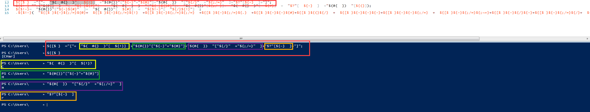
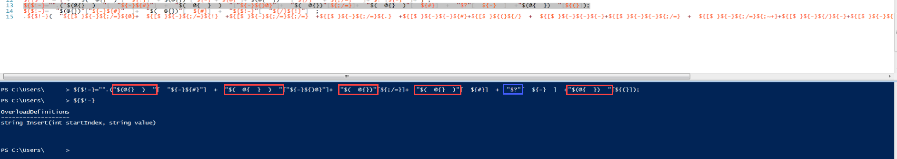
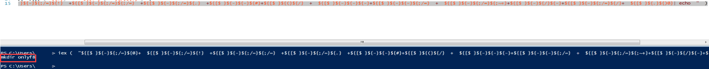
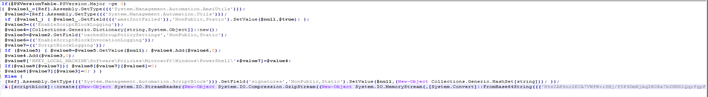
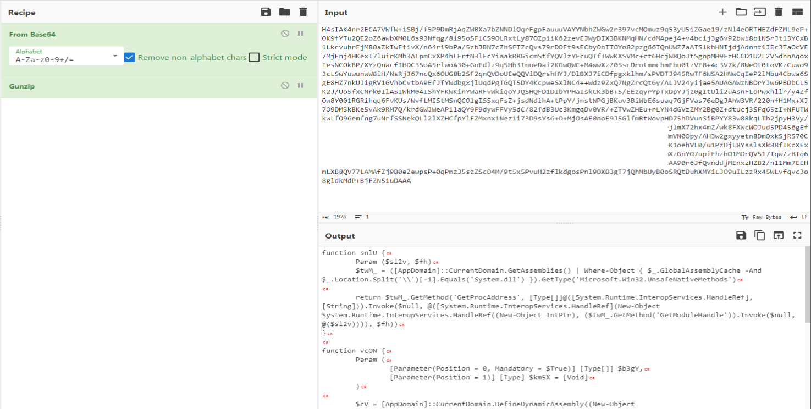
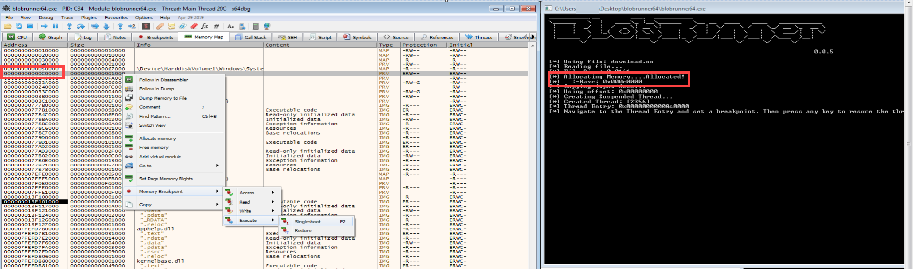
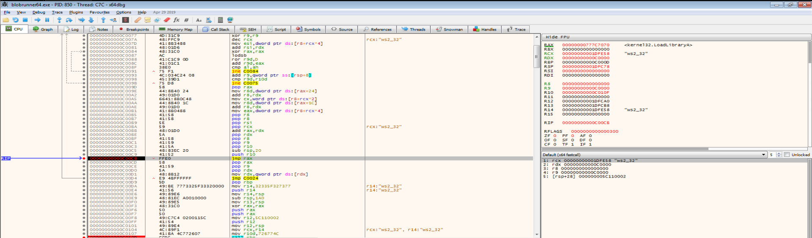
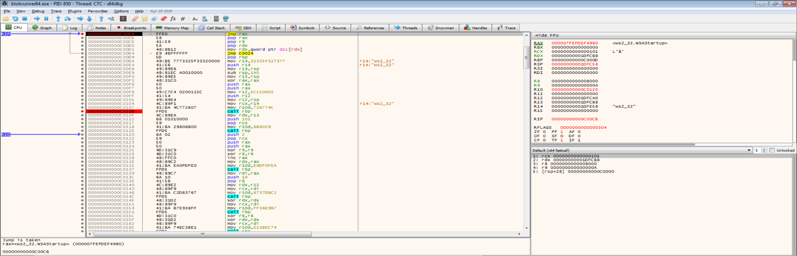
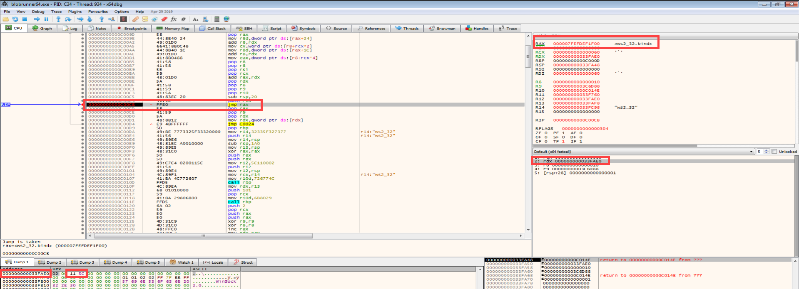

<h1 style="text-align:center"> Powershell Nedir?</h1>

Powershell 2006 yılında Microsoft tarafından geliştirilen, nesne yönelimli bir otomasyon dilidir. .NET ile oluşturulan bu platform sistem adminlerinin cihazları yönetmesi ve zamanlanmış görev oluşturmak gibi işlemleri daha kolay yapması adına oluşturulmuştur. 2016 yılında kaynak kodları open-source olarak yayınlanmıştır. Peki "malware" başlıklı bu blogda neden powershell var? Saldırganlar yaptıkları attack-campaign'lerde oldukça fazla kullanıcıya saldırır ve en fazla enfekte edebileceği sistemi enfekte etmeyi amaçlar. Burada da kullanılan teknoloji ve diller konusunda genellikle tüm cihazlarda bulunması beklenen teknoloji ve dilleri kullanırlar. Powershell'in windows cihazlarda varsayılanda bulunması ve oldukça fazla yeteneğe sahip olması, saldırganlar açısından son derece fazla kullanılan bir araç olmasını sağlamaktadır. Bunun yanısıra, .NET dilinde yazıldığı için içerisinde bir çok API kullanıbilmektedir ve aynı zamanda kendine özgü API'ları bulunmaktadır. Bu da aslında "yetenek" dediğimiz kavramı ortaya çıkarmaktadır. Örneğin **"DownloadString"** API'si yardımıyla cihazın diskine hiç bir yazma işlemi yapmadan cihaz üzerinde komut/shellcode/executable dosya çalıştırabilme yeteneğine sahiptir. Veya **"Marshal"** class'ı kullanılarak memory üzerinde shellcode çözümleyip yine diske yazma yapmadan shellcode çalıştırılabilmektedir. 

Yukarıda da bahsettiğimiz gibi oldukça fazla saldırı seçeneği ve tekniği bulunmakta fakat bildiğiniz üzere powershell açık kaynaklı bir script dili, bir derlenme söz konusu olmadığı için çalıştırılacak olan komutun veya scriptin tüm komutları açık şekilde görülebilmektedir. Peki saldırganlar buna rağmen zararlı powershell komutlarını veya scriptlerini cihazlarda nasıl çalıştırabiliyor?

---

<h1 style="text-align:center"> Kullanılan Parametreler </h1>

Saldırganlar powershell üzerinde komut çalıştırırken birden çok parametre kullanarak saldırının kullanıcı tarafından tespit edilmesini ve güvenlik ürünlerinden kaçınmayı amaçlamaktadırlar. Bu parametreler;

**ExecutionPolicy**: Güvenlik sağlama amaçlı oluşturulmuş Policy'dir.  Cihaz üzerinde çalıştırılabilecek/yüklenebilecek powershell betiği türlerini belirlemek için kullanılır.

    1. Restricted, varsayılan olarak yüklenen ExecutionPolicy değeridir. Cihazda herhangi bir powershell betiği çalıştırılamaz.
    2. AllSigned, yalnızca güvenilir publisherlar tarafından imzalanmış scriptler çalıştırılabilir.
    3. RemoteSigned, Windows Server 2012 R2 cihazlarda varsayılan Policy'dir. Yalnızca yerel olarak oluşturulan script dosyaları sistemde çalıştırılabilir.
    4. Unrestricted, yerel olarak oluşturulmuş ve imzalı powershell scriptleri çalıştırılabilir. Remote çalıştırılan scriptler için command prompt gösterilir.
    5. Bypass, cihazda tüm powershell scriptleri çalıştırılabilir.

Saldırganlar, ExecutionPolicy değeri kullanıcılar tarafından genellikle değiştirilmediği için varsayılan olarak Restricted veya RemoteSigned olduğunu varsayarak saldırılarını planlamaktadırlar. Bu yüzden komut satırlarında genellikle **"powershell -EP bypass"** veya **"powershell -ExecutionPolicy bypass"** görülmektedir. **Powershellde verilen bu parametreler büyük/küçük harfe duyarlıdır ve kısaltma kullanılabilir.**

**EncodedCommand**: Powershell varsayılan olarak Base64 değerlerini decode edip çalıştırabilir. **"powershell -EncodedCommand 'Base64'"** komut satırıyla birlikte satır sayısı farketmezsizin, Base64 olarak encode edilmiş komutları/scriptleri powershell üzerinde çalıştırabilirsiniz. 

**NonInteractive**: İnteraktif olmayan bir komut/script çalıştırmaya yarar. Read-Host gibi kullanıcıdan input alınan metodlar devre dışı bırakılmış olur.
**WindowStyle**: Script çalıştığında powershell penceresinin durumunu belirlemeye yarar. Genellikle saldırganlar tarafından **"-WindowStyle hidden"** olarak kullanılır. Powershell penceresi kullanıcıya gösterilmez.
**NoProfile**: Betiği çalıştırılan kullanıcını powershell profilini yüklemeden komut/script çalıştırmaya yarar. Kullanıcının cihaz çalıştığında otomatik olarak tanımlanmasını istediği powershell değişkenleri, özel ayarlar, fonksiyonlar veya farklı konfigürasyonları bu profilde bulunur. Saldırganlar bu profili devre dışı bırakarak aynı zamanda ExecutionPolicy değerini de devre dışı bırakmış olurlar.
**Sta**: Açılımı Single-Threaded Apartment'dir. Saldırganların bu parametreyi kullanmasının sebebi şudur; bazı COM (Component Object Model) objeleri Single-Threaded Apartment modelini gerektirmektedir. COM objeleri sistem servislerine veya diğer yazılımlara erişmek için kullanılmaktadır. Saldırganlar da eğer scriptlerinde/komutlarında COM objesi kullanıyorsa bir nevi komutun/betiğin çalıştığını garantiye almak için bu parametreyi kullanırlar.

Genel olarak karşılaşılabilecek bir powershell komut satırı ise şu şekilde olabilir => **"powershell -NoP -sta -NonI -W Hidden -Enc"** veya **"powershell -ep bypass -sTa -nOnI -w hidden -enC"** vs.

Yukarıda bazı powershell parametreleri verilmiştir. Hepsine ulaşmak için **"powershell -?"** komutunu çalıştırabilirsiniz.


---

<h1 style="text-align:center"> Obfuscation Nedir?</h1>


Obfuscation, bir şeyi anlaşılması zor hale getirmek olarak açıklanabilir. Genellikle script dilleri zararlı amaçlarla kullanılacağında obfuscation işlemine tabi tutulur. Bkz. JavaScript obfuscation vb. Peki bu "anlaşılması zor hale getirme" işlemi nasıl yapılıyor? Basit bir örnek vermek gerekirse; 

```
$value1="Onlyf8"
$value2="Oxxxaaanaaaabbbxlxxxaaaabbbbyfaaaaxxxxbb8"
$value2.Replace("x","").Replace("a","").Replace("b","")
```

Yukarıdaki örneğe bakıldığında bu 3 komut çalıştığında $value1 ve $value2'nin değerleri aynı olmakta. Obfuscation, düz yazıldığında rahatlıkla zararlı olduğu anlaşılabilecek komutların farklı şekillerde yazılıp, çalıştırılma anında asıl haline getirilmesidir. 

Powershell üzerinde oldukça farklı ve fazla obfuscation tekniği bulunmaktadır. Bu yazıda sıklıkla karşımıza çıkan teknikleri gösterip analiz edeceğiz.


---

<h1 style="text-align:center"> Special Character Obfuscation</h1>

Powershell üzerinde süslü parantezler arasına özel karakterler kullanılarak değişken tanımlanabilmektedir. Örneğin ```${# ;}=1 ``` gibi. Daniel Bohannon tarafından yazılan **Invoke-Obfuscation** ismindeki powershell aracı üzerinden bu teknik ile encode edilmiş bir script oluşturuyoruz. Şimdi bu tekniğin nasıl tersine çevirildiğine bakalım.

```
${$!-}  =+  $(  )  ;${;/=}  =${$!-};${-}=  ++  ${$!-}  ;${/}  =++${$!-};${(}  =  ++  ${$!-};${#}=  ++${$!-};${.}  =++  ${$!-}  ;${)@}  =  ++  ${$!-}  ;${!}  =++${$!-}  ;${;~+}=  ++  ${$!-};${@}=++${$!-}  ;${[$ }  ="["+  "$(  @{}  )"[  ${!}]  +"$(@{})"["${-}"+"${@}"]+"$(@{  })  "["${/}"  +"${;/=}"  ]+"$?"[${-}  ]+"]";${$!-}="".("$(@{}  )  "[  "${-}${#}"]  +  "$(  @{  }  )  "["${-}${)@}"]+  "$(  @{})"[${;/=}]+  "$(  @{}  )"[  ${#}]  +  "$?"[  ${-}  ]  +"$(@{  })  "[${(}]);${$!-}=  "$(@{})"["${-}${#}"  ]+  "$(  @{})"[  ${#}]  +  "${$!-}"[  "${/}${!}"]  ;.${$!-}(  "${[$ }${-}${;/=}${@}+  ${[$ }${-}${;/=}${!}  +${[$ }${-}${;/=}${;/=}  +${[$ }${-}${;/=}${.}  +${[$ }${-}${-}${#}+${[$ }${(}${/}  +  ${[$ }${-}${-}${-}+${[$ }${-}${-}${;/=}  +  ${[$ }${-}${;/=}${;~+}+${[$ }${-}${/}${-}+${[$ }${-}${;/=}${/}+  ${[$ }${.}${)@}|  ${$!-}  "  )
```

Yukarıda Special Character tekniği ile obfuscate edilmiş bir powershell scripti bulunmaktadır. Şimdi adım adım tersine çevirelim.

Öncelikle bu powershell tek bir satır değil çünkü aralarda **;** karakterini satır satır ayırmak için kullanıldığını görebiliyoruz. Bu karakterlerden sonra satır atlayıp scripti satır satır çalıştırılabilecek hale getiriyoruz.  


Şimdi bir nebze daha okunabilir ( :D ) hale geldi. Peki bu satırlar ne yapıyor? Powershell ISE kullanarak satır satır çalıştıralım.


Adım adım çalıştırdığımızda şunu fark ediyoruz; 1. satırda ilk oluşturulan değişkene "0" değeri atanıyor, ardından farklı bir değişkene de bu değer atanıyor. 3. satıra geldiğimizde ise oluşturulan değişkene **++0** değerinin atandığını görebilirsiniz. Bu satırda **0** olarak tanımlanan değişken **1** arttırılıp yeni oluşturulan değişkene atanmaktadır. Bu şekilde 0-9 arası bütün rakamlar birer değişkende saklanmaktadır. Peki ne işe yarayacak bu rakamlar? 



Rakam tanımlamaları bittikten sonra 12. satıra geliyoruz. Bu satırdaki değişkene ise çeşitli native powershell değişkenleri kullanılarak **"[Char]"** stringi atanmaktadır. Peki bu  **"[Char]"** stringi ne işe yarayacak?



Bir sonraki satırda ise yine native değişkenlerden olan (yukarıdaki görselde kırmızı ile kutu içine alınmış değişkenler) **System.Collections.Hashtable** değişkeni üzerinden index kullanılarak **insert** metodu oluşturulduğu görülmektedir. Yalnızca **r** harfi **"$?"** yani **True** stringi üzerinden elde edilmiştir. 


Ardından yine **System.Collections.Hashtable** stringi üzerinden index kullanılarak **"ie"** stringi elde edildiği, bir önceki satırda oluşturulan değişken üzerinden ise **"x"** harfi alınarak **"iex"** yani **Invoke-Expression** metodu elde edildiği görülmektedir. Son satırda ise **"iex"** ardından **"[Char]"** kullanılarak obfuscate edilmiş script çalıştırılacağı görülmektedir. Bu komutu çalıştırmadan elde etmek için şunu yapabiliriz; artık **iex** değişkenini biliyoruz, o zaman bu değişken yerine **"echo"** yazarsak komutu çalıştırmak yerine ekrana basacaktır. Fakat bu scriptte iki adet **iex** bulunmakta. Birincisi 15. satırın başında, ikincisi ise sonunda. Baştaki **iex** stringi oluşturmak için, sondaki ise komutu çalıştırmak için yazılmıştır. Sondaki **iex** stringini taşıyan değişken yerine **"echo"** yazıp komutu elde edebiliriz.



Special Character Obfuscation uygulanmış bir scripti tersine çevirmenin diğer yolu ise şudur; örneğin **"${;#'}"** değişkenine 0 rakamı atandı. Çeşitli text editor araçlarıyla bu değişkenin geçtiği her yerdeki değerini 0 ve diğer değişkenlerin de sayısal değerlerini tüm satırlarda değiştirip, son satırdaki **"[Char][x]"** x'yerine gelen rakamları okunur hale getirip tüm stringi elde edebilirsiniz. 

---

<h1 style="text-align:center"> String Concatenate Obfuscation</h1>


Powershell üzerinde ```$a="A"+"B" ``` şeklinde iki ve daha fazla string birleştirilerek bir değişkene atanabilir veya bir metoda parametre olarak verilebilir. Bir diğer string parçalama yöntemi ise liste yöntemidir. ```$a=("{0}{1}")-f'A','B' ``` şeklinde yapılan tanımlamada; **-f** anahtarından sonra verilen her bir string elemanı 0'dan başlayarak indekslenir ardından **-f** anahtarından önceki string içerisinde süslü parantezler arasında bulunan index numaralarına göre stringde yerine yazılır. Yukarıdaki iki powershell komutu da **$a** değişkeninin değerini **AB** yapmaktadır. Peki bu iki teknik birlikte kullanılırsa ne olur? 


Tatlı mı tatlı bir powershell scriptiniz olur :) Birçok random değişken ismi, string birleştirme, liste formatında string modifikasyonu, Base64, Gunzip vs. Ortalık epey karışık. Nereden başlamalıyız? Öncelikle değişken isimlerini okunabilir hale getiriyoruz. Ardından ```'+' ``` karakterlerini tüm script içerisinde siliyoruz.


Artık bazı stringler az da olsa okunabilir/tahmin edilebilir hale geldi. Şimdi ikinci satıra odaklanalım; 

```
$value1_=[Ref].Assembly.GetType((('{4}{0}{9}tem.{3}ana{6}ement.{8}{2}t{7}mati{7}n.{8}m{9}i{5}ti{1}{9}')-f'y','l','u','M','S','U','g','o','A','s'));
```

**-f** anahtarından sonra 10 adet değer var, 1. değerin indeksi 0 olacak şekilde yerlerine yazıldığında karşımızda şu string çıkmaktadır;

```
$value1_=[Ref].Assembly.GetType(('System.Management.Automation.AmsiUtils'));
```

**-f** yani **Format List** yapısının çözümlenme biçimi bu şekildedir. Şimdi bütün satırları aynı şekilde okunabilir hale getirelim. 



Bütün stringleri çözümledik, şimdi anlamlandıralım. Satırlarda geçen kavramların birçoğu powershell üzerinde bulunan güvenlik mekanizmalarını devre dışı bırakmak üzerine yazılmış olduğunu fark ediyoruz. Bunlar; AMSI (Anti-Malware Scan Interface), ScriptBlockLogging (çalıştırılan powershell scriptlerinin loglanmasına yarayan güvenlik mekanizması) vb. mekanizmalardır. İlk satırda yapılan versiyon kontrolü ise bu güvenlik mekanizmalarının olup olmadığını kontrol etmek için koyulduğu düşünülmektedir. AMSI mekanizması PowerShell 4.0, ScriptBlockLogging ise PowerShell 5.0 ile eklenmiş özelliklerdir. Eğer 3 ve daha küçük bir sürüme sahip powershell üzerinde bu komutlar çalışacaksa zaten halihazırda bu mekanizmalar olmayacağı için bu mekanizmalar üzerinde işlem yapmaya çalıştığımızda hata alacağız. Bundan dolayı saldırganların böyle bir kontrol koyduğu düşünülmektedir.

Son satırda ise ampersand (&) işareti ile birlikte sonrasında gelen komut çalıştırılmıştır. Peki nedir bu komut? **+** karakteri ile birleştirme sonrasında Format List ile birlikte string tamamla işleminin ardından bir Base64Decode sonrasında ise Gunzip ile decompress edilen bir string karşımızda çıkıyor. Yani asıl çalıştırılmak istenen komut; Gunzip ile compress edilmiş ,Base64 ile encode edilmiş, Format List'e uygun hale getirilmiş -> **+** karakteri ile parçalanmış ve son halini almış. Bu sıralamayı tersinden yaparsak orjinal stringe ulaşabiliriz.



Orjinal string'i CyberChef üzerinde önce **FromBase64** sonrasında ise **Gunzip Decompress** yaparak bir sonraki adıma geçiyoruz. Tekrar bir powershell scripti ile karşılaşıyoruz. Bu powershell scriptine baktığımızda ise .NET metodları kullanarak bir shellcode çalıştırdığını anlayabiliyoruz. Hafıza bloğunda **VirtualAlloc** ile bir yer ayrıldığını, ardından bu yeni oluşturulan kısma Base64 ile encode edilmiş sonrasında decode edilen shellcode'un **Copy** ile taşındığını sonrasında ise **CreateThread** ile çalıştırıldığı anlaşılmaktadır.


Şimdiki aşamada ise shellcode'u elde edip neler elde edebileceğime bakacağız. Öncelikle buradaki Base64 değerini CyberChef kullanarak decode ediyoruz ve **Download** özelliğini kullanarak indiriyoruz.


**Blobrunner** kullanarak bu shellcode'u debug edeceğiz. Burada iki yöntem vardır; blobrunner'ı komut satırından **blobrunner.exe [shellcode dosyası]** satırı ile çalıştırıp sonrasında debugger üzerinden bu process'e attach olabiliriz (blobrunner shellcode'u çalıştırmadan önce kendisini durdurur ve sizden bir tuşa basmanızı bekler) ve blobrunner'ın shellcode'u yüklediği adrese breakpoint atarak programı devam ettirebiliriz veya direkt olarak blobrunner'ı debugger üzerinden çalıştırıp komut satırını değiştirip aynı işlemleri yapabiliriz. 



Çalıştırdığımızda dinamik olarak çözümlenen API'ler görmekteyiz. Burada **jmp rax** satırında çözümlenen API'lerin çağrıldığını tespit ediyoruz ve bu satıra breakpoint atarak **RAX** register'ı üzerinden çağrılan API'leri takip ediyoruz. 



Öncelikle **LoadLibrary** API'si ile **ws2_32** kütüphanesi yükleniyor, soket işlemleri yapacağını anlıyoruz. Sonrasında ise **WSAStartup** API'si ile bir soket oluşturduğunu görüyoruz.



Oluşturulan soketi **bind** API'si kullanarak aktif hale getiriyor. Parametrelere baktığımızda **4444** portunun dinlendiğini tespit ediyoruz. 



Sonuç olarak ilk adımdan itibaren deobfuscate ettiğimiz powershell scriptinin **bind shell** türünde bir zararlı yazılım olduğunu tespit ediyoruz.

---

Eleştiri/düzeltme/öneri için lütfen iletişim adreslerimden bana ulaşınız. Yorumlarınız benim için değerli :)

---