<h1 style="text-align:center"> What is Powershell?</h1>

Powershell is an object-oriented automation language developed by Microsoft in 2006. Built with .NET, this platform is built to make it easier for system administrators to manage devices and create scheduled tasks. In 2016, the source code was published as open-source. So why is there powershell in this blog titled "malware"? Attackers attack quite a lot of users in their attack campaigns and aim to infect the system they can infect the most. Here, too, they use the technology and languages that are expected to be present on all devices. The fact that Powershell is by default on windows devices and has quite a lot of capabilities makes it an extremely used tool for attackers. In addition, since it is written in .NET, it can use many APIs and also has its own APIs. This actually reveals the concept we call "talent". For example, with the help of the **"DownloadString"** API, it has the ability to run commands/shellcode/executable files on the device without any write operations to the device's disk. Or using the **"Marshall"** class, shellcode can be decyrpt on memory and shellcode can be executed without writing to disk. 

As we mentioned above, there are quite a lot of attack options and techniques, but as you know, powershell is an open source scripting language, since there is no compilation, all the commands of the command or script to be run can be clearly seen. So how can attackers still run malicious powershell commands or scripts on devices?

---

<h1 style="text-align:center"> Parameters Used </h1>

When executing commands on powershell, attackers use multiple parameters to detect the attack by the user and avoid security products. These parameters are;

**ExecutionPolicy**: Policy created for security purposes.  Used to determine the types of powershell scripts that can be run/installed on the device.

    1. Restricted, is the ExecutionPolicy value that is loaded by default. No powershell scripts can be run on the device.
    2. AllSigned, Only scripts signed by trusted publishers can be run.
    3. RemoteSigned, This is the default policy on Windows Server 2012 R2 devices. Only locally generated script files can be run on the system.
    4. Unrestricted, Locally created and signed PowerShell scripts can be run. Command prompt is shown for scripts run remotely.
    5. Bypass, All PowerShell scripts can be run on the device.

Attackers plan their attacks by assuming that the ExecutionPolicy value is Restricted or RemoteSigned by default, since it is not usually changed by users. Therefore, command lines often show **"powershell -EP bypass"** or **"powershell -ExecutionPolicy bypass"**. **These parameters given in Powershell are case-sensitive and abbreviated may be used.**

**EncodedCommand**: By default, Powershell can decode and run Base64 values. With the **"powershell -EncodedCommand 'Base64'"** command line, you can run commands/scripts that are Base64 encoded in powershell, regardless of the number of lines. 

**NonInteractive**: It serves to execute a non-interactive command/script. Methods such as Read-Host that receive input from the user are disabled.

**WindowStyle**: When the script runs, it serves to determine the state of the powershell window. It is often used by attackers as "-WindowStyle hidden". The Powershell window is not shown to the user.

**NoProfile**: It allows the user who is running the script to run the command/script without loading the powershell profile. Powershell variables, custom settings, functions or different configurations that the user wants to be defined automatically when the device starts are included in this profile. By disabling this profile, attackers also disable the ExecutionPolicy value.

**Sta**: It stands for Single-Threaded Apartment. The reason why attackers use this parameter is that; some COM (Component Object Model) objects require the Single-Threaded Apartment model. COM objects are used to access system services or other software. Attackers also use this parameter to ensure that some kind of command/script works if they use a COM object in their scripts/commands.

A common powershell command line can be as follows => **"powershell -NoP -sta -NonI -W Hidden -Enc"** or **"powershell -ep bypass -sTa -nOnI -w hidden -enC"** etc.

Above are some powershell parameters. To get to all of them **"powershell -?"** You can run the command.


---

<h1 style="text-align:center"> What is Obfuscation?</h1>


Obfuscation can be explained as making something difficult to understand. Generally, script languages are subject to obfuscation when they are used for malicious purposes. See JavaScript obfuscation, etc. So how does this "making it hard to understand" work? To give a simple example; 

```
$value1="Onlyf8"
$value2="Oxxxaaanaaaabbbxlxxxaaaabbbbyfaaaaxxxxbb8"
$value2.Replace("x","").Replace("a","").Replace("b","")
```

Looking at the example above, when these 3 commands run, the values of $value1 and $value2 are the same. Obfuscation is the writing of commands that can easily be understood as harmful when written in plain in different ways and made their original at the time of execution. 

There are quite different and more obfuscation techniques on Powershell. In this article, we'll show and analyze the techniques that we often come across.


---

<h1 style="text-align:center"> Special Character Obfuscation</h1>

A variable can be defined by using special characters between curly brackets on Powershell. For example, ```${# ;}=1 ``` Such as . We create a script encoded with this technique through the powershell tool **Invoke-Obfuscation** written by Daniel Bohannon. Now let's look at how to reverse this technique.

```
${$!-}  =+  $(  )  ;${;/=}  =${$!-};${-}=  ++  ${$!-}  ;${/}  =++${$!-};${(}  =  ++  ${$!-};${#}=  ++${$!-};${.}  =++  ${$!-}  ;${)@}  =  ++  ${$!-}  ;${!}  =++${$!-}  ;${;~+}=  ++  ${$!-};${@}=++${$!-}  ;${[$ }  ="["+  "$(  @{}  )"[  ${!}]  +"$(@{})"["${-}"+"${@}"]+"$(@{  })  "["${/}"  +"${;/=}"  ]+"$?"[${-}  ]+"]";${$!-}="".("$(@{}  )  "[  "${-}${#}"]  +  "$(  @{  }  )  "["${-}${)@}"]+  "$(  @{})"[${;/=}]+  "$(  @{}  )"[  ${#}]  +  "$?"[  ${-}  ]  +"$(@{  })  "[${(}]);${$!-}=  "$(@{})"["${-}${#}"  ]+  "$(  @{})"[  ${#}]  +  "${$!-}"[  "${/}${!}"]  ;.${$!-}(  "${[$ }${-}${;/=}${@}+  ${[$ }${-}${;/=}${!}  +${[$ }${-}${;/=}${;/=}  +${[$ }${-}${;/=}${.}  +${[$ }${-}${-}${#}+${[$ }${(}${/}  +  ${[$ }${-}${-}${-}+${[$ }${-}${-}${;/=}  +  ${[$ }${-}${;/=}${;~+}+${[$ }${-}${/}${-}+${[$ }${-}${;/=}${/}+  ${[$ }${.}${)@}|  ${$!-}  "  )
```

Above is a powershell script obfuscated with the Special Character technique. Now let's reverse it step by step.

First of all, this is not a single line in powershell because we can see that it is used to separate the **;** character line by line in between. After these characters, we skip the line and make the script available to run line by line.  

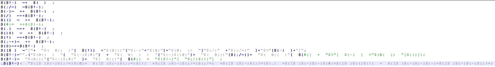

Now it's a bit more readable (:D). So what do these lines do? Let's run it line by line using Powershell ISE.

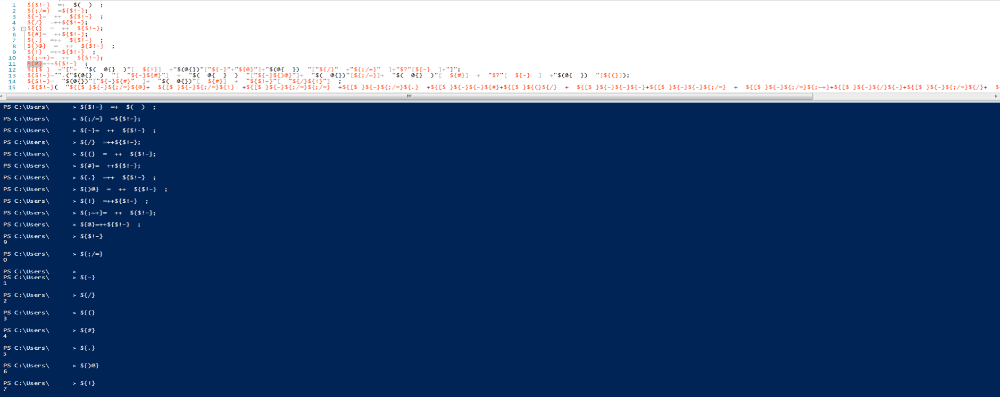

When we run it step by step, we notice that; In line 1, the first variable created is assigned a value of "0", and then a different variable is assigned this value. When we come to the 3rd line, you can see that the value **++0** is assigned to the created variable. The variable defined as **0** in this line is incremented by **1** and assigned to the newly created variable. In this way, all digits between 0-9 are stored in a variable. So what are these numbers going to do? 

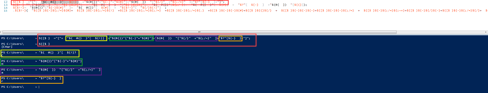

After the number definitions are finished, we come to the 12th line. The variable in this line is assigned the string **"[Char]"** using various native powershell variables. So what will this **"[Char]** string do?

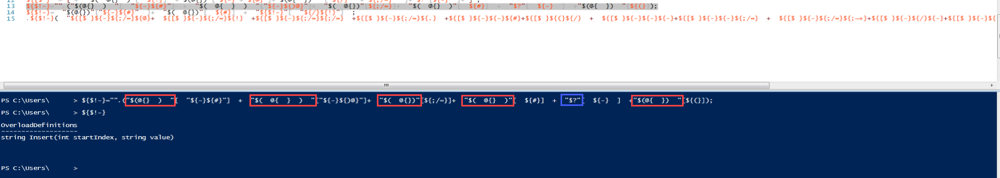

In the next line, it is seen that the **insert** method is created by using index over the **System.Collections.Hashtable** variable, which is also one of the native variables (variables boxed in red in the image above). Only the letter **r** is obtained from the string **"$?"** i.e. **True**. 

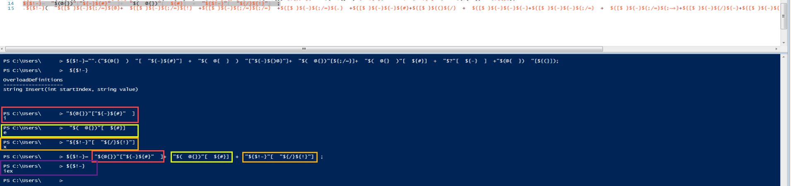

Then, it is seen that the **"ie"** string is obtained by using index over the **System.Collections.Hashtable** string, and the **"iex"** method is obtained by taking the letter **"x"** over the variable created in the previous line. The last line shows that the obfuscated script will be run using **"iex"** followed by **"[Char]"**. To obtain it without running this command, we can do the following; Now that we know the **IEX** variable, then if we type **"echo"** instead of this variable, it will print the screen instead of executing the command. But there are two **iex**s in this script. The first is at the beginning of the 15th line, and the second is at the end. The leading **iex** is written to create the string, and the last one is written to execute the command. Instead of the variable carrying the **iex** string at the end, we can write **"echo"** and obtain the command.


The other way to reverse a script with Special Character Obfuscation is to; For example, the variable **"${;#'}"** is assigned the number 0. With various text editor tools, you can change the value of this variable to 0 everywhere it occurs and the numeric values of the other variables in all rows, and make the digits that replace the **"[Char][x]"** x in the last line readable and get the whole string. 

---

<h1 style="text-align:center"> String Concatenate Obfuscation</h1>


In Powershell, two or more strings ```$a="A"+"B"``` can be combined to assign them to a variable or given as parameters to a method. Another string sharding method is the list method. ```$a=("{0}{1}")-f'A','B``` ; Each string element after the **-f** key is indexed starting at 0, then substituted in the string according to the index numbers between the curly parentheses in the string before the **-f** key. The two powershell commands above also make the value of the variable **$a** into **AB**. So what happens if these two techniques are used together? 

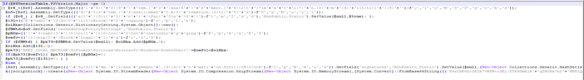

You get a sweet powershell script :) A lot of random variable names, string merging, string modification in list format, Base64, Gunzip etc. It's a mess. Where should we start? First of all, we make the variable names readable. Then we delete the ```'+'``` characters in the entire script.

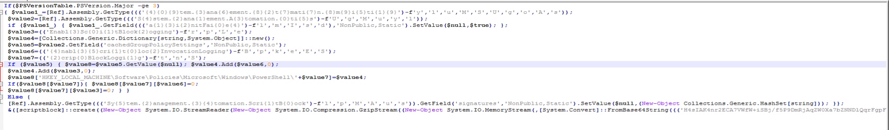

Now some strings are slightly readable/predictable. Now let's focus on the second line; 

```
$value1_=[Ref].Assembly.GetType((('{4}{0}{9}tem.{3}ana{6}ement.{8}{2}t{7}mati{7}n.{8}m{9}i{5}ti{1}{9}')-f'y','l','u','M','S','U','g','o','A','s'));
```

There are 10 values after the **-f** switch, when the index of the 1st value is written in such a way that it is 0, we see the following string;

```
$value1_=[Ref].Assembly.GetType(('System.Management.Automation.AmsiUtils'));
```

This is how the **-f** structure is resolved. Now let's make all the lines readable in the same way. 

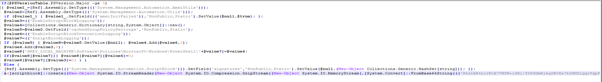

We have solved all the strings, now let's make sense of them. We notice that many of the concepts mentioned in the lines are written on disabling the security mechanisms found in powershell. These; AMSI (Anti-Malware Scan Interface), ScriptBlockLogging (security mechanism for logging the running powershell scripts), etc. The version control in the first line is thought to be put in place to check whether these security mechanisms exist. The AMSI mechanism is a feature added in PowerShell 4.0 and ScriptBlockLogging is a feature added in PowerShell 5.0. If these commands will run on powershell with version 3 and less, we will get an error when we try to operate on these mechanisms because there will not be these mechanisms already. It is because of this that the attackers are thought to have put such control in place.

On the last line, the ampersand (&) sign and the following command are executed. So what is this command? After merging with the **+** character, we come across a string that is decompressed with a Base64Decode and then Gunzip with the Format List. In other words, the command that is wanted to be executed; Compressed with Gunzip, encoded with Base64, made compatible with Format List, fragmented with **+** character and finalized. If we do this order in reverse, we can reach the original string.

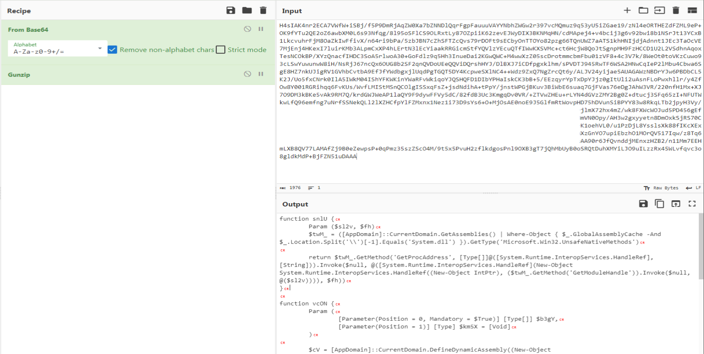

We go to the next step by doing the original string on CyberChef first **FromBase64** and then **Gunzip Decompress**. We encounter a powershell script again. When we look at this powershell script, we can understand that it runs a shellcode using .NET methods. It is understood that a place is allocated with **VirtualAlloc** in the memory block, then this newly created part is encoded with Base64, then the decoded shellcode is moved with **Copy** and then it is run with **CreateThread**.

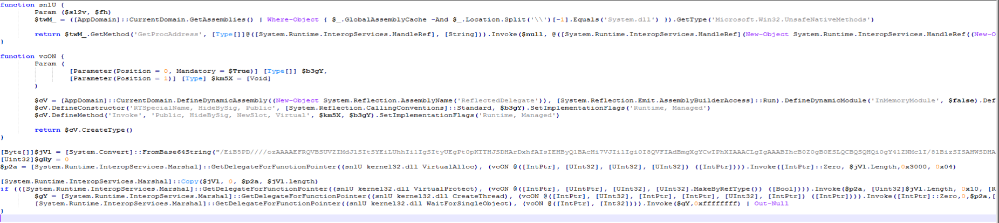

In the next stage, we will get the shellcode and see what I can get. First of all, we decode the Base64 value here using CyberChef and download it using the **Download** feature.

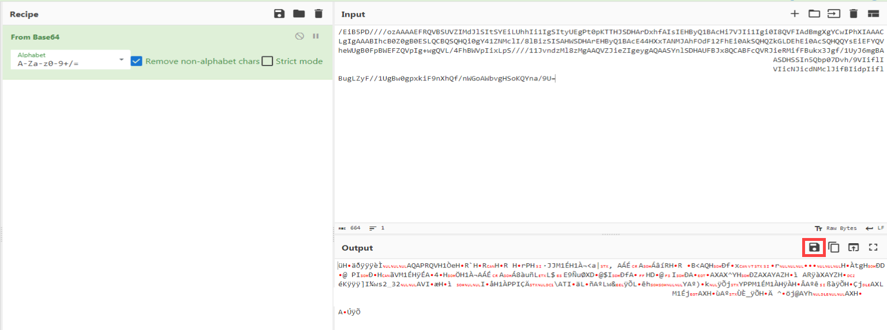

We will debug this shellcode using **BlobRunner**. There are two methods here; We can run BlobRunner from the command line with the **BlobRunner.exe [ShellCode File]** line and then attach to this process through the debugger (BlobRunner stops itself before running ShellCode and waits for you to press a key) and continue the program by toggle breakpoint the address where BlobRunner loads ShellCode, or we can run BlobRunner directly from the debugger and change the command line and do the same operations. 

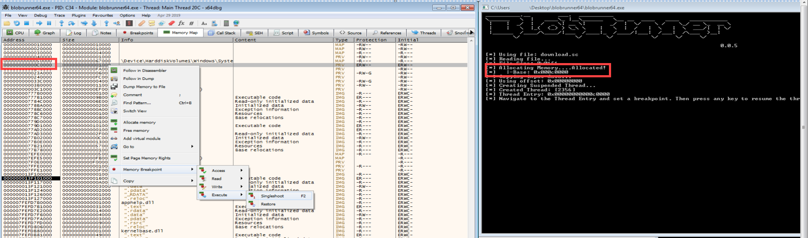

When we run it, we see APIs that resolve dynamically. Here we detect that the APIs resolved in the **jmp rax** line are called, and we toggle breakpoint this line and track the APIs called through the **RAX** register. 

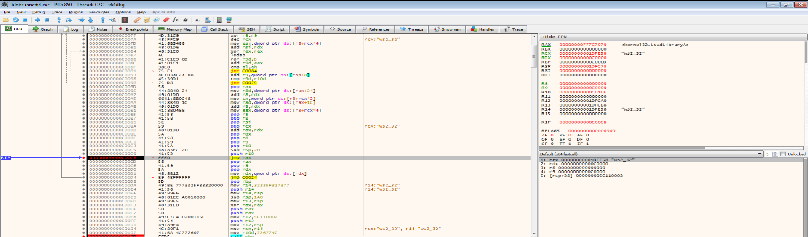

First of all, loading the **ws2_32** library with the **LoadLibrary** API, we understand that it will perform socket operations. Then we see that it creates a socket with the **WSAStartup** API.

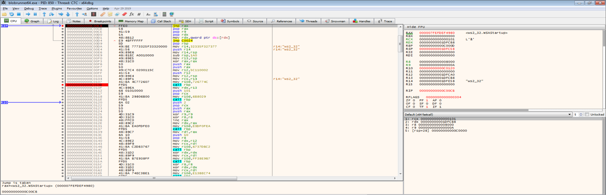

It activates the created socket using the **bind** API. When we look at the parameters, we find that the **4444** port is listening. 


As a result, we determine that the powershell script we deobfuscate from the first step is a **bind shell** type of malware.

---

Please contact me at my contact addresses for criticism/correction/suggestion. Your comments are valuable to me :)

---
