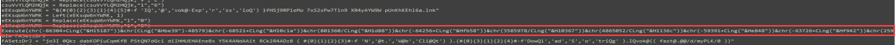
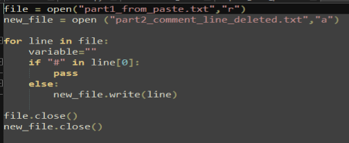

<h1 style="text-align:center"> Introduction </h1>

On the previous article we started malicious document analysis topic with Microsoft Word Documents. In this blog we will see Malicious Excel Documents. Actually these 2 topics and from now on malicious document topics will not be so different. I wanna analyze most seen type of malwares and these types uses mostly common techniques but each post i try to show you different technique. 

In this post; we will see a little bit reversing, coding and malware analysis. This will be a little long post, but i think you'll enjoy it :)  So let's start an adventure.

<h1 style="text-align:center"> Malicious Excel Document </h1>

I found this sample from MalwareBazaar, you can download samples from this site. There are multiple sites like that. In this blog post we will use the sample with **DF261D141CDB424B73C960D4AE4357A5** MD5 and **f4cf566217708d9c5e6d7bb3c39fa2acb5ae2ee86fd0fed9d19999f4b7b22eab** SHA256 hash. 

When we open excel, typically there are some random values and buttons. Also we can see "Enable macro" warning.

Actually when we analyze a suspicious document file, we don't need to open document, we can use **OfficeMalScanner** tool or right click and extract the document. Let's use OfficeMalScanner to see what this suspicious file contains. 

When we run OfficeMalScanner, we see there are multiple **.bin** files that contains VBA macros and these files extract to **"%TEMP%\DecompressedMsOfficedocument"** by OfficeMalScanner tool.

In this directory, there is **"XL"** subdir that contains **"vbaProject.bin"** file that contains VBA macro but this version of this file not readable. We need to make one more run with OfficeMalScanner. 

OfficeMalScanner made this macros readable and extract them foreach seperate file under run directory. We can see this directory at the bottom of the command line.

There are 6 VBA script but I won't show you all of it, some of them just nonsense macros that show this excel file as a legit file. But in **"Module2"** we detect some Google Drive address. A file download from this address and write as **"%TEMP%\update-1.3.vbs"** file and run with **"wscript.exe"**. 

<h1 style="text-align:center"> Second Stage Payload </h1>

Let's download this second stage **"vbs"** payload and see what happens. 

This file's MD5 hash is **19CD89FCF51FD576238A4913D32EDD9A**. It's heavily obfuscated VBS macro and contains so much junk code and lines that won't work because these are not commands therefore there is **"On Error Resume Next"** command in script. What does "junk code" mean? There are random values that created and replace by some random values and never used again. But except that values, there are some **"Execute"** command lines in that script. 

This **"Execute"** command takes string argument and run it like **eval** on javascript or **IEX** on powershell. But this string values are obfuscated -as expected- too. I coded a python script -i am not professional in python scripting, so please don't judge me :D- that extract these **"Execute"** command lines and make conversions. After conversions, create a txt file for each line and we can see each lines commands. I will share all of scripts that I coded for that sample on github. You can think these commands run in actual VBS script but obfuscated way. So if any variable created or changed in these lines, it affects variable in actual VBS script.

This script catch the Execute lines and deobfuscate them. After deobfuscation, create text file for each line and write them in it.

We have 8 **"Execute"** lines and 8 text files that contains these line's string values. I won't show all of them to you but I can say that it's a dead-end, just a trick that can hide something in that lines and tamper the analysis process for manual analysis. I show you one example of them.

You can say there are some "DownloadString" strings but these are just a string, none of them will execute.

So what we do now? Just old school analyze technique, find suspicious commands :) When we search **"Run"** string, we made a score eventually. There is a third stage payload named **"Update.4.0.1.ps1"**. 

But where is the content of script to be created? We need to search **"Update.4.0.1.ps1"** string and find a clue.  

With **CreateTextFile**, **"C:\Users\Public\Update.4.0.1.ps1"** file created and some values write in it. When we search this "Write" command parameter we can see another stage. 

This line is basically use format list feature of powershell and deobfuscate this string. The final string would be **"Invoke-Expression New-object Net.WebClient.DownloadString"** and we can see URL of third stage payload. But there is something nonsense. These "@" characters need to be replace in some line. When we search **"RQPH8WFOp0P5F"** variable on the script, there aren't any replace line. So what's the deal? 

I thought many thing, maybe its just a silly feature of powershell bla bla bla :D But then "Execute" lines came to my mind. These lines contains more lines and maybe in one of them there are replace line for this variable. And boom! My theory was correct. In 4th of execute line, there are 2(both same so you can think as one) replace lines for that variable.

After that correction we need to download third stage payload of malware.

<h1 style="text-align:center"> Third Stage Payload </h1>

So let's see what contains that matryoshka doll :D 

In this third stage, there are so many obfuscation technique; again nonsense and non used values, comment lines and there are obfuscated hex values that contains PE file(just a theory for now). So let's start coding again. I wanna add something here; I could make "Invoke-Expression" line or another execution line to "echo" or "write-host" and take the next stage payload for each of these steps but i want to code and fun :) . So first of all  lets start with comment lines. 

Its just basic script that if a line starts with **"\#"** character -which is comment line indicator in powershell- pass that line and if a line doesn't start with that character write that line to new file. After comment lines, we have another trouble, there are some lines in script that just create and initalize with some random values but never used after initialization. So I coded a script that delete these lines from script.

I am not the best, I coded the first algorithm that came to my mind, so don't get stuck here. After long hours of analyzing still there are nonsense lines of codes, I couldn't find a common "thing" to delete these lines. Finally, I figured it out that these nonsense lines contains **"-replace"** command. So I need to code again. Again I coded a basic scripts that if a line contains **"-replace"**, just pass it. If my technique would be wrong, I still have previous files, so I can look at them for specific variable or etc.

Finally I have some nice powershell malware. But still there are **".replace()"** commands in hex value initialization lines. I didn't need to code for that because i will get these values from final variable but I want to deal with it just for fun. So -again- I coded a python script that takes lines that contains **".replace()"** and replace the values in the variable. 

So what happened to third stage powershell payload? All obfuscation lines (almost all) cleared and we have a clear vision of what happens in that script. There are 1731 lines of initialization hex values and after that initialization some of concatenate(i think) with hex values. 

These much values made me think that there are 2 PE file and I searched for **"MZ"** signature that **"4D5A"**. So this theory is correct. There are 2 variables that starts with **"4D5A"**. 

When I first see these random and mixed concatenation, I thought I need to code a python script that takes variables values and order them for proper PE file. But then I said to myself, no need that much :D So I need to find execute line of the fourth stage of malware. 

At the end of the script; in line 1826(actually there are much line seperated by ";") script create a command for execution. **"Start-Process -FilePath [Path] -ArgumentList [Arguments], [$C2 variable value]"**. In line 1827 (also its a one line that seperated by ";") there is **"&"** symbol that execute commands that come after it which contains another format list obfuscation that contains "Invoke-Expression" and created commands in line 1826. Let's get these parameters.

It's clear that **"Abab"** and **"Abcabc"** variables create with **"GetTempFileName"** function. Our main malware in **"Abab"** variable's file and the other file is maybe for injection for **"RegsSvcs.exe"**. It's a common technique that create **"RegsSvcs.exe"** and inject a .NET malware in it. So it looks legit. 

We can see these file names created with **"GetTempFileName"** and after that with **"WriteAllBytes"**; **"Abcd"** variable's value write to **"Abab"** variable's file and **"Abcde"** variable's value to **"Abcabc"** variable's file. So let's get these values with **"Set-Content"** cmdlet.

We can see these **"Abcd"** and **"Abcde"** values fill with bytes that in **"Update1"** and **"Update2"** variables. So we can get these values from script without running the PE files. 

These are final stage of malware. So let's look at first one; **"Update2"**

This is **"Update1"**

When we look at the community comments for **"Payload2"** file, we understand that this is process injector. Now things are starting to become clear. Think about this **"Start-Process -FilePath [Path] -ArgumentList [Arguments], [$C2 variable value]"** command line. First file is process injector, after injector process (actual process) comes **"[.NET MalwareFile], RegsSvcs.exe"** part which is like **"[PE to be inject], [RegsSvcs.exe]"**. My theory is injector file injects **.NET Malware** to **"RegsSvcs.exe"** but this blog post for excel, I won't dive deeper for PE files. But I have a little gift for you. 

In the .NET Malware there is AES decryption function and key is somewhere in the machine. How can we know this? So let's look at AES decyrption.

AES key is taking from **"this.A"** and **"this.A"** declared in **"g"** function. But there are some obfuscate values in **"str, str2, path and text"** variables. This is a common obfuscation technique that used in .NET malwares. I show you a little trick. As a note, also you can use **"De4dot"** tool for deobfuscation for **.NET PE** files. So let's look at these strange named class and functions.

We can understand from here that there is a array and these functions split them with **"[Start Index] , [Length of string]"**. I am not going deeper for this technique, I will share a post about these technique and how to deobfuscate it. So for our 3 values that **"str, str2 and part of path"** variables, above functions is called. In **"EF71A7C6-2C98-4D7F-BEF1-B77ABE2DD9C4"** class, there is array that named **"4"** that contains deobfuscated values. We can understand that from function **"6"**.

Quickly we can figure it out that in array named **"4"** there are byte values and these values XORed for anti-detection. In runtime these values deXOR. 

We can simulate this behaviour in python and can take these **"str, str1 and part of path"** values. So we need values that between index of "4366" and "4384+4(length of last string)". With a little python coding, I coded a script that simulate this XOR operation and get the value of **"path"**.

But what is this **"bootstrapper-assistant"**? We know its combine with temp file path, so my theory is it's a file. A little rethinking the whole analysis, I remember that I saw this "bootstrapper-assistant" somewhere and I started to look previous scripts. Our careful readers already got this I think. 

In the last of third stage payload these string occurs with splitted shape and this file is located in **"%TEMP%"** path. This **"bootstrapper-assistant"** file contains AES key for sample. 

We can confirm that from function **"b"** from function **"g"**. Function **"b"** called from function **"g"**, parameter is FilePath of **"bootstrapper-assistant"**. Read the file and decode the Base64 value and assign this value to **"this.A"** which is **"aes.Key"**.

You can see above screenshot that **"B"** is file name which is **"bootstrapper-assistant"** and **"A"** is the value which is Base64 encoded **AES Key**.

Also you can use this **C#** code for decrypt the values of that .NET malware uses.

---

I know it was a bit of a long blog post but I want to share this adventure with you. There are too much steps after that to analyze .NET malware and find **C2, anti-debug and anti-analyze techniques, telegram address of attacker, FTP server** etc. but it will be subject for another blog post. Thank you for reading this far, I hope you had fun while you're learning something. I would like to thank [Ahmet A. GÜLTEKİN](https://www.linkedin.com/in/ahmetgultekin12/)  and [Yılmaz DİNÇER](https://www.linkedin.com/in/ylmzdncr/) for help me while review.

---

For your criticism, corrections, suggestions, and questions, please reach out to me through my contact addresses. Your feedback is valuable to me :)