<h1 style="text-align:center"> Giriş </h1>

Önceki makalede, zararlı doküman analizi konusunu Microsoft Word belgeleri ile başlatmıştık. Bu blog yazısında Zararlı Excel Belgelerini inceleyeceğiz. Aslında bu iki konu ve bundan sonra zararlı doküman konuları arasında çok fazla fark olmayacak. En çok görülen kötü amaçlı yazılım türlerini analiz ediyorum ve bu türler genellikle ortak teknikleri kullanıyor, ancak her yazıda size farklı bir teknik göstermeye çalışacağım.

Bu yazıda; biraz tersine mühendislik, kodlama ve zararlı yazılım analizi göreceğiz. Bu biraz uzun bir yazı olacak, ancak umarım keyif alırsınız :) Öyleyse bir maceraya başlayalım.

<h1 style="text-align:center"> Zararlı Excel Dokümanı </h1>

Bu sample'ı **MalwareBazaar**'dan buldum, bu site üzerinden zararlı yazılım sample'ları indirebilirsiniz. Bu tarz birkaç site bulunmaktadır. Bu blog yazısında **DF261D141CDB424B73C960D4AE4357A5** MD5 ve **f4cf566217708d9c5e6d7bb3c39fa2acb5ae2ee86fd0fed9d19999f4b7b22eab** SHA256 hash değerlerine sahip örneği kullanacağız.

Excel'i açtığımızda genellikle bazı rastgele değerler ve butonlar görürüz. Ayrıca **"Makroları Etkinleştir"** uyarısını görebiliriz.

Aslında şüpheli bir doküman dosyasını analiz ettiğimizde belgeyi açmamıza gerek yok; **OfficeMalScanner** aracını kullanabiliriz ya da sağ tıklayarak belgeyi ayıklayabiliriz. Dosyayı ayıkladığımızda zaten içerisinde bir makro içeren dosya varsa bunu alt dizinlerde görebiliriz ve tabii ki sonrasında tekrar **OfficeMalScanner** veya çeşitli araçlar kullanarak bu makroları okunabilir hale getirmemiz gerekmekte. Bu şüpheli dosyanın içerdiği şeyleri görmek için **OfficeMalScanner**'ı kullanalım.

OfficeMalScanner aracını çalıştırdığımızda doküman içerisinde VBA makrosu içeren birden fazla **.bin** dosyası olduğunu görebiliyoruz. OfficeMalScanner aracı bu dosyaları **"%TEMP%\DecompressedMsOfficedocument"** dizini altına çıkartıyor.

Bu dizin içerisinde **"XL"** isimli bir alt dizinde VBA makroları içeren **"vbaProject.bin"** isimli dosyayı bulabiliriz fakat bu dosya içerisindeki makrolar okunabilir halde değildir. OfficeMalScanner aracına **"vbaProject.bin"** dosyasını vererek okunabilir hale getirmemiz gerekmektedir.

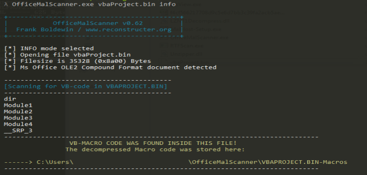

OfficeMalScanner bu makroları okunabilir hale getirerek her birini ayrı bir dosyaya çıkartmaktadır. Bu dosyaların çıkartıldığı dizini komut satırının en altında görebiliriz.

Burada 6 adet VBA script(makro) dosyası bulunmaktadır fakat her birini size göstermeyeceğim, bazıları anlamsız komutlar içermektedir. Bu anlamsız komutlar genelde zararlı dokümanları legal bir doküman gibi göstermek için kullanılmaktadır. Fakat **"Module2"** script dosyasında bir **Google Drive** adresi tespit ediyoruz. Google Drive adresinde bulunan dosya indirilip **"%TEMP%\update-1.3.vbs"** olarak kaydediliyor ve **"wscript.exe"** uygulaması ile çalıştırılıyor.

<h1 style="text-align:center"> Second Stage Payload </h1>

Second Stage Payload olan **"update-1.3.vbs"** dosyasını indirip içeriğinde ne olduğuna bakalım

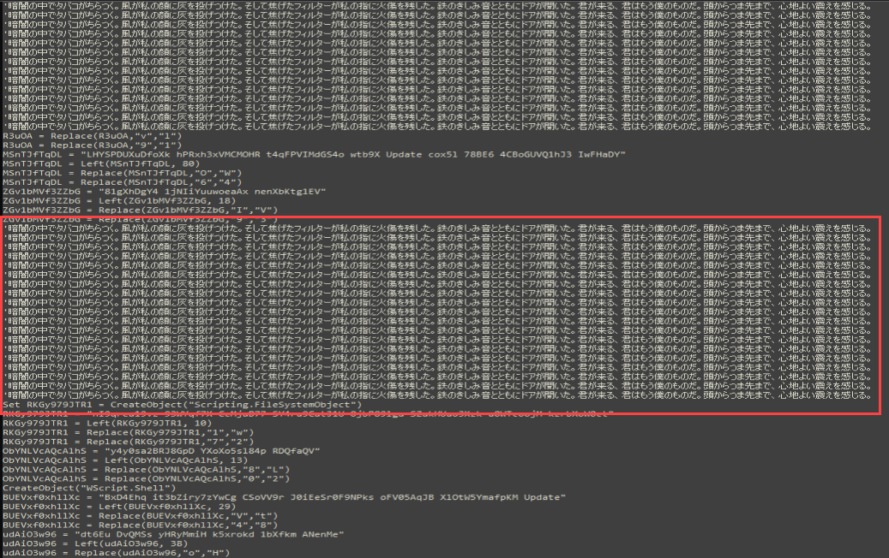

Dosya **19CD89FCF51FD576238A4913D32EDD9A** MD5 hash değerine sahiptir. Bu VBS scripti obfuscate edilmiş; junk code satırları ve çalışmayacak olan anlamsız karakterlerin bulunduğu satırlar içermektedir. Bundan dolayı script içerisinde **"On Error Resume Next"** komutunu görmekteyiz. Peki bu "junk code"lar nedir ve ne anlama gelir? Script içerisinde bazı rastgele oluşturulan ve yine bazı rastgele stringler ile replace işlemi yapılan değişkenler bulunmaktadır. Fakat bu değişkenler scriptin herhangi bir yerinde kullanılmamaktadır. Yani sadece analizi ve kodun okunmasını zorlaştırmak için oluşturulmuştur. Fakat bu değişkenlerin dışında script içerisinde bazı **"Execute"** satırları bulunmaktadır. 

Bu **"Execute"** komutu bir string argümanı alır ve bu string argümanı komut olarak çalıştırır. Javacsriptte bulunan **"eval"** ve Powershell'in cmdlet'i olan **"IEX"** gibi düşünebilirsiniz. Fakat bu argümanlar da obfuscate -beklendiği üzere- edilmiş halde bulunmaktadır. Bu satırları ayrıştırmak ve içerisinde bulunan komutları açık halde görebilmek için bir python -python scripting konusunda çok iyi olduğumu iddia etmiyorum, bunu bilerek kodu okuyunuz lütfen :D- scripti kodladım. Bu python scripti, VBS scripti içerisinde bulunan **"Execute"** satırlarını tek tek okuyup içerisindeki dönüşüm işlemlerini yapıp açık haldeki metinleri, her biri ayrı text dosyasına yazmaktadır. Bu blog yazısında kullanılan tüm scriptleri github'a yükleyeceğim. Burada ayrıştırılan -Execute satırı içerisindeki- komutları asıl VBS içerisinde çalışmış gibi düşünebilirsiniz. Örneğin bu satırlar içerisinde bir değişken oluşturulduysa veya değiştirildiyse bu asıl VBS scriptini de etkilemektedir. 

Bu python scripti, VBS scripti içerisinde bulunan **"Execute"** satırlarını tek tek okuyup içerisindeki dönüşüm işlemlerini yapıp açık haldeki metinleri, her biri ayrı text dosyasına yazmaktadır.

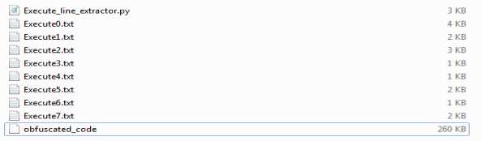

Script içerisinde 8 adet **"Execute"** satırı bulunmaktadır ve python scriptini çalıştırdığımızda elimizde 8 adet text dosyası oluşuyor. Bütün text dosyaların içerisine göstermeyeceğim çünkü şunu söyleyebilirim ki bu satırlar içerisinde kayda değer hiç bir şey bulunmuyor. Yine kullanılmayan değişkenler için replace satırlarının bulunduğu, obfuscate edilmiş komutlar bulunmaktadır. Bu **"Execute"** satırları genellikle çalıştırılacak olan asıl zararlı komutları gizlemek için kullanılmaktadır fakat bu örnekte manuel analizi güçleştirmek için kullanıldığını görebiliyoruz. Bir örnek göstereceğim.

Burada "DownloadString fonksiyonu var" diyebilirsiniz fakat oradaki değerler sadece string, hiç biri script içerisinde çalıştırılmıyor.

Peki o zaman şimdi ne yapacağız? Tabii ki old-school tekniklere başvurup, şüpheli komutları arayacağız :)  **"Run"** stringini script içerisinde aradığımızda sonunda bir şeyler elde edebiliyoruz. Burada **"ShellExecute"** ile çalıştırılan **"Update.4.0.1.ps1"** isimli bir dosya olduğunu görüyoruz. Bunun third stage bir payload olduğunu düşünüyorum.

Fakat bu oluşturulacak olan dosyanın içeriği nerede? Bunun için **"Update.4.0.1.ps1"** stringini script içerisinde aratıyoruz.

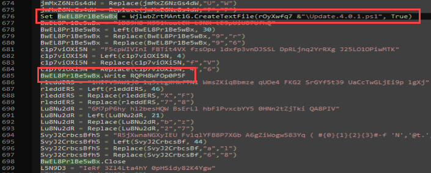

**CreateTextFile** ile birlikte **"C:\Users\Public\Update.4.0.1.ps1"** dosyası oluşturulup içerisine bir değişkenin değerleri yazıldığını tespit ediyoruz. Bu dosyaya veri yazması için **"Write"** cmdlet'ini kullanacağını düşünüp string olarak arıyorum ve third stage payload'ın içeriğini yakalıyoruz.

Bu satır aslında PowerShell'ın format list özelliğini kullanıyor ve bu stringi deobfuscate ediyor. Son string şu şekilde olacaktır: **"Invoke-Expression New-object Net.WebClient.DownloadString"** ve third stage payload'ın URL'sini görebiliriz. Ancak anlamsız bir durum var. Bu **"@"** karakterleri bazı satırlarda replace edilmesi gerekiyor. Scriptte **"RQPH8WFOp0P5F"** değişkenini aradığımızda, herhangi bir replace satırı bulunmuyor. Peki, bu bu string nasıl düzgün hale gelecek?

Düşündüm ki belki de bu sadece PowerShell'ın tuhaf özelliklerinden birisidir vs vs :D Ama sonra **"Execute"** satırları aklıma geldi. Bu satırlar daha fazla satır içeriyor ve belki de bu değişken için bir değiştirme satırı vardır. Ve işte! Teorim doğruydu. 4. Execute komutunda, bu değişken için 2 (ikisi de aynı, bu yüzden bir tane olarak düşünebilirsiniz) **replace"** satırı bulunuyor.

Teorimizi doğruladıktan sonra third stage payload'ı indirebiliriz.

<h1 style="text-align:center"> Third Stage Payload </h1>

Bakalım matruşka bebeğinin bu sefer içinde ne var :D

Bu third stage payload'da birçok obfuscation tekniği bulunmakta; yine anlamsız ve kullanılmayan değerler, yorum satırları ve PE dosyası içeren obfuscated Hex değerleri var (şu an için sadece bir teori). Bu yüzden tekrar kodlamaya başlayalım. Burada bir şey eklemek istiyorum; "Invoke-Expression" satırını veya başka bir komut çalıştırma satırını "echo" veya "write-host" yaparak her adımda bir sonraki payload'ı alabilirdim ama kodlamak ve eğlenmek istiyorum :) . O yüzden ilk olarak yorum satırlarıyla başlayalım.

Basit bir python scripti, eğer bir satır **"\#"** karakteri ile başlıyorsa -ki bu PowerShell'de bir yorum satırını gösteren bir işaret- o satırı atlar ve eğer bir satır bu karakterle başlamıyorsa, o satırı yeni dosyaya yazar. Yorum satırlarından sonra başka bir sorunumuz var, scriptte sadece bazı rastgele değerlerle oluşturulan ve başlangıçta değer atanan ancak sonra hiç kullanılmayan bazı değişkenler bulunmaktadır. Bu satırları scriptten silen bir python scripti yazdım.

Python kodlamada mükemmel olmadığımı biliyorum, aklıma gelen ilk algoritmayı kodladım, bu yüzden koda takılmayın. Uzun saatler süren analizden sonra hâlâ anlamsız kod satırları var ve bu satırları silmek için ortak bir "şey" bulamadım. Sonunda, bu anlamsız satırların **"-replace"** komutunu içerdiğini fark ettim. Bu yüzden tekrar kodlamam gerekiyor. Yine basit bir betik yazdım, eğer bir satır **"-replace"** içeriyorsa bu satırı siliyor. Eğer tekniğim yanlışsa, hâlâ önceki dosyalara sahibim, bu yüzden özel bir değişken veya benzeri için onlara bakabilirim.

Sonuç olarak güzel bir powershell zararlı yazılımı elde ettik. Fakat hala hex değerlerinin oluşturulduğu satılarda **".replace()"** bulunuyor. Bunun için bir script yazmama gerek yok çünkü bu hex değerlerinin birleştirildiği değişkeni alıp direkt olarak sıralanmış şekilde PE dosyasını elde edebilirim. Fakat analizimizi biraz eğlenceli hale getirmek için bunun için de bir python scripti yazacağım; bu script **".replace()"** bulunan satırları alarak replace işlemlerini yapacak ve temiz halini powershell dosyasına yazacak.

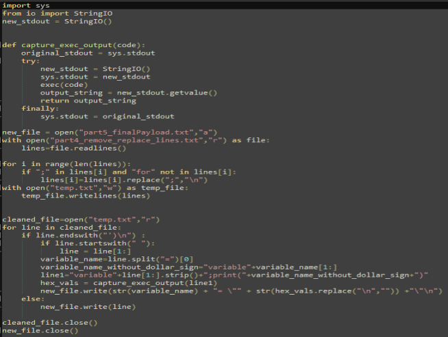

Sonuç olarak ne elde ettik? Bütün obfuscation satırları (neredeyse hepsi) temizlendi ve tamamen temizlenmiş bir powershell zararlı yazılımı elde ettik. Temiz bir görünüş ve okunabilirliği elde etmiş olduk. 1731 satır Hex tanımlaması bulunmakta ve bu tanımlamalardan sonra karmaşık bir sıra ile bu Hex değerleri birleştirilmekte.

Bu kadar fazla hex değerinin bulunmasından dolayı 2 adet PE dosyası içerebileceğini düşündüm ve **"MZ"** imzası yani PE dosyalarının magic byte'ı olan **"4D5A"** değerini arattım ve teorim doğru çıktı. 2 adet değişken **"4D5A"** ile başladığını tespit etmiş olduk.

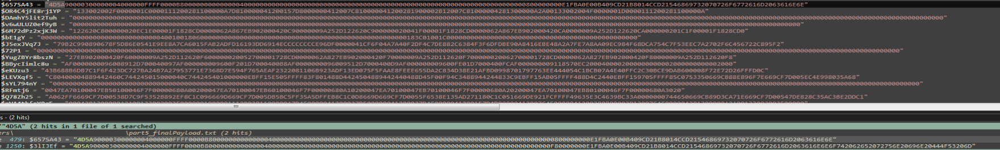

Buradaki karmaşık birleştirme işlemlerini ilk gördüğümde kendi kendime "Bunun için de bir script yazsam, değişken sırasına göre değerleri alıp düzgün sırayla birleştiren ve sonuç olarak 2 adet PE dosyasını bana verse" diye düşündüm fakat sonra dedim ki o kadar abartmaya gerek yok :D Fourth Stage payload'ı bulmak için bu PE dosyalarının oluşturulduğu ve çalıştırıldığı satırı bulmamız gerekiyor.

Scriptin son satırlarına baktığımızda; 1826. satırda (burada normalde birden fazla satır var fakat ";" ile ayrılmış durumda) powershell scripti içerisinde bir process oluşturma komutu bulunduğu tespit ediyoruz. **"Start-Process -FilePath [Path] -ArgumentList [Arguments], [$C2 variable value]"**. 1827. satırda (yine ";" ile ayrılmış satırlar bulunmakta) **"&"** karakteri bulunduğunu tespit ediyoruz. Bu karakter kendinden sonra gelen komutu çalıştırmaya yaramaktadır. Bu karakterden sonra gelen değere baktığımızda ise yine format list özelliği kullanılarak obfuscated halde "Invoke-Expression" komutu bulunduğunu tespit ediyoruz. Peki bu parametreler nedir? 

**"Abab"** ve **"Abcabc"** değişkenleri **"GetTempFileName"** fonksiyonu ile oluşturulmuştur. Asıl zararlı yazılım **"Abab"** değişkeninin içinde ismi bulunan dosyanın içerisinde bulunduğunu düşünüyoruz ve diğer dosya muhtemelen **"RegsSvcs.exe"** processine enjekte edilmek için parametre olarak veriliyor. **"RegsSvcs.exe"** processini çalıştırıp içine bir .NET zararlı yazılımını enjekte etmek yaygın bir tekniktir. Bu teknikle birlikte aslında kullanıcı sadece **"RegsSvcs.exe"** görüyor fakat içerisinde zararlı bir payload bulunuyor.

**"GetTempFileName"** ile dosya isimleri oluşturulduğu ve sonrasında **"WriteAllBytes"** ile birlikte; **"Abcd"** değişkeni içerisinde bulunan PE dosyası **"Abab"** değişkeni içerisinde bulunan dosyaya, **"Abcde"** değişkeni içerisinde bulunan PE dosyası ise **"Abcabc"** değişkeni içerisinde bulunan dosyaya yazılmaktadır. Bu değerleri **"Set-Content"** cmdlet'i ile birlikte alalım.

Buradaki **"Abcd"** ve **"Abcde"** değişkenleri içerisindeki değerlerin **"Update1"** ve **"Update2"** içerisine byte haline getirilerek yazıldığını tespit ediyoruz.

Buradaki değerlerin ise zararlı yazılımın son aşama payloadları olduğunu düşünüyoruz. İlk payload'a bakalım; **"Update2"**

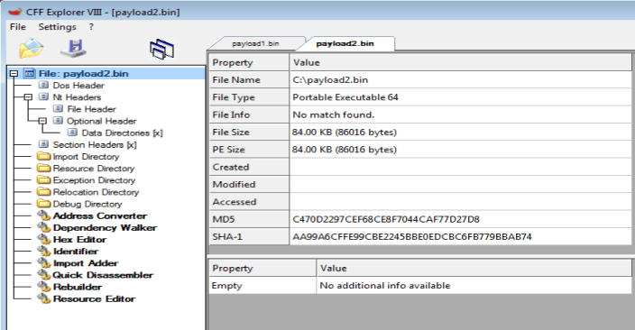
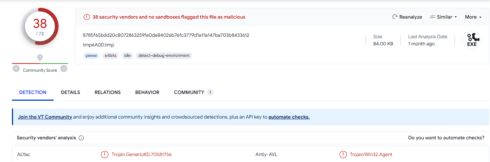

Bu da **"Update1"**

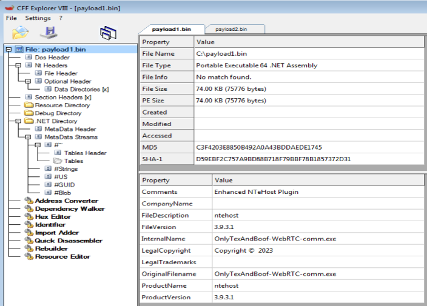

**"Payload2"** dosyası için VirusTotal topluluk yorumlarına baktığımızda, bu dosyanın bir process injector olduğunu anlıyoruz. Şimdi bir şeyler netleşmeye başlıyor. Bu **"Start-Process -FilePath [Path] -ArgumentList [Arguments], [$C2 variable value]"** komut satırını düşünelim. İlk dosya bir process injector, inject işleminden sonra (gerçek işlem) **"[.NET Zararlı yazılımı], RegsSvcs.exe"** kısmı geliyor ki bu da **"[Enjekte edilecek PE dosyası], [RegsSvcs.exe]"** kısmıdır. Teorim; injector dosyanın **.NET** zararlı yazılımını, **"RegsSvcs.exe"**'ye enjekte ettiğidir, ancak bu blog yazısı Excel için olduğundan PE dosyalarına daha derinlemesine inmeyeceğim. Ancak size küçük bir hediyem var.

.NET zararlı yazılım dosyası içerisinde AES decryption fonksiyonu bulunuyor ve burada kullanılan AES Key'i cihaz içerisinde bir dosyaya yazılıyor. Peki bunu nereden biliyoruz? AES Decryption fonskyionuna bir göz atalım.

AES anahtarı **"this.A"** değişkeninden alınmaktadır ve **"this.A"** değişkeni **"g"** fonksiyonunda tanımlanmıştır. Ancak **"str, str2, path ve text"** değişkenlerinde bazı obfuscated değerler bulunmaktadır. Bu, **.NET** zararlı yazılımlarında yaygın olarak kullanılan bir obfuscation tekniğidir. Size küçük bir trick göstereceğim. Bir not olarak, **.NET PE** dosyalarını deobfuscate etmek için "De4dot" aracını kullanabilirsiniz. Bu tuhaf isimli class ve fonksiyonlara bir göz atalım.

Buradan şunu anlıyoruz; bir array var ve bu fonksiyonlar onları **"[Başlangıç İndeksi], [Dize Uzunluğu]"** ile ayırarak deobfuscate ediyor. Bu tekniğe hakkında çok derine inmiyorum, bununla ilgili bir yazı ve bunu nasıl deobfuscate edilebileceği hakkında bir paylaşım yapacağım. Bu yüzden **"str, str2 ve path'ın bir kısmı"** değişkenleri için, yukarıdaki fonksiyonlar çağrılır. **"EF71A7C6-2C98-4D7F-BEF1-B77ABE2DD9C4"** classında, deobfuscate edilmiş değerleri içeren **"4"** adlı bir array bulunmaktadır. Bu, fonksiyon **"6"**dan anlaşılabilir.

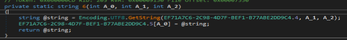

Hızlı bir şekilde **"4"** isimli dizinin içerisindeki değerlerin byte olarak atandığı ve sonrasında XOR'lanarak decrypt ediliğini tespit ediyoruz. Bu genellikle anti-detection için kullanılan bir run-time anında çözümleme tekniğidir. 

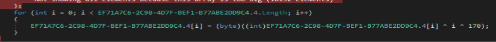

Buradaki davranışı pythonda simüle ederek bu **"str, str1 and part of path"** değerlerini elde edebiliriz. Bunun için "4366" ve "4384+4(son stringin uzunluğu)" indeksleri arasında bulunan byte değerlerini alıyoruz. Küçük bir python kodlamasıyla birlikte bu XOR işlemini simüle ederek decyrpt edilmiş **"path"** değişkenini elde ediyoruz.

Fakat bu **"bootstrapper-assistant"** ne? **"Path.Combine(Path.GetTempPath(),path)"** komutundan da anladığımız üzere bu dosya **"%TEMP%"** dizininde bulunan bir dosya. Bütün analizi aklımdan geçirdiğimde **"bootstrapper-assistant"** stringini bir yerlerde gördüğümü hatırladım. Sanıyorum ki dikkatli okuyucular bunu çoktan fark etti zaten :) 

Third Stage Payload'ın son satırlarında bu stringin parçalı şekilde bulunduğunu ve sonrasında **"%TEMP%"** dizini altına yazıldığını tespit ediyoruz. Bu **"bootstrapper-assistant"** dosyasının içerisinde sample'ımızın AES Key'i bulunmaktadır.

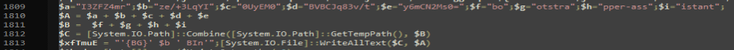

Bunu şuradan onaylayabiliriz; **"g"** fonksiyonu içerisinden çağrılan **"b"** fonksiyonu içerisine baktığımızda bu fonksiyonun parametresi bir **"FilePath"** ve bu değer **"bootstrapper-assistant"**. Sonrasında bu parametredeki dosya okunarak içerisindeki değer Base64 ile decode edilerek **"this.A"** değerine atanıyor ve bu değer de sonrasında **"aes.Key"** olarak kullanılıyor.

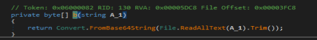

Bunu yukarıdaki ekran görüntüsünden anlayabiliriz. **"B"** dosya ismi yani **"bootstrapper-assistant"** ve **"A"** ise Base64 ile encode edilmiş AES key.

Ek olarak bu zararlı yazılım içerisindeki encrypted metinleri decyrpt etmek için aşağıdaki **"C#"** fonksiyonunu kullanabilirsiniz. 

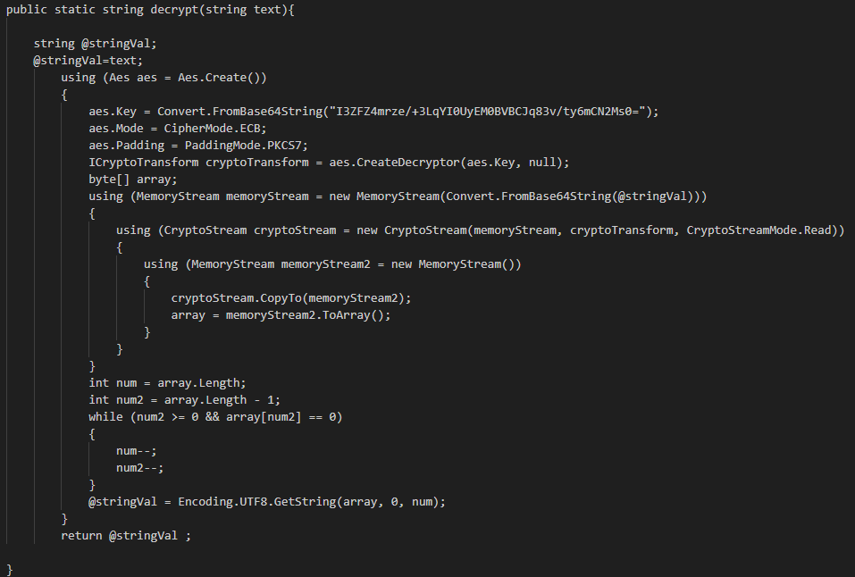

---

Biliyorum biraz uzun bir yazı oldu fakat bu macerayı sizinle paylaşmak ve Excel zararlı yazılımlarının -aslında dokümanların- nelere yapabileceğini ve hikayenin nerelere gidebileceğini görmenizi istedim. Bu .NET zararlı yazılımını elde ettikten sonra bir çok aşama bulunuyor; C2 adresini elde etme, anti tekniklerin tespiti, saldırganın telegram adresi, FTP server credential değerleri vs. fakat bu başka yazımınızın konusu olsun :) Buraya kadar okuduğunuz için teşekkür ederim, umarım bir şeyler öğrenirken aynı zamanda eğlenmişsinizdir. Bu yazının yazılması sırasında yanımda olan ve görüşlerini bildiren  [Ahmet A. GÜLTEKİN](https://www.linkedin.com/in/ahmetgultekin12/)  and [Yılmaz DİNÇER](https://www.linkedin.com/in/ylmzdncr/) teşekkür ederim.

---

Eleştiri/düzeltme/öneri ve sorularınız için lütfen iletişim adreslerimden bana ulaşınız. Yorumlarınız benim için değerli :)