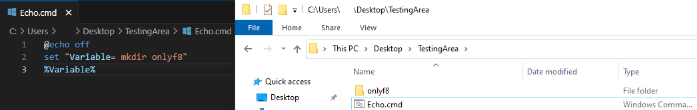
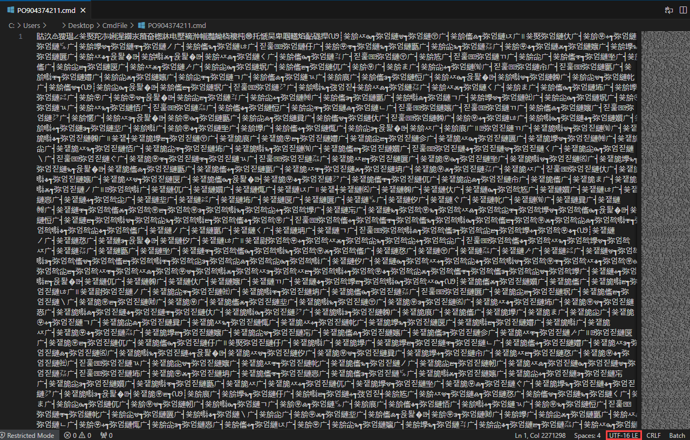
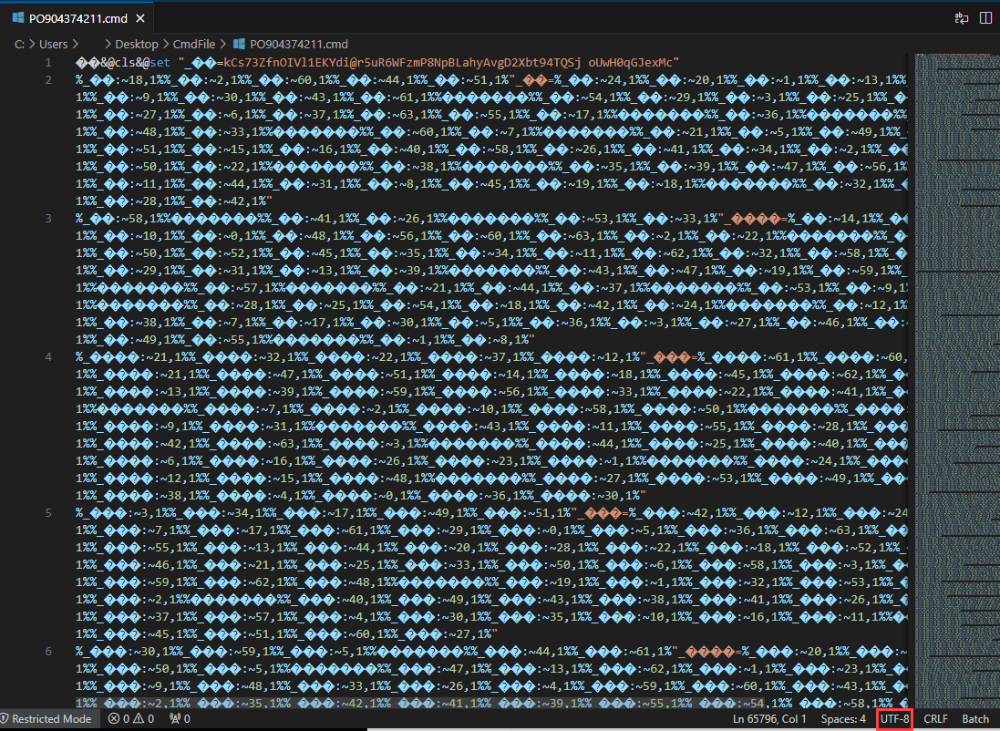
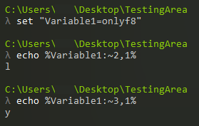
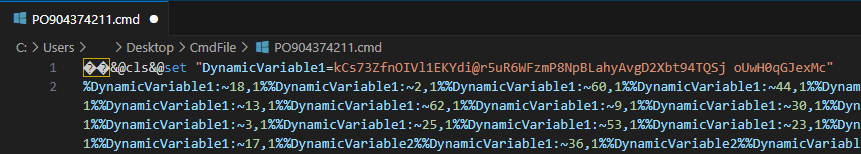
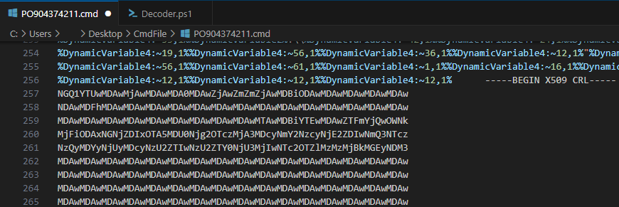
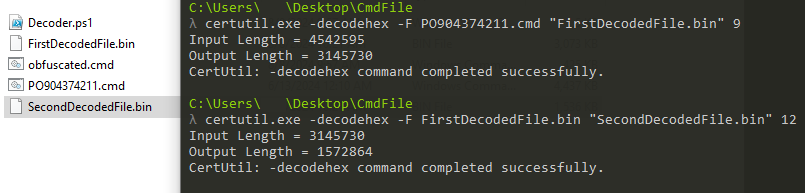
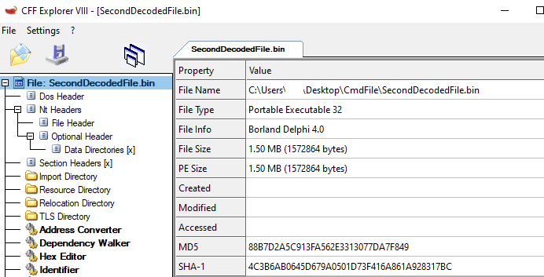

<h1 style="text-align:center"> Batch Script'leri </h1>

"**Batch** dosyası, DOS, OS/2 ve Microsoft Windows işletim sistemlerinde kullanılan bir komut dosyasıdır. Düz metin formatında saklanan bu dosya, komut satırı yorumlayıcısı tarafından çalıştırılacak bir dizi komut içerir. Toplu iş dosyası, yorumlayıcının interaktif olarak kabul ettiği herhangi bir komutu içerebilir"[1]

**"Cmd"** olarak bildiğimiz komut satırı ekranına yazdığımız komutların bir dize halinde bulunduğu dosya formatına **Batch** denmektedir. **".bat, .cmd, .btm"** uzantılarına sahip olabilirler. 

Saldırılarda genellikle ikinci aşama payload dediğimiz (second stage payload) dosya/dosyaları indirmek/droplamak için kullanılan Batch scriptleri, düşünüldüğünde oldukça esnek özellikleri sahip olabilmektedirler. Direkt olarak dosya yürütme olanaklarından dolayı çeşitli sistem dosyalarını kullanarak (Bkz. LOLBIN(Living of the Land Binaries)) güvenlik ürünlerini atlatabilme özelliklerine sahip olabilirler. 



Örneği yukarıdaki gibi basit bir Batch scripti oluşturarak dosya oluşturabilirsiniz. 

Her script dilinde olduğu gibi Batch scriptlerinde de obfuscation(karmaşıklaştırma)'ın bir sınırı yok denilecek kadar azdır. Bu yazımızda yeni(?) ortaya çıkmış obfuscation tekniklerinden birini inceleyeceğiz.


<h1 style="text-align:center"> RemcosRAT Obfuscated Batch Dosyası </h1>

Dosya İsmi : **"PO904374211.cmd"**

Dosya MD5 Hash'i : **"00ed3b00b39d4beba6d0c5e79ae9a95b"**



Bir script dosyası olması sebebiyle herhangi bir text-editor aracı kullanarak içeriğini inceleyebiliriz. Fakat açtığımızda dosya içerisinde Çince(?) benzeri karakterler olduğunu fark ediyoruz. Sağ alta baktığımızda ise ilgili dosyanın kaydedilirken "UTF-16 LE" formatında kaydedildiğini görebiliyoruz. Batch scriptleri genelde UTF-8 ve ASCII dilinde yazılmaktadır. Yukarıdaki görselde gördüğümüz karakterlere gelin bir de Hex Editör'de bakalım.  


Dosyanın character encoding algoritması ANSI olduğunda anlamlı karakterler görebilmekteyiz. Visual Studio Code'un encoding değiştirme özelliğini kullanarak dosyayı UTF-8 formatına çevirebiliriz.



İlk satıra baktığımızda **"set"** komutu kullanılarak bir değişkene değer ataması yapıldığını görebiliyoruz. Fakat sonrasındaki satırlar tam olarak ne işe yarıyor? 

Batch script dilinde **"%"** karakterleri arasında yazılan değer bir değişken olarak algılanmaktadır. Bir karakter dizisi gibi index verilerek bu dizinin belirtilen karakterini kullanabiliriz. Aşağıdaki örnekte olduğu gibi :



Zararlı Batch scriptine baktığımızda ise bu tekniği kullanarak bir obfuscation tekniği kullanıldığı belli olmaktadır. Şimdi elimizdeki scripti biraz güzel hale getirelim, Non-ASCII karakterleri değiştirerek daha okunabilir hale gelmesini sağlayalım. Eğer bu şekilde bir Batch scripti veya herhangi bir script ile uğraşıyorsanız, karakter uzunluklarını baz alarak toplu değiştirme işlemini kullanmanızı tavsiye ederim. 



"Tamam bu hale getirdik iyi güzel de şimdi bu dağınıklığı nasıl toparlayacağız?" sorusu aklınıza geliyordur. Biraz kolları sıvayıp kodlama yapmamız gerekecek gibi duruyor. Burada direkt olarak Batch scriptini çalıştırıp otomatize araçlar yardımıyla ne yaptığını elbette tespit edebiliriz fakat biraz eğlenmeyelim mi? :) 

Çok iyi bir programlamacı olduğumu iddia etmiyorum fakat bir şeyler biliyorum diyebilirim. Öncelikle algoritmamız şu şekilde olacak;

1- Başlangıçta ayarlanan değişkeni kaydet (buradaki adım da otomatize hale getirilebilirdi fakat o kadar zaman kaybetmek istemedim)

2- Satırı oku ve "%" karakteri arasındaki değerleri al

3- "%" karakterleri arasındaki değerde bulunan değişkenin ismini ve hangi karaktere erişmeye çalıştığını al

4- Elimizde bulunan değişkenin istenilen karakteri ile "%" karakterleri ve arasındaki karakterlerin yerine bu karakteri yaz

5- Bütün "%" karakterleri arasında bulunan değerleri yazdıysan yeni satırı oluştur

6- Yeni oluşturulan satırda "set" anahtar kelimesi geçiyorsa ilgili değişkeni kod içerisinde güncelle

7- Yeni satırı yaz ve güncelleme yapılan satırları belirt.

İlgili koda aşağıdaki Github adresimden erişebilirsiniz:

https://github.com/fatihbeyexe/Remcos-Rat-Batch-Deobfuscator



İlgili Batch scriptinin aşağıdaki satırlarına baktığımızda değişken atamaları ve kullanımı bittikten sonra bir "X509 CRL" başlangıcı olduğunu görebiliriz. **"X509 CRL"**, "X.509 Certificate Revocation List"ın kısaltmasıdır. Digital sertifika algoritmasıdır(?). Bilindiği üzere digital sertifikalar şifrelenmiş bir biçimde saklanır. Fakat ilgili dosya içerisinde bulunan değer bir digital sertifika değildir. Bakalım bu değer decrypt/decode edildiğinde karşımıza ne çıkaracak.

Değişken atamalarından sonra bulunan "X509 CRL" kısmı ve sonrasını farklı bir dosyaya kaydederek yukarıda bulunan obfuscate edilmiş komutları yazdığımız scripti kullanarak deobfuscate edebiliriz.

İlk satırda atama yapılan değeri yazdığımız scriptte bulunan "DynamicVariable1" değerine atıyoruz ve zararlı batch scriptindeki ilk satırı siliyoruz. Ardından yazdığımız scripti çalıştırıyoruz ve obfuscate edilen komutları elde ediyoruz.


Şimdi peki bu satırlar ne işe yarıyor? Gelin satır satır bakalım;

```C:\\Windows\\System32\\extrac32 /C /Y C:\\Windows\\System32\\cmd.exe  "C:\\Users\\Public\\alpha.exe"```

Extrac32 : "Extracts files from a cabinet or source."[2]. Windows sistemlerde bulunan "Extrac32" isimli araç ".cab" gibi cabinet dosyalarından dosya ayıklamak için kullanılmaktadır. 

**"/c	Copy source file to destination (to copy from DMF disks)."**

**"/y	Don't prompt before overwriting an existing file."**

**"/c"** ve **"/y"** parametreleri kullanarak çıkartma işlemi değil yalnızca kopyalama işlemi yapılmasını ve var olan bir dosya ise prompt gösterilmeden üzerine yazılması gerektiği belirtiliyor. Kaynak dosyamız **"cmd.exe"** ve hedefimiz ise **"Users\Public\alpha.exe"**. Yani "cmd.exe" dosyası hedef konuma kopyalanıyor. "cmd.exe"nin ismini değiştirmek genellikle güvenlik ürünlerini atlatmak için kullanılmaktadır.

```C:\\Users\\Public\\alpha /c extrac32 /C /Y C:\\Windows\\System32\\certutil.exe C:\\Users\\Public\\kn.exe```

Aynı şekilde "alpha" yani "cmd" kullanılarak **"certutil.exe"** dosyası **"Users\Public\kn.exe"** hedefine kopyalanıyor.

```C:\\Users\\Public\\alpha /c  C:\\Users\\Public\\kn  -decodehex -F "%~f0"  "C:\\Users\\Public\\Audio.mp4" 9```

Certutil: Sertifika servislerinin bir parçasıdır. Sertifika dosyalarını decode etmek için kullanılabilir. Saldırganlar genellikle Base64 ve hex decode yapmak için kullanmaktadır.  "-decodehex" parametresi verilerek hexadecimal olarak encode edilmiş bir dosya olduğunu ve sonda bulunan "9" sayısı ile de **"CRYPT_STRING_BASE64X509CRLHEADER"** tipinde olduğu belirtiliyor.[3] "-F" yani kaynak dosya ise **"%~f0"** yani bu komutun çalıştığı dosya kaynak olarak verilmektedir. Verilen tipe baktığımızda değişken atamalarından sonra bulunan sertifika tipinde olduğunu ve burada bulunan encoded değerin decode edilerek **"C:\Users\Public"** dizinine **"Audio.mp4"** ismiyle yazıldığını görebiliriz.

```C:\\Users\\Public\\alpha /c  C:\\Users\\Public\\kn  -decodehex -F "C:\\Users\\Public\\Audio.mp4"  "C:\\Users\\Public\\Libraries\\Audio.pif" 12```

Aynı şekilde tekrar bir decode işlemi bulunmaktadır. Burada verilen "12" değeri ise ilgili verinin **"CRYPT_STRING_HEXRAW"** tipinde olduğunu belirtmektedir. İki katmanlı bir decode işlemi yapılıyor diyebiliriz. İkinci decode edilen veri ise **"C:\Users\Public\Libraries"** dizinine **"Audio.pif"** ismiyle kaydedilmektedir.

```if exist C:\Users\Public\Libraries\Audio.pif start C:\Users\Public\Libraries\Audio.pif```

Ardından **"Audio.pif"** ismiyle kaydedilen dosya çalıştırılıyor ve sonraki satırlarda da farklı isimle kaydedilen "cmd.exe" ve "certutil.exe" siliniyor ardından batch scripti "exit" komutu ile sonlandırılıyor. Bu adımları kendimiz yapıp son olarak çalıştırılan **"Audio.pif"** dosyasının içeriğine gelin bakalım. 

Öncelikle aynı komutları kullanarak ilgili dosyayı oluşturalım.



İlk decode işlemi sonrası oluşan dosya :


Burada zaten "4D 5A" yani "MZ" byte'larını gördüğümüzde bir executable dosya olduğunu anlayabiliriz. İlk decode işleminden gelen dosyayı da decode ettiğimizde elde ettiğimiz dosya :



Son aşama olarak droplanan zararlı yazılımın MD5 Hash değeri : "88B7D2A5C913FA562E3313077DA7F849"

---

Eleştiri/düzeltme/öneri için lütfen iletişim adreslerimden bana ulaşınız. Yorumlarınız benim için değerli :)

---

Kaynakça

[1] https://en.wikipedia.org/wiki/Batch_file

[2] https://learn.microsoft.com/en-us/windows-server/administration/windows-commands/extract

[3] https://learn.microsoft.com/en-us/windows/win32/api/wincrypt/nf-wincrypt-cryptstringtobinarya